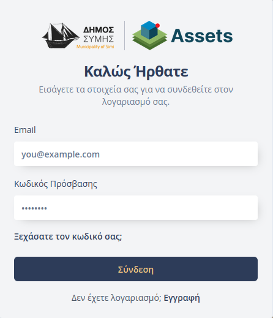
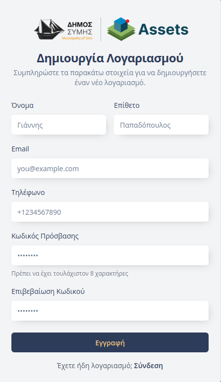

# Είσοδος στην Πλατφόρμα

Η πλατφόρμα του **Συστήματος Καταγραφής Παγίων και Υποστήριξης Δημοτών** προσφέρει διαβαθμισμένη πρόσβαση ανάλογα με την ιδιότητα του χρήστη, εξυπηρετώντας τόσο τις εσωτερικές υπηρεσίες του Δήμου όσο και τους πολίτες.

---

## Σύνδεση
Η είσοδος στην πλατφόρμα πραγματοποιείται με την εισαγωγή των διαπιστευτηρίων (email και κωδικός πρόσβασης) στη φόρμα σύνδεσης.

Εφόσον ο χρήστης έχει ολοκληρώσει τη διαδικασία ενεργοποίησης ή εγγραφής (όπως περιγράφεται παρακάτω), αποκτά πρόσβαση στο περιβάλλον εργασίας που αντιστοιχεί στον ρόλο του (Δημότης ή Στέλεχος Δήμου).

---

## Εγγραφή & Ενεργοποίηση Λογαριασμού
Η δημιουργία λογαριασμού πραγματοποιείται με δύο τρόπους, ανάλογα με τον τύπο του χρήστη:

### 1. Εσωτερικοί Χρήστες (Στελέχη Δήμου)
Η εγγραφή κάθε νέου μέλους πραγματοποιείται κεντρικά από εσωτερικό χρήστη με ρόλο **«Διαχειριστή»**. Με τη δημιουργία του λογαριασμού, ο χρήστης λαμβάνει ένα αυτοματοποιημένο email καλωσορίσματος και ακολουθεί τη διαδικασία **«Ορισμού Κωδικού»** για την ενεργοποίηση της πρόσβασής του.

> Αναλυτικές οδηγίες για τη διαδικασία αυτή μπορείτε να βρείτε στην ενότητα [«Είσοδος στην Πλατφόρμα»](../geoportal/02-entry.md) του Συστήματος Διαχείρισης Υποδομών.

### 2. Πολίτες (Εγγραφή)
Οι δημότες έχουν τη δυνατότητα να πραγματοποιήσουν **εγγραφή** απευθείας από την αρχική σελίδα της πλατφόρμας. 

**Βήματα Διαδικασίας:**

1.  **Έναρξη:** Ο χρήστης επιλέγει τον σύνδεσμο εγγραφής στη φόρμα σύνδεσης της αρχικής σελίδας.  
    

2.  **Υποβολή Στοιχείων:** Συμπληρώνει τα απαραίτητα πεδία στη φόρμα εγγραφής.  
    

3.  **Λήψη Κωδικού (OTP):** Θα σταλεί ένας **μοναδικός κωδικός μίας χρήσης (OTP)** στον δηλωμένο λογαριασμό ηλεκτρονικού ταχυδρομείου.  
    

4.  **Ολοκλήρωση:** Ο χρήστης εισάγει τον κωδικό OTP για την επαλήθευση του λογαριασμού του και αποκτά άμεση πρόσβαση στην πλατφόρμα.

---

## Επαναφορά Κωδικού
Η διαδικασία επαναφοράς είναι κοινή για όλους τους χρήστες και ακολουθείται σε περίπτωση απώλειας των στοιχείων πρόσβασης. 

Περιγράφεται αναλυτικά στην ενότητα [«Επαναφορά ή Αρχικός Ορισμός Κωδικού»](../geoportal/02-entry.md#επαναφορά-ή-αρχικός-ορισμός-κωδικού) του οδηγού του Συστήματος Διαχείρισης Υποδομών.