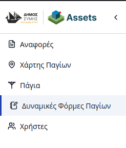

# Διαχείριση Δυναμικών Φορμών

Η πλατφόρμα του **Συστήματος Καταγραφής Παγίων και Υποστήριξης Δημοτών** επιτρέπει τη δημιουργία δυναμικών φορμών που λειτουργούν ως «Κατηγορίες Παγίων». Οι φόρμες αυτές καθορίζουν τα πεδία και τις πληροφορίες που συλλέγονται κατά την καταγραφή κάθε στοιχείου στο μητρώο.

Για τη διαχείριση των φορμών, ο χρήστης επιλέγει την καρτέλα **«Δυναμικές φόρμες»** από την πλευρική μπάρα πλοήγησης.

---

## Γενική Δομή

Στη σελίδα αυτή προβάλλεται ένας πίνακας με όλες τις καταχωρημένες δυναμικές φόρμες που αφορούν τα **Πάγια**. Σε αντίθεση με το **Σύστημα Διαχείρισης Υποδομών**, εδώ η διαχείριση επικεντρώνεται αποκλειστικά στα πάγια του Δήμου και όχι στις τοποθεσίες.

Ο χρήστης μπορεί να προχωρήσει σε **δημιουργία**, **επεξεργασία** ή **διαγραφή** των φορμών, οι οποίες συγχρονίζονται αυτόματα με τις διαθέσιμες κατηγορίες της πλατφόρμας.

---

## Διαδικασία Δημιουργίας & Παραμετροποίησης

Η διαδικασία δημιουργίας μιας νέας φόρμας, η προσθήκη ενοτήτων και ο ορισμός των πεδίων (τύποι δεδομένων, κανόνες επικύρωσης και επιλογές) ακολουθεί την ίδια ακριβώς λογική με το **Σύστημα Διαχείρισης Υποδομών**.

Για αναλυτικές οδηγίες σχετικά με τη χρήση του εργαλείου δημιουργίας φορμών, τους διαθέσιμους τύπους πεδίων και τις ρυθμίσεις τους, ανατρέξτε στην αντίστοιχη ενότητα της τεκμηρίωσης του Geoportal:

> **[Οδηγός Δημιουργίας Δυναμικών Φορμών (Geoportal)](../geoportal/04-dynamic-forms.md#δημιουργία-φορμών)**

---

## Αποθήκευση

Με την ολοκλήρωση της παραμετροποίησης, οι αλλαγές οριστικοποιούνται με το κουμπί **«Αποθήκευση Διαμόρφωσης»**. Η νέα κατηγορία γίνεται άμεσα διαθέσιμη για χρήση από τους εσωτερικούς χρήστες του Δήμου κατά την εισαγωγή ή επεξεργασία παγίων.
