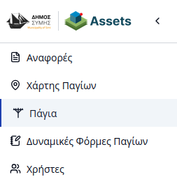
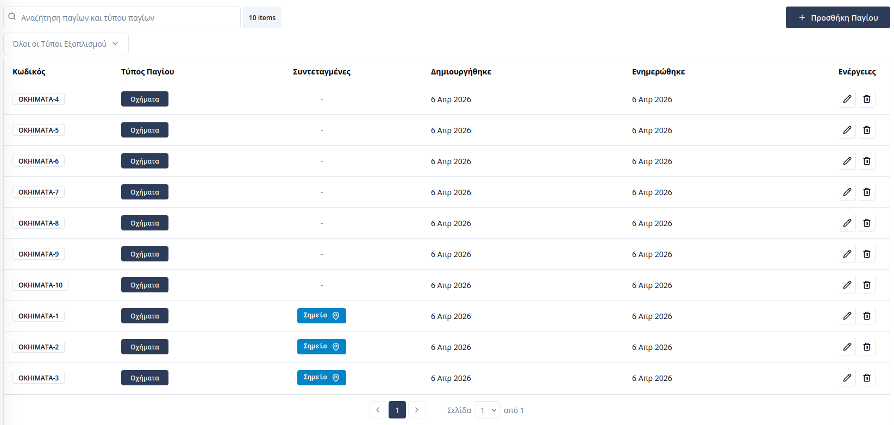
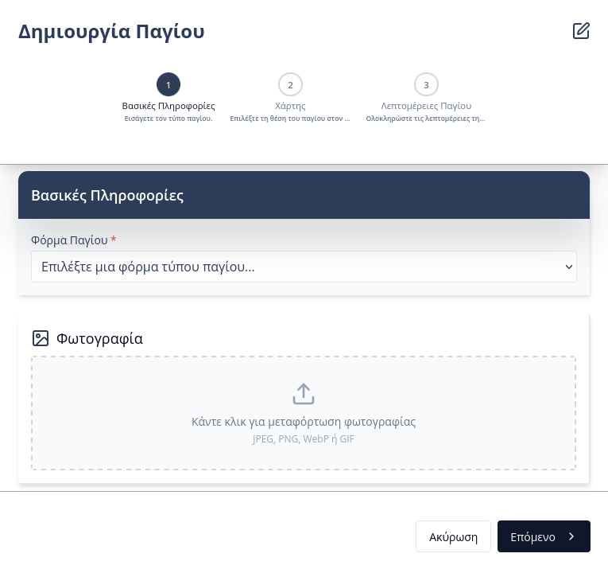
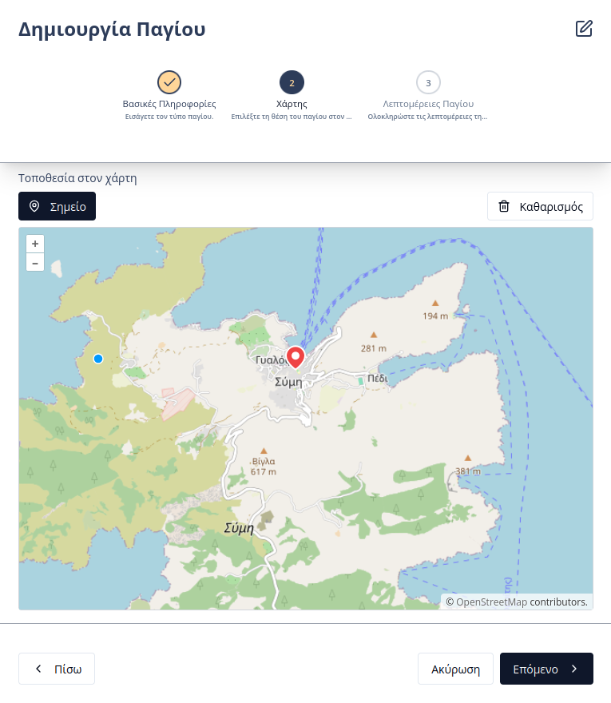
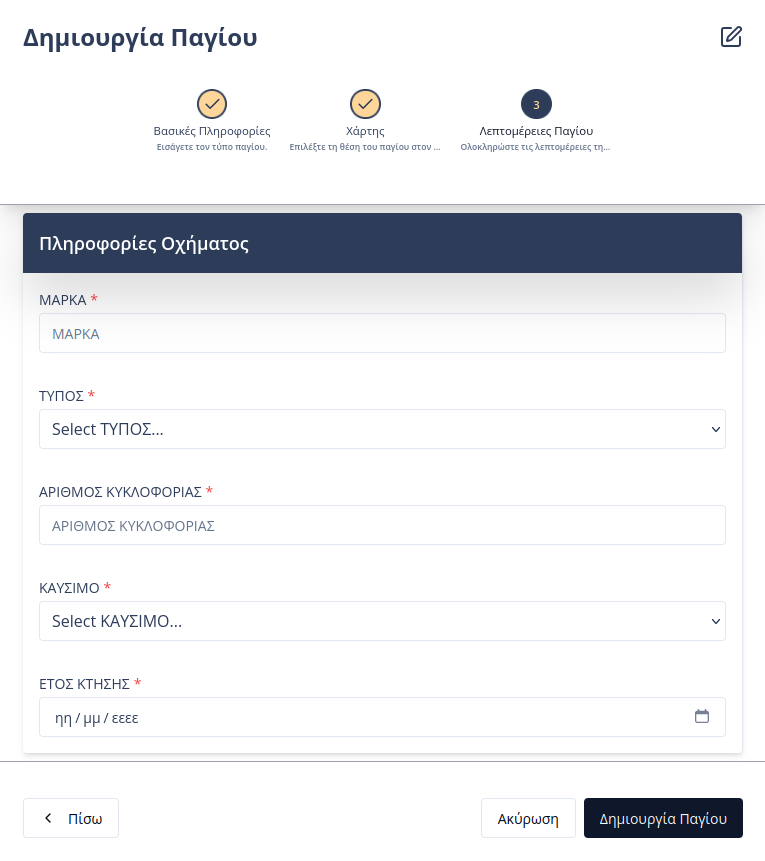

# Διαχείριση Παγίων

Η πλατφόρμα του **Συστήματος Καταγραφής Παγίων και Υποστήριξης Δημοτών** παρέχει στους εσωτερικούς χρήστες τη δυνατότητα για πλήρη καταγραφή και παρακολούθηση των παγίων του Δήμου. Η πρόσβαση στην ενότητα πραγματοποιείται μέσω της καρτέλας **«Πάγια»** στην πλευρική μπάρα πλοήγησης.

---

## Επισκόπηση Παγίων
Στην κεντρική σελίδα της ενότητας, εμφανίζεται ένας συγκεντρωτικός πίνακας που περιλαμβάνει τα βασικά στοιχεία των καταχωρημένων παγίων:

* **Κωδικός:** Ο μοναδικός, αυτόματα παραγόμενος κωδικός ταυτοποίησης (Asset ID).
* **Τύπος Παγίου:** Η κατηγορία ή η [δυναμική φόρμα](03-dynamic-forms.md) στην οποία ανήκει το πάγιο.
* **Συντεταγμένες:** Η τρέχουσα τοποθεσία του παγίου.

Οι χρήστες μπορούν να χρησιμοποιήσουν τη **μπάρα αναζήτησης** για άμεσο εντοπισμό ή να εφαρμόσουν **φίλτρα** βάσει του τύπου παγίου (δυναμική φόρμα).

Ο πίνακας προσφέρει επιπλέον λειτουργίες μέσω των ενεργειών σε κάθε γραμμή:
* **Επεξεργασία:** Τροποποίηση των στοιχείων του παγίου.
* **Διαγραφή:** Οριστική αφαίρεση της καταχώρησης.

---

## Προσθήκη Νέου Παγίου
Η διαδικασία καταχώρησης νέου παγίου υλοποιείται μέσω μιας καθοδηγούμενης φόρμας. Σημειώνεται ότι στο σύστημα αυτό, όλα τα πάγια θεωρούνται εξ ορισμού **εξωτερικά** για τον δήμο.

### Στάδιο 1: Βασικές Πληροφορίες
Ο χρήστης επιλέγει τη **Φόρμα Παγίου** (Κατηγορία) που αντιστοιχεί στο πάγιο. Σε αυτό το στάδιο μπορεί επίσης να μεταφορτωθεί μια φωτογραφία για την οπτική ταυτοποίηση του αντικειμένου.

### Στάδιο 2: Χάρτης
Στο δεύτερο στάδιο, ο χρήστης προσδιορίζει τη γεωγραφική θέση του παγίου, τοποθετώντας μια πινέζα στον διαδραστικό χάρτη. Η πληροφορία αυτή είναι κρίσιμη για τον εντοπισμό του παγίου από τα συνεργεία συντήρησης.

### Στάδιο 3: Λεπτομέρειες Παγίου
Στο τελικό στάδιο, συμπληρώνονται τα ειδικά πεδία που έχουν οριστεί στη δυναμική φόρμα της επιλεγμένης κατηγορίας (π.χ. υλικό κατασκευής, σειριακός αριθμός, ημερομηνία τοποθέτησης).

---

## Καρτέλα Παγίου
Επιλέγοντας μια καταχώρηση από τον πίνακα, ο χρήστης μεταφέρεται στην αναλυτική καρτέλα του παγίου, η οποία περιλαμβάνει:

1.  **Στοιχεία Παγίου:** Γενικές πληροφορίες ταυτοποίησης του παγίου.
2.  **Τεχνικές Λεπτομέρειες:** Προβολή των χαρακτηριστικών που ορίζονται από τη δυναμική φόρμα.
3.  **Γεωχωρική Απεικόνιση:** Εμφάνιση της θέσης του παγίου στον χάρτη.

> **Συγχρονισμός:** Τα πάγια που καταχωρούνται εδώ είναι ορατά και στο **Σύστημα Διαχείρισης Υποδομών** ως "Εξωτερικός Εξοπλισμός" για την ενιαία διαχείριση των υποδομών του Δήμου.
