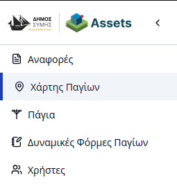
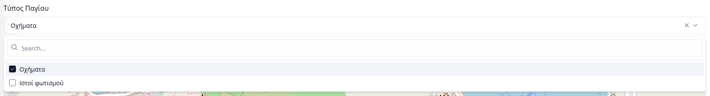
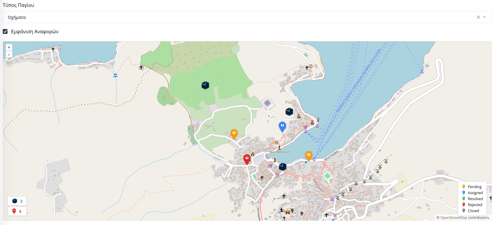

# Χάρτης Παγίων

Η ενότητα **«Χάρτης Παγίων»** επιτρέπει τη γεωχωρική απεικόνιση των παγίων του Δήμου, καθώς και των αιτημάτων των πολιτών. Η πρόσβαση γίνεται μέσω της καρτέλας **«Χάρτης Παγίων»** στην πλευρική μπάρα πλοήγησης.

---

## Λειτουργίες Χάρτη

Ο διαδραστικός χάρτης παρέχει εργαλεία για τον φιλτραρισμό και την οπτικοποίηση των δεδομένων σε πραγματικό χρόνο:

### 1. Επιλογή Τύπου Παγίων
Στο μενού επιλογών, ο χρήστης μπορεί να επιλέξει τη συγκεκριμένη **Δυναμική Φόρμα** (Κατηγορία Παγίου) που επιθυμεί να εμφανιστεί. Με την επιλογή μιας φόρμας:
* Εμφανίζονται στον χάρτη όλα τα καταχωρημένα πάγια της συγκεκριμένης κατηγορίας ως πινέζες.
* Κάνοντας κλικ σε μια πινέζα, ο χρήστης μπορεί να δει συνοπτικές πληροφορίες για το πάγιο.

### 2. Προβολή Αιτημάτων Πολιτών
Ο χρήστης έχει τη δυνατότητα να ενεργοποιήσει το σχετικό πεδίο ελέγχου (checkbox) για την εμφάνιση των **Αιτημάτων Πολιτών** πάνω στον χάρτη. 
  
  

* **Συνδυαστική Προβολή:** Η λειτουργία αυτή επιτρέπει τον εντοπισμό περιοχών όπου υπάρχουν συσσωρευμένα αιτήματα (π.χ. βλάβες) σε σχέση με την τοποθεσία των παγίων.
* **Διάκριση Δεδομένων:** Οι πινέζες των αιτημάτων διαφοροποιούνται οπτικά από εκείνες των παγίων για την εύκολη αναγνώριση των προβλημάτων.

---

## Πλοήγηση και Πληροφορίες
Ο χάρτης υποστηρίζει όλες τις τυπικές λειτουργίες πλοήγησης (zoom in/out, μετακίνηση). 

> **Σημείωση:** Η ακρίβεια της τοποθεσίας των παγίων εξαρτάται από τις συντεταγμένες που ορίστηκαν κατά το [Στάδιο 2 της Προσθήκης Νέου Παγίου](04-assets.md#στάδιο-2-χάρτης).

---