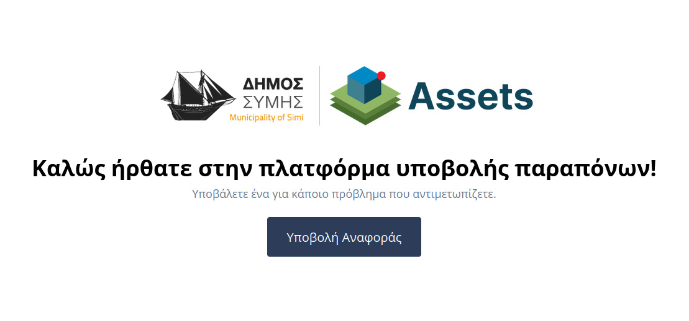
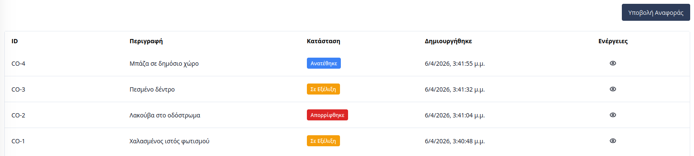
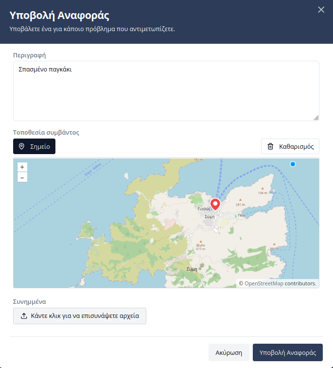
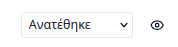
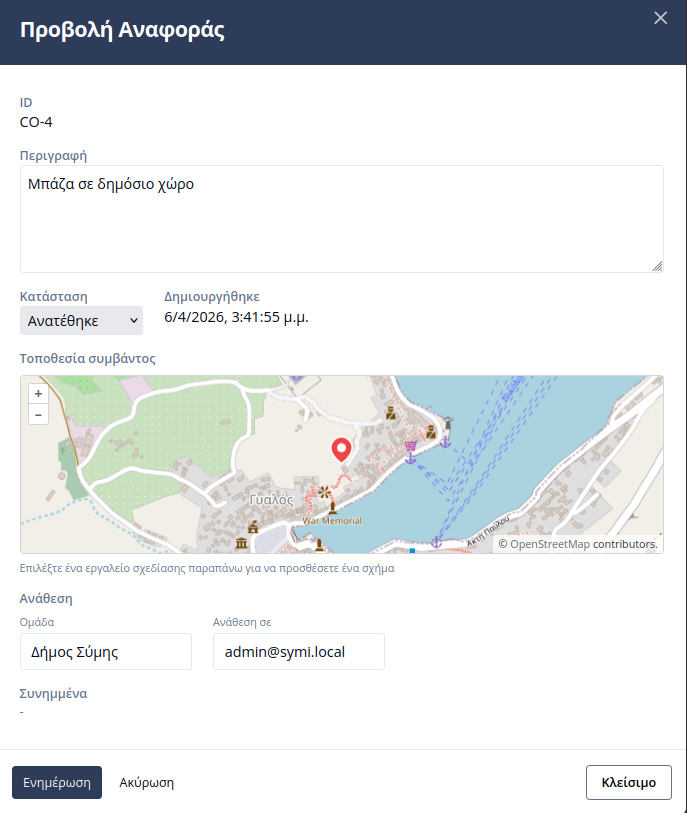
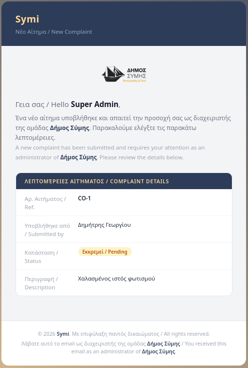
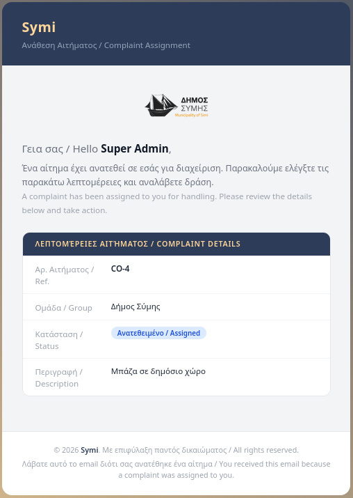
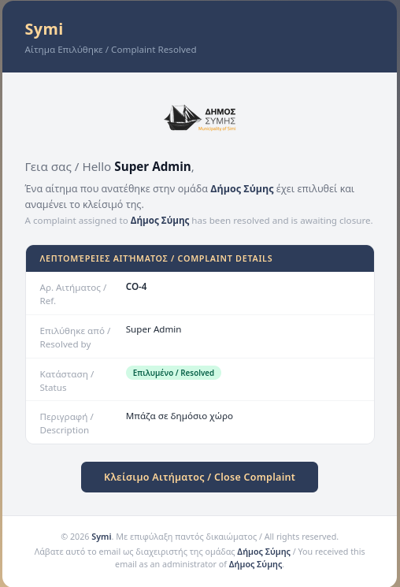
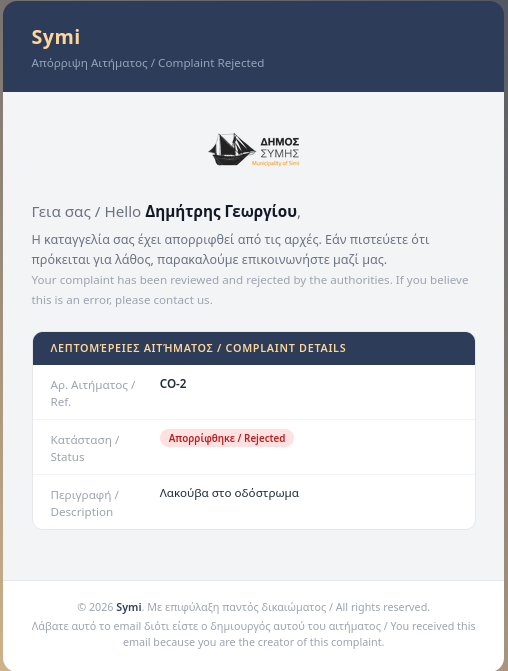
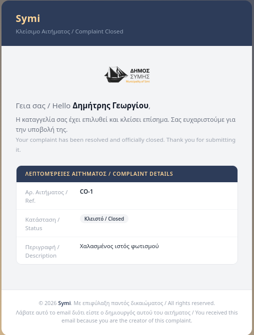

# Διαχείριση Αναφορών

Η ενότητα **«Αναφορές»** αποτελεί το κεντρικό σημείο επικοινωνίας μεταξύ πολιτών και Δήμου. Μέσω αυτής, οι χρήστες μπορούν να δηλώσουν βλάβες ή προβλήματα, ενώ οι υπάλληλοι του Δήμου αναλαμβάνουν τη διαχείριση και την επίλυσή τους.

---

## Επισκόπηση Αναφορών
Όταν ένας χρήστης εισέρχεται για πρώτη φορά στην ενότητα και δεν υπάρχουν καταχωρήσεις, εμφανίζεται ένα κεντρικό κουμπί **«Δημιουργία Πρώτης Αναφοράς»**. 

Μετά την πρώτη καταχώρηση, εμφανίζεται ένας πίνακας με τα εξής στοιχεία:
* **ID:** Ο μοναδικός αριθμός αναφοράς.
* **Περιγραφή:** Σύντομο κείμενο του αιτήματος.
* **Κατάσταση:** Η τρέχουσα φάση στην οποία βρίσκεται το αίτημα (π.χ. Εκκρεμεί, Ανατέθηκε).

---

## Δημιουργία Αναφοράς
Κατά τη δημιουργία μιας νέας αναφοράς, ο χρήστης συμπληρώνει μια φόρμα που περιλαμβάνει:
1.  **Περιγραφή:** Αναλυτική περιγραφή του προβλήματος.
2.  **Τοποθεσία:** Προσδιορισμός του σημείου στον χάρτη.
3.  **Συνημμένα Αρχεία:** Δυνατότητα μεταφόρτωσης φωτογραφιών ή εγγράφων για τεκμηρίωση.

---

## Διαχείριση από Υπαλλήλους Δήμου

Οι εσωτερικοί χρήστες έχουν διευρυμένα δικαιώματα διαχείρισης μέσω της στήλης **«Ενέργειες»**:
* **Dropdown Κατάστασης:** Άμεση αλλαγή του status από τον πίνακα.
* **Εικονίδιο Προβολής (Μάτι):** Μετάβαση στην αναλυτική σελίδα του αιτήματος.

### Επεξεργασία και Ανάθεση
Από τη σελίδα προβολής, ο διαχειριστής μπορεί να πατήσει το κουμπί **«Επεξεργασία»**. Στη φόρμα αυτή, εκτός από τη διόρθωση στοιχείων, πραγματοποιείται η **Ανάθεση σε Υπηρεσία του Δήμου**. Επιλέγοντας την αρμόδια υπηρεσία, το αίτημα δρομολογείται αυτόματα στους αντίστοιχους υπευθύνους.

---

## Κύκλος Ζωής Αιτήματος

Κάθε αίτημα ακολουθεί μια συγκεκριμένη ροή εργασίας, η οποία αντικατοπτρίζεται στις παρακάτω καταστάσεις:

| Κατάσταση | Περιγραφή |
|:----------|:----------|
| **Σε εξέλιξη** | Το αίτημα έχει υποβληθεί και αναμένει αρχικό έλεγχο από τον διαχειριστή. |
| **Ανατέθηκε** | Το αίτημα έχει ανατεθεί σε συγκεκριμένη Υπηρεσία ή χρήστη για ενέργεια. |
| **Επιλυμένο** | Οι απαραίτητες εργασίες ολοκληρώθηκαν επιτυχώς. |
| **Απορρίφθηκε** | Το αίτημα κρίθηκε άκυρο ή εκτός αρμοδιότητας. |
| **Κλειστό** | Η διαδικασία ολοκληρώθηκε και το αίτημα αρχειοθετήθηκε. |

---

## Ροή Ενημερώσεων (Email Notifications)

Το σύστημα αυτοματοποιεί την επικοινωνία μέσω email σε κάθε κρίσιμο στάδιο της διαδικασίας, ενημερώνοντας τόσο τους υπαλλήλους όσο και τους πολίτες:

1.  **Υποβολή:** Ο πολίτης δημιουργεί την αναφορά $\rightarrow$ Αποστολή email σε όλους τους **Admins του Δήμου**.
    

2.  **Ανάθεση σε Χρήστη:** Η Υπηρεσία αναθέτει το αίτημα σε συγκεκριμένο υπάλληλο/τεχνικό $\rightarrow$ Αποστολή email στον **Υπεύθυνο Χρήστη**.
    

3.  **Επίλυση Αιτήματος:** Όταν ο τεχνικός ολοκληρώσει την εργασία και αλλάξει την κατάσταση σε "Επιλυμένο" $\rightarrow$ Ο πολίτης λαμβάνει επιβεβαίωση επίλυσης.
    

4.  **Απόρριψη Αιτήματος:** Σε περίπτωση που το αίτημα απορριφθεί (π.χ. λανθασμένη τοποθεσία ή εκτός αρμοδιότητας) $\rightarrow$ Ο πολίτης ενημερώνεται για τον λόγο της απόρριψης.
    

5.  **Ολοκλήρωση (Κλείσιμο):** Μόλις ο διαχειριστής ελέγξει την επίλυση και κλείσει οριστικά το αίτημα $\rightarrow$ Αποστολή τελικού email ενημέρωσης στον **Πολίτη**.
    
