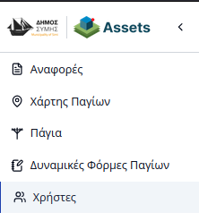
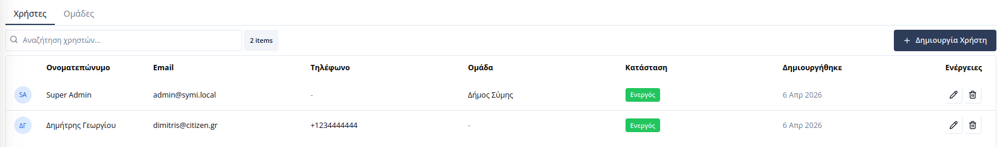
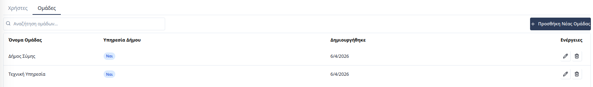
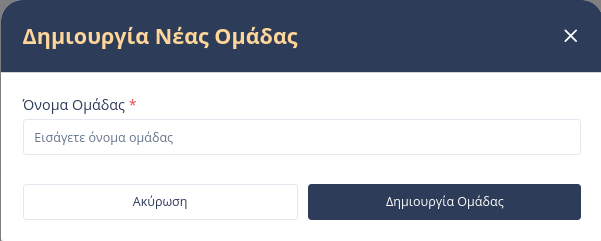
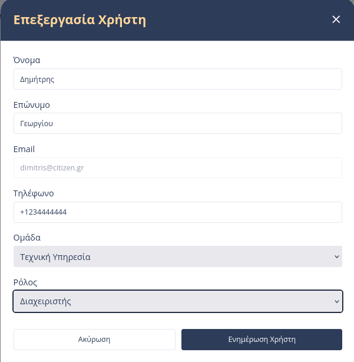

# Διαχείριση Χρηστών & Υπηρεσιών

Η ενότητα **Χρήστες** επιτρέπει τη διαχείριση της πρόσβασης στην πλατφόρμα παγίων. Σε αντίθεση με το Geoportal, η πλατφόρμα αυτή εστιάζει στη διαχείριση των **Πολιτών** που υποβάλλουν αναφορές και των **Υπηρεσιών του Δήμου** που αναλαμβάνουν την επίλυσή τους.

Η πρόσβαση γίνεται μέσω της καρτέλας **«Χρήστες»** στην πλευρική μπάρα.

---

## Γενική Δομή

Η διαχείριση χωρίζεται σε δύο βασικές ενότητες:

### 1. Υποκαρτέλα Χρήστες
Εδώ προβάλλονται όλοι οι εγγεγραμμένοι χρήστες, οι οποίοι διακρίνονται σε δύο κατηγορίες:
*   **Πολίτες:** Χρήστες που έχουν εγγραφεί για να υποβάλλουν αναφορές και να παρακολουθούν την εξέλιξή τους.
*   **Υπάλληλοι Δήμου:** Χρήστες που ανήκουν σε κάποια υπηρεσία και διαχειρίζονται τα πάγια και τις αναφορές.

### 2. Υποκαρτέλα Ομαδών (Υπηρεσίες)
Στην ενότητα αυτή διαχειρίζεστε τις **Εσωτερικές Ομάδες (Υπηρεσίες)** του Δήμου. Εδώ ορίζονται οι δομές (π.χ. Υπηρεσία Πρασίνου, Ηλεκτρολογικό) που θα δέχονται τις αναθέσεις των αναφορών.

---

## Δημιουργία Νέας Υπηρεσίας

Στην πλατφόρμα παγίων, όλες οι ομάδες που δημιουργούνται είναι εξ ορισμού **Εσωτερικές (Internal)**. Πατώντας το κουμπί **«Προσθήκη Νέας Ομάδας»**, ο διαχειριστής ορίζει:

1.  **Όνομα Υπηρεσίας:** Ο τίτλος της διεύθυνσης ή του τμήματος.

---

## Προσθήκη & Διαχείριση Χρηστών

Ο διαχειριστής μπορεί να προσθέσει υπαλλήλους χειροκίνητα ή να επεξεργαστεί τα στοιχεία των πολιτών.

*   **Ανάθεση σε Υπηρεσία:** Κατά τη δημιουργία ή επεξεργασία ενός υπαλλήλου, είναι απαραίτητο να επιλεγεί η **Υπηρεσία** στην οποία ανήκει, ώστε να λαμβάνει τις σχετικές ειδοποιήσεις για τα αιτήματα.
*   **Ρόλοι:** Καθορίζεται αν ο χρήστης θα έχει δικαιώματα Διαχειριστή (Admin) ή Χειριστή (Operator) εντός της υπηρεσίας του.

---

## Ρόλοι & Δικαιώματα

Τα δικαιώματα πρόσβασης ορίζονται βάσει της κατηγορίας του χρήστη και του ρόλου του εντός της ομάδας/υπηρεσίας.

### Α. Υπάλληλοι Δήμου (Municipality Users)

| Ρόλοι | Δυναμικές Φόρμες | Πάγια | Χρήστες | Ομάδες | Αναφορές |
|:---|:---:|:---:|:---:|:---:|:---:|
| **Υπερδιαχειριστής** | Όλα | Όλα | Όλα | Όλα | Επεξργασία |
| **Διαχειριστής** | Όλα | Όλα | Όλα εκτός από άλλους διαχειριστές και υπερδιαχειριστές | Όλα εκτός από επεξεργασία και διαγραφή της ομάδας του | Επεξεργασία |
| **Χειριστής** | Όλα | Όλα | Κανένα | Κανένα | Επεξεργασία |

### Β. Πολίτες (Citizens)
Οι πολίτες δεν διαθέτουν ρόλους, καθώς η πρόσβασή τους είναι περιορισμένη αποκλειστικά στη διαχείριση των δικών τους δεδομένων.

| Χρήστης | Δυναμικές Φόρμες | Πάγια | Χρήστες | Ομάδες | Αναφορές (Complaints) |
|:---|:---:|:---:|:---:|:---:|:---:|
| **Πολίτης** | Κανένα | Κανένα | Κανένα | Κανένα | Δημιουργία |

---

> **Σημείωση:** Οι Πολίτες που εγγράφονται μόνοι τους στην πλατφόρμα εμφανίζονται αυτόματα στην υποκαρτέλα «Χρήστες» χωρίς να ανήκουν σε κάποια υπηρεσία.