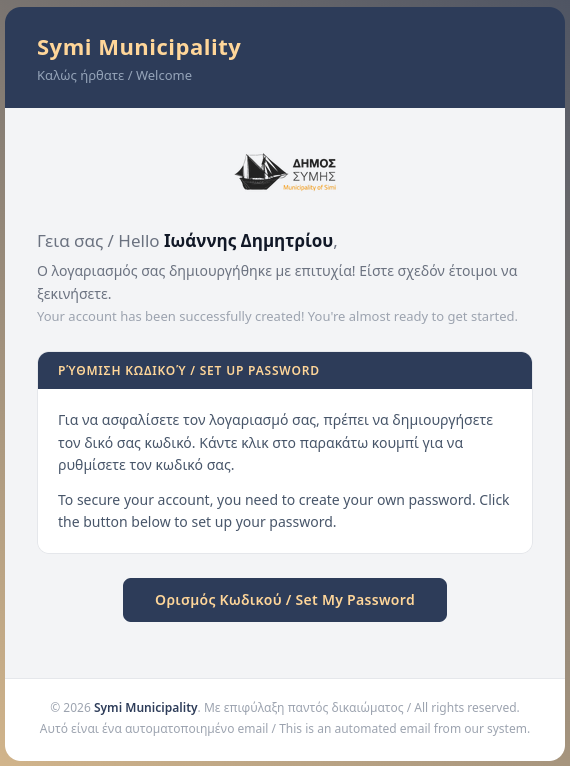
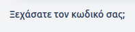
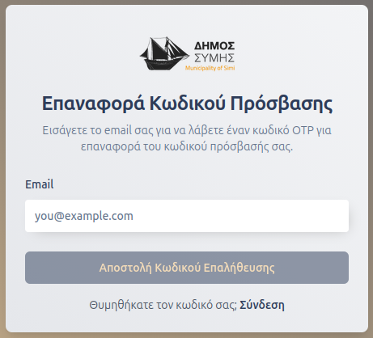
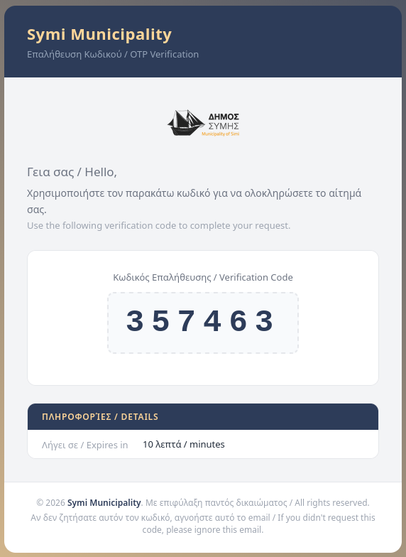
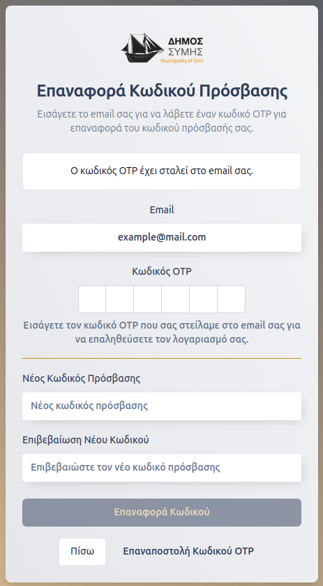
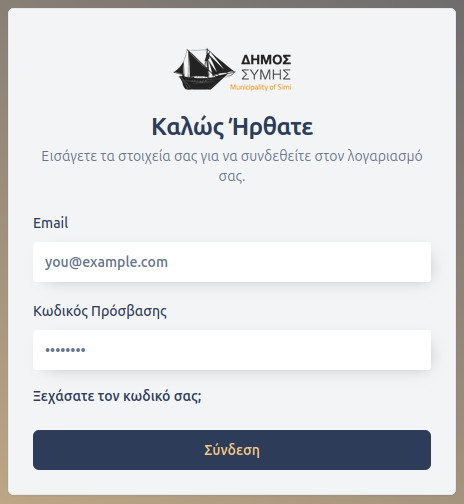

# Είσοδος στην Πλατφόρμα

Η πλατφόρμα του **Συστήματος Διαχείρισης Υποδομών** είναι προσβάσιμη τόσο από εσωτερικούς χρήστες (στελέχη του Δήμου) όσο και από εξωτερικούς συνεργάτες (εργολάβους).

---

## Εγγραφή & Ενεργοποίηση Λογαριασμού
Η εγγραφή κάθε νέου μέλους πραγματοποιείται κεντρικά από εσωτερικό χρήστη με ρόλο **«Διαχειριστή»**. 

Με τη δημιουργία του λογαριασμού, ο νέος χρήστης λαμβάνει ένα αυτοματοποιημένο μήνυμα (email) καλωσορίσματος. Η ενεργοποίηση του λογαριασμού και η ταυτοποίηση του χρήστη γίνονται μέσω της διαδικασίας **Ορισμού Κωδικού**.

> **Σημαντικό:** Κατά την πρώτη αυτή διαδικασία ορισμού κωδικού, η ηλεκτρονική διεύθυνση του χρήστη **επαληθεύεται αυτόματα**.

---

## Επαναφορά ή Αρχικός Ορισμός Κωδικού
Η διαδικασία αυτή ακολουθείται είτε κατά την πρώτη είσοδο (ενεργοποίηση), είτε σε περίπτωση που ο χρήστης ξεχάσει τα στοιχεία του.

### Βήματα Διαδικασίας:
1. **Έναρξη:** Ο χρήστης επιλέγει το κουμπί στο email καλωσορίσματος ή τον σύνδεσμο **«Ξεχάσατε τον κωδικό σας;»** στη φόρμα σύνδεσης.
   
   

2. **Υποβολή Email:** Συμπληρώνει τη διεύθυνση email του για να ξεκινήσει η ταυτοποίηση.
   

3. **Λήψη Κωδικού (OTP):** Θα σταλεί ένας **μοναδικός κωδικός μίας χρήσης (OTP)** στο email του.
   

4. **Ορισμός Νέου Κωδικού:** Ο χρήστης εισάγει τον κωδικό OTP που έλαβε και στη συνέχεια ορίζει τον νέο προσωπικό του κωδικό πρόσβασης.
   

Με την επιτυχή υποβολή, ο λογαριασμός θεωρείται **επαληθευμένος** και ο χρήστης είναι έτοιμος για σύνδεση.

---

## Σύνδεση
Η είσοδος στην πλατφόρμα πραγματοποιείται με την εισαγωγή των διαπιστευτηρίων (email και κωδικός πρόσβασης) στη φόρμα σύνδεσης.

Εφόσον ο χρήστης έχει ήδη ολοκληρώσει τη διαδικασία ορισμού κωδικού (όπως περιγράφηκε παραπάνω), γίνεται η είσοδος στην πλατφόρμα.