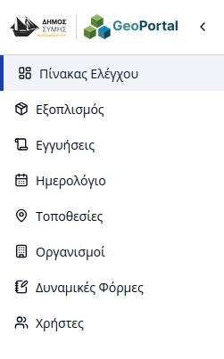
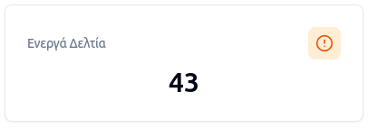
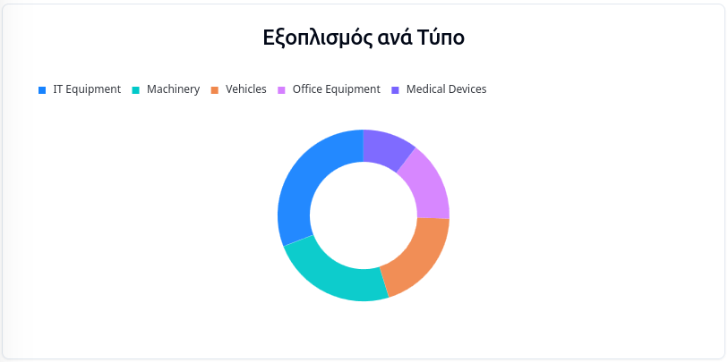
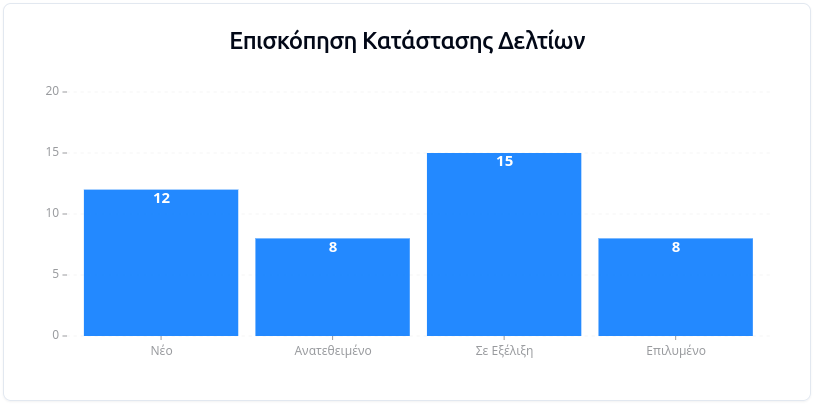
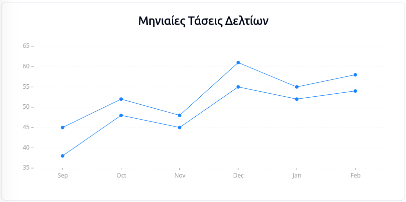
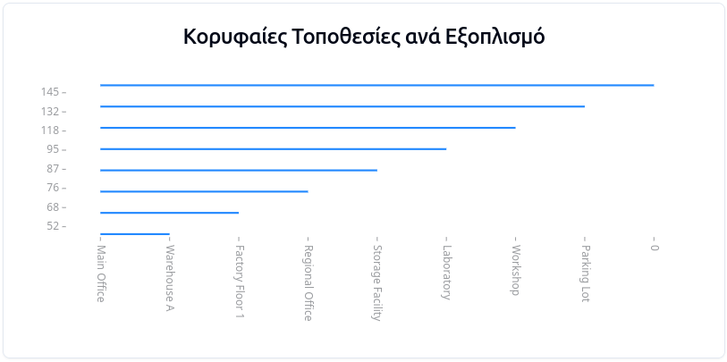
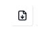

# Πίνακας Ελέγχου

Η πλατφόρμα του **Συστήματος Διαχείρισης Υποδομών** παρέχει στους εσωτερικούς χρήστες μια ολοκληρωμένη εικόνα της κατάστασης του εξοπλισμού μέσω στατιστικών αναλύσεων και οπτικοποίησης δεδομένων. 

Η πρόσβαση στον **Πίνακα Ελέγχου** γίνεται εύκολα επιλέγοντας την ομώνυμη καρτέλα από την πλευρική μπάρα πλοήγησης (sidebar).

---

## Στατιστικά Στοιχεία

Ο Πίνακας Ελέγχου συγκεντρώνει κρίσιμες πληροφορίες για την υποδομή του Δήμου, χωρισμένες σε δύο βασικές κατηγορίες:

### 1. Γενική Επισκόπηση (Key Metrics)
Στο επάνω μέρος προβάλλονται συνοπτικές κάρτες με τα εξής στοιχεία:
* **Συνολικός Εξοπλισμός:** Το πλήθος όλων των καταγεγραμμένων μονάδων.
    
* **Ενεργά Αιτήματα:** Ο αριθμός των ανοιχτών εισιτηρίων (tickets) που εκκρεμούν.
    
* **Συνολικές Τοποθεσίες:** Τα σημεία ενδιαφέροντος όπου υπάρχει εγκατεστημένος εξοπλισμός.
    
* **Εγγυήσεις προς Λήξη:** Εξοπλισμός του οποίου η εγγύηση λήγει σύντομα, για τον έγκαιρο προγραμματισμό συντήρησης.
    

### 2. Εξειδικευμένες Αναλύσεις (Charts)
Ακολουθούν δυναμικά διαγράμματα για βαθύτερη ανάλυση των δεδομένων:
* **Εξοπλισμός ανά Κατηγορία:** Κατανομή του υλικού σε κατηγορίες (Donut Chart).
    
* **Επισκόπηση Κατάστασης Αιτημάτων:** Οπτικοποίηση των αιτημάτων ανά στάδιο εξέλιξης (Bar Chart).
    
* **Μηνιαίες Τάσεις Αιτημάτων:** Χρονική εξέλιξη του όγκου των αιτημάτων (Line Chart).
    
* **Κορυφαίες Τοποθεσίες ανά Εξοπλισμό:** Κατάταξη των τοποθεσιών με τη μεγαλύτερη συγκέντρωση υποδομών.
    

---

## Προσαρμογή Δεδομένων
Στα διαγράμματα που περιλαμβάνουν χρονικό παράγοντα, ο χρήστης έχει τη δυνατότητα να ορίσει το **διάστημα δειγματοληψίας** των δεδομένων. 

Η προσαρμογή επιτυγχάνεται μέσω του εικονιδίου φιλτραρίσματος που βρίσκεται σε κάθε σχετικό διάγραμμα, επιτρέποντας την εστίαση σε συγκεκριμένες περιόδους ενδιαφέροντος.

---

## Εξαγωγή Στοιχείων
Για περαιτέρω επεξεργασία ή αναφορά, ο χρήστης μπορεί να εξάγει τα δεδομένα οποιουδήποτε διαγράμματος σε αρχείο μορφής **.CSV**. Η ενέργεια αυτή πραγματοποιείται πατώντας το εικονίδιο εξαγωγής στην επάνω δεξιά γωνία του εκάστοτε γραφήματος.

