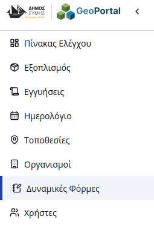
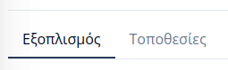
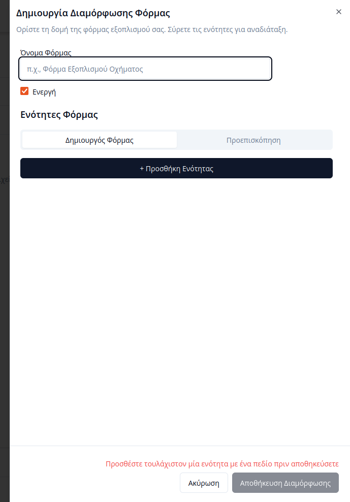
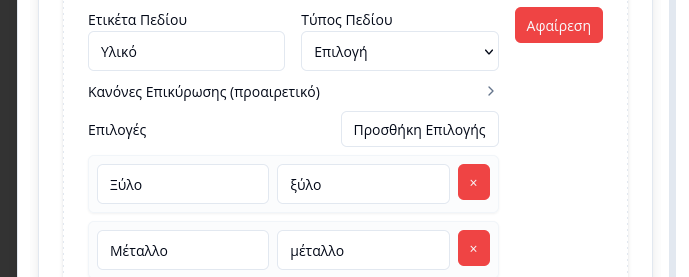

# Διαχείριση Δυναμικών Φορμών

Η πλατφόρμα του **Συστήματος Διαχείρισης Υποδομών** παρέχει στους εσωτερικούς χρήστες τη δυνατότητα δημιουργίας δυναμικών φορμών για τον εξοπλισμό και τις τοποθεσίες. Οι φόρμες αυτές λειτουργούν ως «Κατηγορίες» και επιτρέπουν την πλήρη παραμετροποίηση των πεδίων που απαιτούνται για την καταγραφή κάθε είδους υποδομής.

Για τη διαχείριση των φορμών, ο χρήστης επιλέγει την καρτέλα **«Δυναμικές φόρμες»** από την πλευρική μπάρα πλοήγησης.

---

## Γενική Δομή

Η σελίδα διαχείρισης οργανώνεται σε δύο βασικές υποκαρτέλες, επιτρέποντας τον διαχωρισμό των προτύπων ανάλογα με τη χρήση τους:

### 1. Υποκαρτέλα Εξοπλισμός
Στην ενότητα αυτή προβάλλεται ένας πίνακας με τις καταχωρημένες δυναμικές φόρμες που αφορούν τον εξοπλισμό. 

Ο πίνακας παρέχει δυνατότητα αναζήτησης για την άμεση εύρεση των προτύπων. Ο χρήστης μπορεί σε αυτό το σημείο να προχωρήσει σε **δημιουργία**, **επεξεργασία** ή **διαγραφή** των φορμών εξοπλισμού.

### 2. Υποκαρτέλα Τοποθεσιών
Η ενότητα αυτή είναι αντίστοιχη με την παραπάνω, με τη διαφορά ότι οι φόρμες αφορούν κατηγορίες τοποθεσιών (π.χ. Δημοτικά Κτίρια, Εξωτερικοί Χώροι).

---

## Δημιουργία Φορμών

Ο χρήστης μπορεί να δημιουργήσει μια νέα δυναμική φόρμα πατώντας το κουμπί **«Δημιουργία Νέας Φόρμας»** στο επάνω μέρος της σελίδας. Με την ενέργεια αυτή, μια αναδιπλούμενη φόρμα δημιουργίας εμφανίζεται στη δεξιά πλευρά της οθόνης.

Κατά τη διαδικασία, ο χρήστης ορίζει το όνομα της φόρμας, δημιουργεί τις απαραίτητες υποενότητες (sections), καθορίζει τις ετικέτες τους και προσθέτει τα επιθυμητά πεδία σε κάθε ενότητα.

### Τύποι Πεδίων & Κανόνες
Τα πεδία που ορίζονται από τον χρήστη υποστηρίζουν τους παρακάτω τύπους και κανόνες επικύρωσης:

| Τύπος | Περιγραφή | Κανόνες Επικύρωσης |
|:------|:----------|:-------------------|
| **Κείμενο** | Εισαγωγή σύντομου κειμένου μίας γραμμής. | Υποχρεωτικό, Ελάχιστο/Μέγιστο Μήκος |
| **Περιοχή Κειμένου** | Εισαγωγή εκτενούς κειμένου ή σημειώσεων. | Υποχρεωτικό, Ελάχιστο/Μέγιστο Μήκος |
| **Αριθμός** | Εισαγωγή αριθμητικών τιμών (ποσότητα, μέγεθος). | Υποχρεωτικό, Ελάχιστη/Μέγιστη Τιμή |
| **Αναπτυσσόμενο** | Επιλογή μιας τιμής από προκαθορισμένη λίστα. | Υποχρεωτικό |
| **Ημερομηνία** | Επιλογή ημερομηνίας από ημερολόγιο. | Υποχρεωτικό | 
| **Κουτάκι Επιλογής** | Επιλογή μίας ή περισσότερων αυτόνομων τιμών. | Υποχρεωτικό |
| **Επιλογή** | Αποκλειστική επιλογή μίας τιμής από σύνολο. | Υποχρεωτικό |
| **Email** | Εισαγωγή έγκυρης διεύθυνσης email. | Υποχρεωτικό, Ελάχιστο/Μέγιστο Μήκος |  

Για τους τύπους **Αναπτυσσόμενο**, **Κουτάκι Επιλογής** και **Επιλογή**, ο χρήστης πρέπει να ορίσει τις διαθέσιμες επιλογές, εισάγοντας την **ετικέτα** (πώς εμφανίζεται στη φόρμα) και την **τιμή** (πώς καταγράφεται στη βάση).

---

## Αποθήκευση

Με την ολοκλήρωση της παραμετροποίησης, ο χρήστης πατάει το κουμπί **«Αποθήκευση Διαμόρφωσης»** για την οριστική καταχώρηση της φόρμας στο σύστημα. 

Η νέα φόρμα ταξινομείται αυτόματα είτε στον Εξοπλισμό είτε στις Τοποθεσίες, ανάλογα με την υποκαρτέλα που ήταν ενεργή κατά την έναρξη της διαδικασίας.