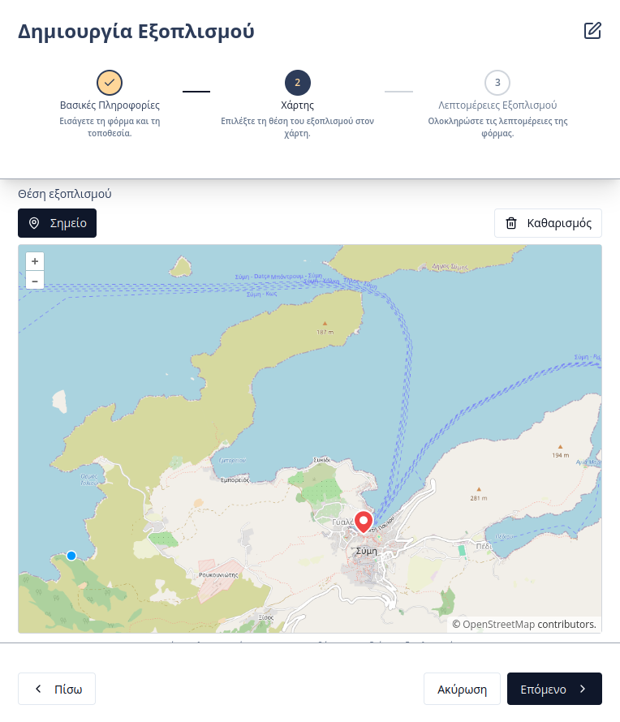

# Διαχείριση Εξοπλισμού

Η πλατφόρμα του **Συστήματος Διαχείρισης Υποδομών** παρέχει στους εσωτερικούς χρήστες τη δυνατότητα για πλήρη καταγραφή, παρακολούθηση και γεωχωρική απεικόνιση του εξοπλισμού του Δήμου. Η πρόσβαση στην ενότητα πραγματοποιείται μέσω της καρτέλας **«Εξοπλισμός»** στην πλευρική μπάρα πλοήγησης.

---

## Επισκόπηση Εξοπλισμού
Στην κεντρική σελίδα της ενότητας, εμφανίζεται ένας συγκεντρωτικός πίνακας που περιλαμβάνει τα εξής βασικά πεδία:
* **Κωδικός:** Ο μοναδικός, αυτόματα παραγόμενος κωδικός ταυτοποίησης του εξοπλισμού.    
* **Τύπος Εξοπλισμού:** Η κατηγορία ή η [δυναμική φόρμα](04-dynamic-forms.html) στην οποία έχει ενταχθεί το αντικείμενο.
* **Τοποθεσία/Κτίριο:** Το γεωγραφικό σημείο ή η υποδομή όπου βρίσκεται εγκατεστημένος ο εξοπλισμός.
* **Γονέας:** Συσχέτιση με άλλη μονάδα εξοπλισμού, στην περίπτωση που το αντικείμενο αποτελεί υπο-εξάρτημα μιας μεγαλύτερης μονάδας.

Οι χρήστες μπορούν να χρησιμοποιήσουν τη **μπάρα αναζήτησης** για τον άμεσο εντοπισμό καταχωρήσεων ή να εφαρμόσουν **φίλτρα** βάσει τύπου εξοπλισμού (δυναμική φόρμα) και τοποθεσίας.

  

Ο πίνακας προσφέρει επιπλέον λειτουργίες μέσω των ενεργειών σε κάθε γραμμή:
* **Επεξεργασία:** Τροποποίηση των στοιχείων του εξοπλισμού.
* **Διαγραφή:** Οριστική αφαίρεση της καταχώρησης από τη βάση δεδομένων.
* **Προεπισκόπηση QR:** Άμεση εμφάνιση του μοναδικού κωδικού QR που αντιστοιχεί στον συγκεκριμένο εξοπλισμό.

---

## Προσθήκη Νέου Εξοπλισμού
Η διαδικασία καταχώρησης νέου εξοπλισμού υλοποιείται σε τρία στάδια μέσω μιας καθοδηγούμενης φόρμας (wizard):

### Στάδιο 1: Βασικές Πληροφορίες
Ο χρήστης επιλέγει τη **Δυναμική Φόρμα** (Κατηγορία) και ορίζει την **Τοποθεσία/Κτίριο** εγκατάστασης. Επιπλέον, επιλέγονται ο **Πάροχος** και ο **Κατασκευαστής**. Εάν ο εξοπλισμός είναι υπο-εξάρτημα, μπορεί να οριστεί ένας **Γονέας** εξοπλισμός. Τέλος, προσδιορίζεται αν ο εξοπλισμός είναι εσωτερικός ή εξωτερικός, με δυνατότητα μεταφόρτωσης φωτογραφίας για την οπτική του ταυτοποίηση.

> **Σημαντικό:** Οι εξωτερικοί εξοπλισμοί συγχρονίζονται με το **Σύστημα Καταγραφής Παγίων και Υποστήριξης Δημοτών** ως πάγια και η διαχείρισή τους μπορεί να γίνει και από εκεί.

_Σημείωση: Ένας εξοπλισμός που έχει οριστεί ως εξάρτημα άλλου (child) δεν μπορεί να αποτελέσει γονέα για τρίτο αντικείμενο._

### Στάδιο 2: Χάρτης
Στο δεύτερο στάδιο, ο χρήστης προσδιορίζει προαιρετικά τη γεωγραφική θέση του εξοπλισμού, τοποθετώντας μια πινέζα στον διαδραστικό χάρτη.

### Στάδιο 3: Λεπτομέρειες Εξοπλισμού
Στο τελικό στάδιο, συμπληρώνονται τα ειδικά πεδία που έχουν οριστεί στη δυναμική φόρμα της επιλεγμένης κατηγορίας (π.χ. σειριακός αριθμός, μοντέλο, έτος κτήσης).

---

## Καρτέλα Εξοπλισμού
Επιλέγοντας μια καταχώρηση από τον πίνακα ή σαρώνοντας τον κωδικό QR, ο χρήστης μεταφέρεται στην αναλυτική καρτέλα του εξοπλισμού, η οποία οργανώνεται στις εξής ενότητες:

1. **Στοιχεία Εξοπλισμού:** Γενικές πληροφορίες ταυτοποίησης και ο κωδικός **QR** για χρήση στο πεδίο.
    
    
2. **Λεπτομέρειες:** Προβολή και διαχείριση των τεχνικών χαρακτηριστικών που ορίζονται από τη δυναμική φόρμα.
    
    
3. **Γεωχωρική Απεικόνιση (Χάρτης):** Εμφάνιση της ακριβούς θέσης στον χάρτη με δυνατότητα διόρθωσης του γεωμετρικού ίχνους. Περισσότερες πληροφορίες είναι διαθέσιμες στην ενότητα [Διαχείριση Τοποθεσιών](06-locations.html).
    
    
4. **Εγγυήσεις:** Πίνακας με τις συνδεδεμένες εγγυήσεις που καλύπτουν το αντικείμενο.
    
    
5. **Βλάβες / Συντηρήσεις:** Ιστορικό και τρέχουσα κατάσταση των αιτημάτων (tickets) που αφορούν τον συγκεκριμένο εξοπλισμό.
    
    