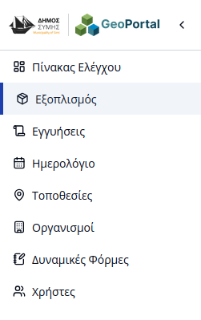
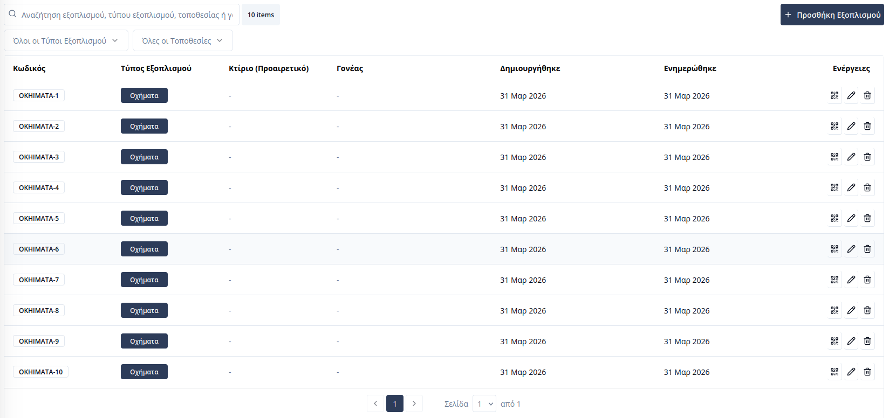
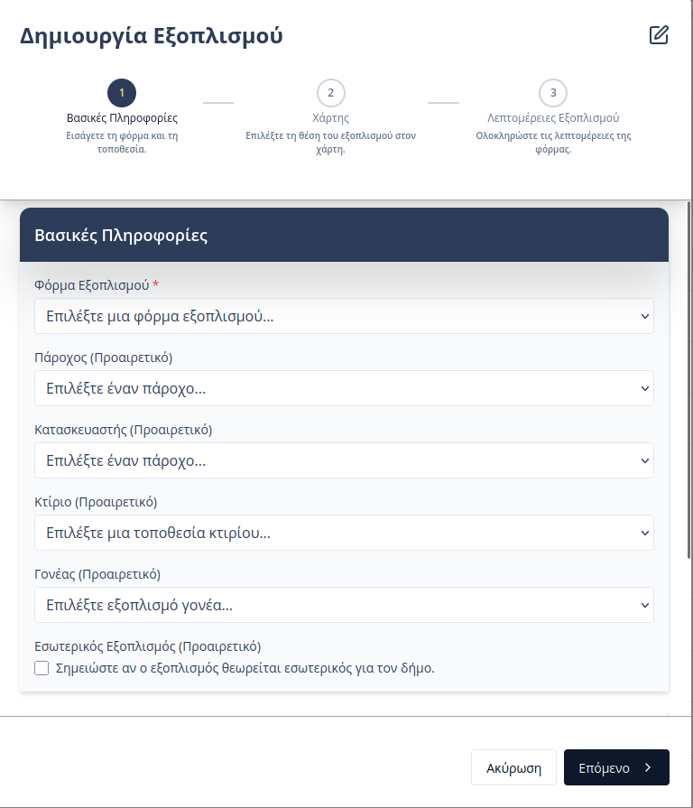
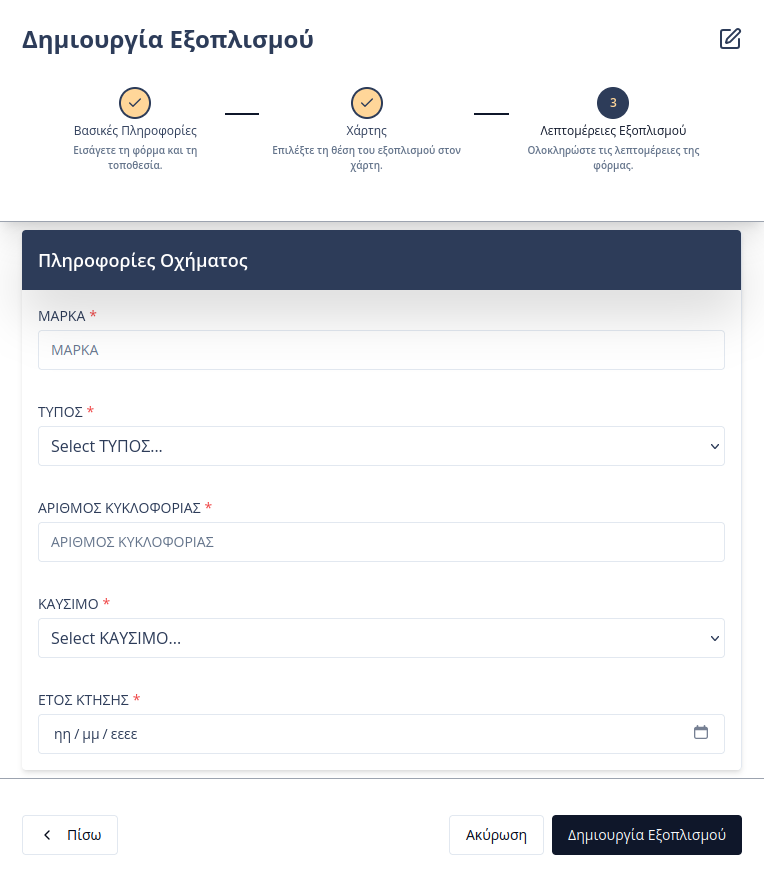
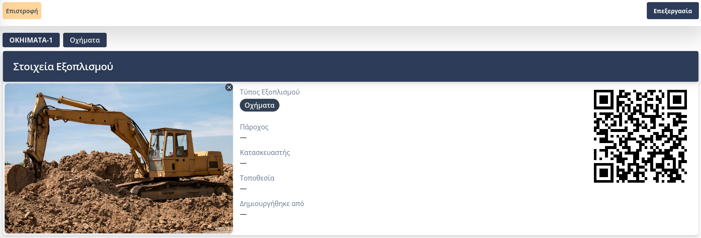
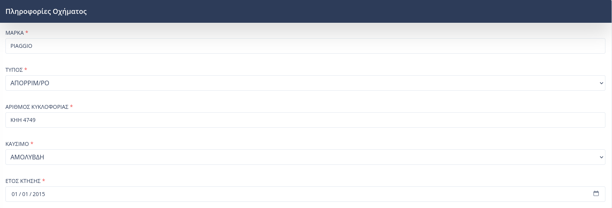
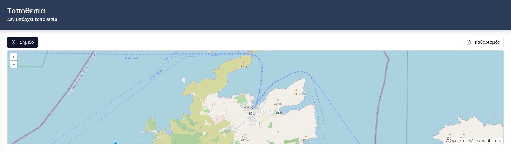

# Διαχείριση Εξοπλισμού

Η πλατφόρμα του **Συστήματος Διαχείρισης Υποδομών** επιτρέπει στους εσωτερικούς χρήστες την πλήρη καταγραφή, παρακολούθηση και γεωχωρική απεικόνιση του εξοπλισμού του Δήμου. Η πρόσβαση στη σχετική ενότητα γίνεται μέσω της καρτέλας **«Εξοπλισμός»** στην πλευρική μπάρα πλοήγησης.

---

## Επισκόπηση Εξοπλισμού
Στην κεντρική σελίδα της ενότητας, ο χρήστης έχει πρόσβαση σε έναν συγκεντρωτικό πίνακα που περιλαμβάνει βασικά πεδία πληροφορίας:
* **Τύπος Εξοπλισμού:** Η κατηγορία ή η [δυναμική φόρμα](04-dynamic-forms.html) στην οποία ανήκει το αντικείμενο.
* **Τοποθεσία:** Το γεωγραφικό σημείο ή η υποδομή όπου βρίσκεται εγκατεστημένος ο εξοπλισμός.
* **Γονέας:** Συσχέτιση με άλλον εξοπλισμό, στην περίπτωση που το αντικείμενο αποτελεί υπο-εξάρτημα μιας μεγαλύτερης μονάδας.

Ο χρήστης μπορεί να χρησιμοποιήσει τη **μπάρα αναζήτησης** για τον άμεσο εντοπισμό συγκεκριμένων καταχωρήσεων βάσει κειμένου.

Ο πίνακας προσφέρει επιπλέον λειτουργίες μέσω των ενεργειών σε κάθε γραμμή:
* **Επεξεργασία:** Τροποποίηση των στοιχείων του εξοπλισμού.
* **Διαγραφή:** Οριστική αφαίρεση της καταχώρησης από τη βάση δεδομένων.
* **Προεπισκόπηση QR:** Γρήγορη εμφάνιση του μοναδικού κωδικού QR που αντιστοιχεί στον συγκεκριμένο εξοπλισμό.

---

## Προσθήκη Νέου Εξοπλισμού
Η διαδικασία καταχώρησης νέου εξοπλισμού υλοποιείται σε δύο στάδια μέσω μιας καθοδηγούμενης φόρμας:

### Στάδιο 1: Βασικές Πληροφορίες
Ο χρήστης επιλέγει τη **Δυναμική Φόρμα** (Κατηγορία) στην οποία εντάσσεται ο εξοπλισμός και ορίζει την **Τοποθεσία** εγκατάστασής του. Παράλληλα, παρέχεται η δυνατότητα μεταφόρτωσης φωτογραφίας για την οπτική ταυτοποίηση του αντικειμένου. Τέλος ο χρήστης μπορεί να ορίσει **Γονέα** εξοπλισμό, στην περίπτωση που καταχωρούμενος εξοπλισμός είναι υποεξάρτημα ενός υπάρχοντα εξοπλισμού.

_Σημείωση: ένας εξοπλισμός που αποτελεί εξάρτημα κάποιου άλλου δεν μπορεί να αποτελέσει γονέα. Δηλαδή δεν μπορεί να έχει δικά του εξαρτήματα_

### Στάδιο 2: Λεπτομέρειες Εξοπλισμού
Στο δεύτερο στάδιο, ο χρήστης συμπληρώνει τα ειδικά πεδία που έχουν προκαθοριστεί στη δυναμική φόρμα (π.χ. για ένα όχημα: Μάρκα, Αριθμός Κυκλοφορίας, Τύπος Καυσίμου, Έτος Κτήσης).

---

## Καρτέλα Εξοπλισμού
Επιλέγοντας μια καταχώρηση από τον πίνακα ή σαρώνοντας τον αντίστοιχο κωδικό QR, ο χρήστης μεταφέρεται στην αναλυτική καρτέλα του εξοπλισμού, η οποία οργανώνεται στις εξής ενότητες:

1. **Στοιχεία Εξοπλισμού:** Γενικές πληροφορίες ταυτοποίησης και ο αυτόματα παραγόμενος **κωδικός QR** για χρήση στο πεδίο.
2. **Λεπτομέρειες:** Προβολή και διαχείριση των τεχνικών χαρακτηριστικών που ορίζονται από τη δυναμική φόρμα.
3. **Γεωχωρική Απεικόνιση (Χάρτης):** Εμφάνιση της ακριβούς θέσης στον χάρτη. Ο χρήστης μπορεί να ορίσει ή να διορθώσει το γεωμετρικό ίχνος (σημείο, γραμμή ή πολύγωνο). Περισσότερες λεπτομέρειες είναι διαθέσιμες στην ενότητα [Διαχείριση Τοποθεσιών](06-locations.html).
4. **Εγγυήσεις:** Πίνακας με όλες τις συνδεδεμένες εγγυήσεις που καλύπτουν το αντικείμενο.
5. **Βλάβες / Συντηρήσεις:** Ιστορικό και τρέχουσα κατάσταση των αιτημάτων βλαβών ή προγραμματισμένων συντηρήσεων που αφορούν τον συγκεκριμένο εξοπλισμό.

