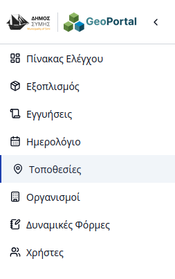
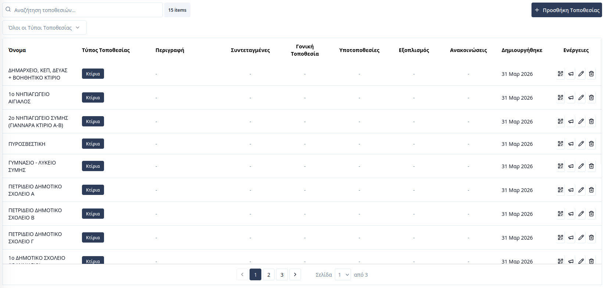
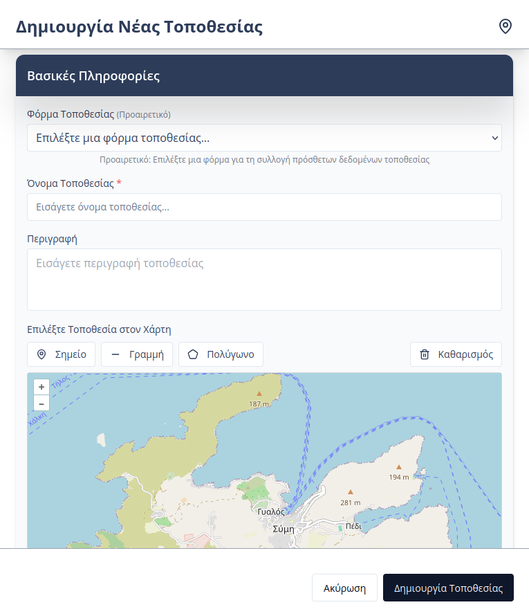
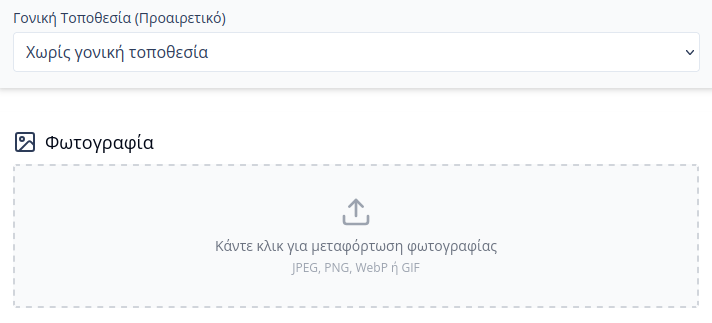
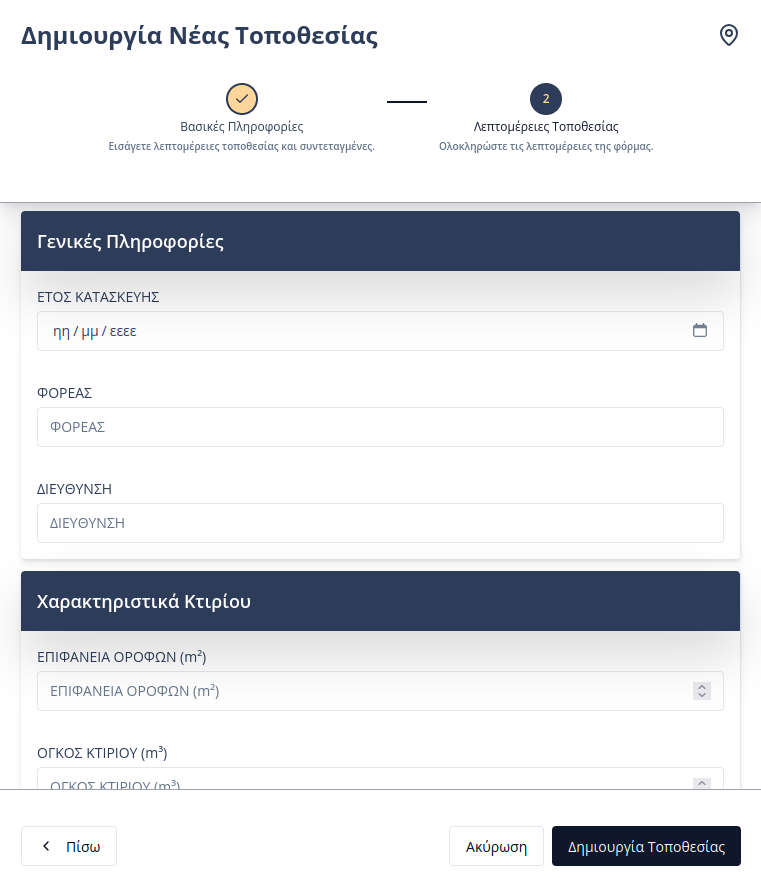
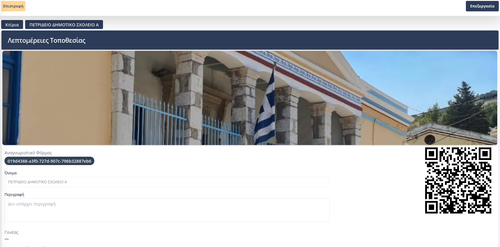
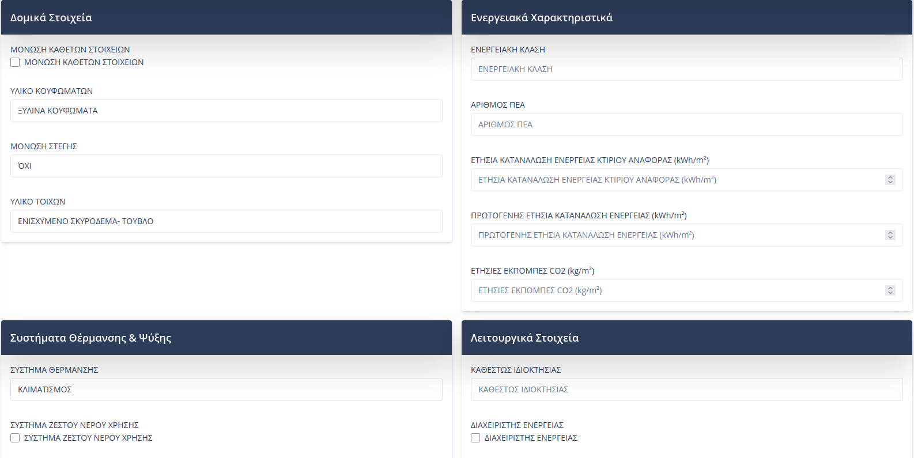
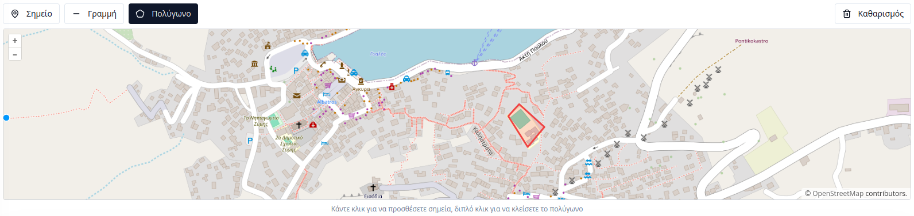
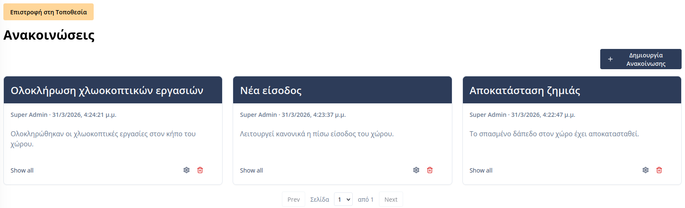

# Διαχείριση Τοποθεσιών

Η πλατφόρμα του **Συστήματος Διαχείρισης Υποδομών** παρέχει στους εσωτερικούς χρήστες τη δυνατότητα εποπτείας και γεωχωρικού προσδιορισμού των σημείων ενδιαφέροντος του Δήμου (κτίρια, πάρκα κ.λπ.). Η πρόσβαση στην ενότητα πραγματοποιείται επιλέγοντας την καρτέλα **«Τοποθεσίες»** από την πλευρική μπάρα πλοήγησης.

---

## Επισκόπηση Τοποθεσιών

Στην κεντρική σελίδα προβάλλεται ένας συγκεντρωτικός πίνακας με όλες τις καταχωρημένες τοποθεσίες. Τα βασικά πεδία πληροφορίας περιλαμβάνουν:

* **Όνομα:** Η επίσημη ονομασία της τοποθεσίας.
* **Τύπος Τοποθεσίας:** Η κατηγορία ή η [δυναμική φόρμα](04-dynamic-forms.html) στην οποία ανήκει.
* **Περιγραφή:** Συνοπτικές πληροφορίες για τον χώρο.
* **Συντεταγμένες:** Οπτική ένδειξη του τύπου γεωμετρίας (σημείο, γραμμή, πολύγωνο).
* **Γονική Τοποθεσία:** Συσχέτιση ιεραρχίας (π.χ. ένα συγκεκριμένο γραφείο εντός του Δημαρχείου).
* **Υποτοποθεσίες:** Το πλήθος των επιμέρους σημείων που υπάγονται στη συγκεκριμένη τοποθεσία.
* **Εξοπλισμός:** Ο αριθμός των μονάδων εξοπλισμού που είναι εγκατεστημένες στο σημείο.
* **Ανακοινώσεις:** Ο αριθμός των ενεργών ανακοινώσεων που αφορούν τη συγκεκριμένη τοποθεσία.

  

Οι χρήστες μπορούν να εντοπίσουν άμεσα μια καταχώρηση μέσω της **μπάρα αναζήτησης** ή εφαρμόζοντας **φίλτρα** βάσει τύπου τοποθεσίας. Μέσω των ενεργειών σε κάθε γραμμή, παρέχονται οι εξής δυνατότητες:
* **Προεπισκόπηση QR:** Εμφάνιση του μοναδικού κωδικού QR της τοποθεσίας.
* **Ανακοινώσεις:** Μετάβαση στη διαχείριση ανακοινώσεων της τοποθεσίας.
* **Επεξεργασία:** Τροποποίηση των στοιχείων ή της γεωμετρικής απεικόνισης.
* **Διαγραφή:** Οριστική αφαίρεση της τοποθεσίας από τη βάση δεδομένων.

  

### Διαχείριση Γεωμετρίας (Συντεταγμένες)
Οι τοποθεσίες ταξινομούνται στον πίνακα με ειδικές ετικέτες ανάλογα με τον τύπο του γεωμετρικού τους ίχνους:  

| Ετικέτα | Περιγραφή |
|:--------|:----------|
|  | Η τοποθεσία έχει οριστεί ως **Σημείο** |
|  | Η τοποθεσία έχει οριστεί ως **Γραμμή** |
|  | Η τοποθεσία έχει οριστεί ως **Πολύγωνο** |  

> **Σημείωση:** Κάνοντας κλικ πάνω στην ετικέτα των συντεταγμένων, οι γεωγραφικές πληροφορίες αντιγράφονται αυτόματα στο πρόχειρο (clipboard) για χρήση σε άλλες εφαρμογές.

---

## Προσθήκη Νέας Τοποθεσίας

Η διαδικασία προσθήκης υλοποιείται μέσω μιας καθοδηγούμενης φόρμας δύο σταδίων:

### Στάδιο 1: Βασικές Πληροφορίες & Χάρτης
Ο χρήστης συμπληρώνει τα στοιχεία ταυτοποίησης και προσδιορίζει γεωγραφικά την τοποθεσία στον χάρτη.

* **Τύπος Τοποθεσίας:** Επιλογή της κατάλληλης [δυναμικής φόρμας](04-dynamic-forms.html).
* **Γεωγραφικός Προσδιορισμός:** Χρήση των εργαλείων σχεδίασης για την αποτύπωση στον χάρτη.
* **Γονική Τοποθεσία:** Ορισμός ιεραρχικής σχέσης, εφόσον η τοποθεσία ανήκει σε άλλη μεγαλύτερη.
* **Φωτογραφίες:** Μεταφόρτωση αρχείων για την ευκολότερη οπτική αναγνώριση του χώρου.

#### Εργαλεία Σχεδίασης  

| Εργαλείο | Οδηγίες Χρήσης |
|:---------|:---------------|
|  | **Σημείο:** Απλό κλικ στον χάρτη για τοποθέτηση δείκτη (marker). |
|  | **Γραμμή:** Διαδοχικά κλικ για τη χάραξη διαδρομής· διπλό κλικ για ολοκλήρωση. |
|  | **Πολύγωνο:** Σχεδιασμός κλειστού σχήματος· διπλό κλικ για αυτόματο κλείσιμο. |  

### Στάδιο 2: Εξειδικευμένες Λεπτομέρειες
Εφόσον επιλέχθηκε συγκεκριμένος **Τύπος Τοποθεσίας**, το σύστημα προβάλλει τα παραμετροποιημένα πεδία της αντίστοιχης φόρμας (π.χ. Διεύθυνση, Τετραγωνικά Μέτρα, Όροφος).

---

## Καρτέλα Τοποθεσίας

Η αναλυτική προβολή κάθε τοποθεσίας περιλαμβάνει:

1. **Γενικές Πληροφορίες:** Βασικά στοιχεία ταυτοποίησης και ο μοναδικός κωδικός **QR**.
    
    
2. **Τεχνικά Χαρακτηριστικά & Χάρτης:** Προβολή των δεδομένων της δυναμικής φόρμας και της γεωχωρικής θέσης.
    
      
      
---

## Διαχείριση Ανακοινώσεων

Οι εσωτερικοί χρήστες έχουν τη δυνατότητα να αναρτούν ανακοινώσεις που συνδέονται με συγκεκριμένες τοποθεσίες. Οι πληροφορίες αυτές είναι άμεσα προσβάσιμες σε όποιον σαρώνει τον κωδικό QR της τοποθεσίας, διευκολύνοντας την ενημέρωση πολιτών ή συνεργατών.

  

Η πλήρης διαχείριση (δημιουργία, επεξεργασία, διαγραφή) των ανακοινώσεων πραγματοποιείται μέσω της καρτέλας της εκάστοτε τοποθεσίας.