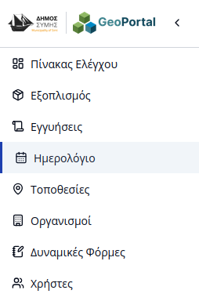
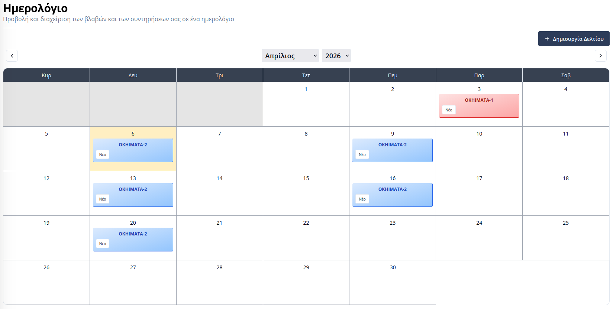
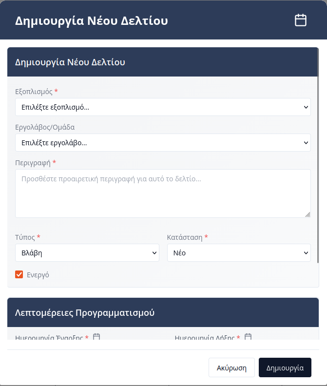
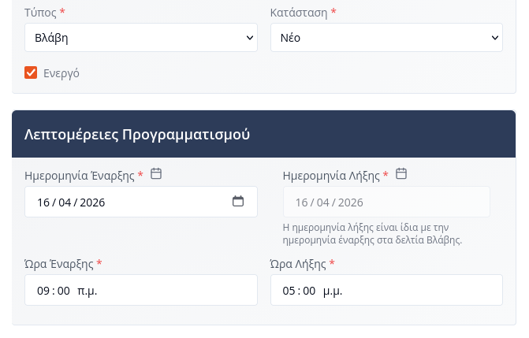
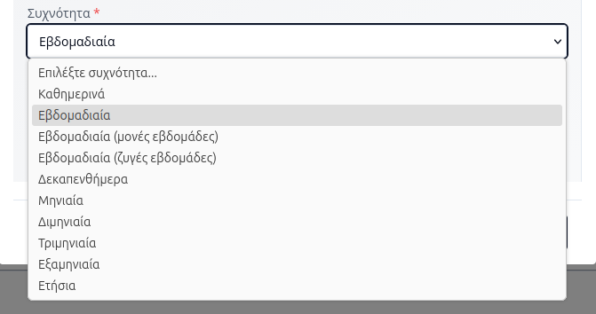
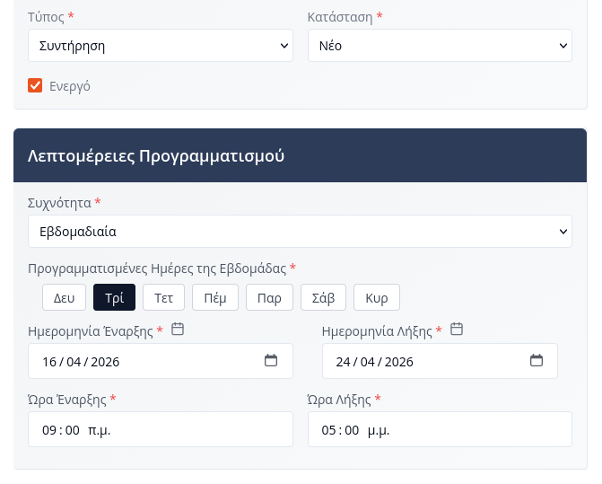
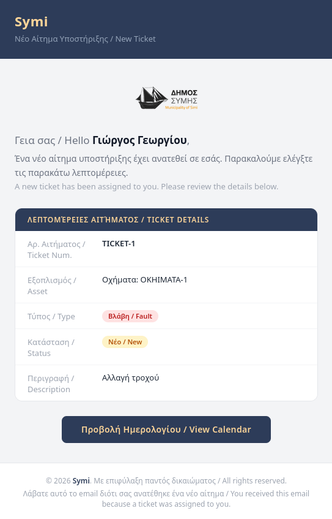
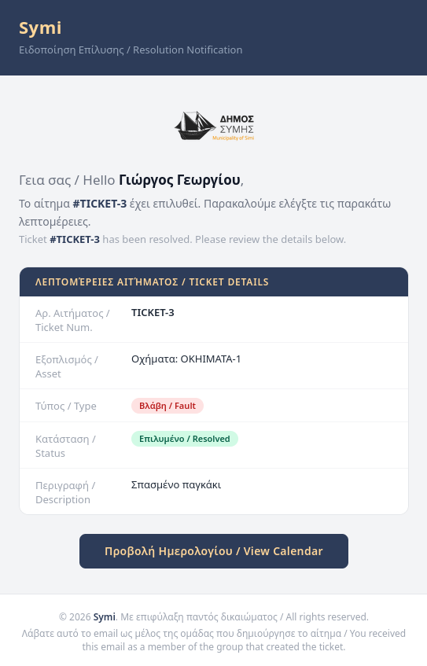

# Ημερολόγιο

Η πλατφόρμα του **Συστήματος Διαχείρισης Υποδομών** διαθέτει ένα ολοκληρωμένο **Ημερολόγιο**, το οποίο επιτρέπει στους χρήστες να έχουν μια εποπτική εικόνα όλων των εργασιών που αφορούν τον εξοπλισμό του Δήμου. Μέσω του ημερολογίου, πραγματοποιείται ο προγραμματισμός των συντηρήσεων και η παρακολούθηση της αποκατάστασης των βλαβών.

Η πρόσβαση στο Ημερολόγιο γίνεται από την πλευρική μπάρα πλοήγησης επιλέγοντας την καρτέλα **«Ημερολόγιο»**.

---

## Επισκόπηση Ημερολογίου

Στην κεντρική οθόνη του ημερολογίου, τα αιτήματα (tickets) εμφανίζονται ως έγχρωμες εγγραφές επάνω στις αντίστοιχες ημερομηνίες. Ο χρήστης μπορεί να πλοηγηθεί μεταξύ μηνών και ετών χρησιμοποιώντας τα βέλη πλοήγησης στο επάνω μέρος.

> **Σημείωση:** Η ορατότητα των δεδομένων εξαρτάται από τον ρόλο του χρήστη. Οι εσωτερικοί χρήστες του Δήμου έχουν πρόσβαση στο σύνολο των αιτημάτων, ενώ οι εξωτερικοί συνεργάτες (εργολάβοι) βλέπουν αποκλειστικά τα αιτήματα που έχουν ανατεθεί στην ομάδα τους.

### Τύποι Αιτημάτων (Ticket Types)
Τα αιτήματα κατηγοριοποιούνται βάσει της φύσης της εργασίας:
* **Βλάβη (Fault):** Αφορά έκτακτα περιστατικά και μη προγραμματισμένες ζημιές που απαιτούν άμεση παρέμβαση.
* **Συντήρηση (Maintenance):** Αφορά προγραμματισμένες εργασίες πρόληψης και ελέγχου.

---

## Δημιουργία Νέου Αιτήματος

Για την καταχώρηση μιας νέας εργασίας, ο χρήστης πατάει το κουμπί **«+ Δημιουργία αίτηματος»**. Στη φόρμα που αναδύεται, συμπληρώνονται τα εξής στοιχεία:

* **Εξοπλισμός:** Επιλογή της συγκεκριμένης μονάδας στην οποία αφορά το αίτημα.
* **Εργολάβος/Ομάδα:** Ανάθεση της εργασίας σε συγκεκριμένο εργολάβο ή τεχνική ομάδα (συμπεριλαμβανομένων των εσωτερικών συνεργείων του Δήμου).
* **Περιγραφή:** Αναλυτική καταγραφή του προβλήματος ή των εργασιών που πρέπει να εκτελεστούν.
* **Τύπος & Κατάσταση:** Καθορισμός της κατηγορίας (Βλάβη/Συντήρηση) και της αρχικής φάσης του αιτήματος.

---

## Προγραμματισμός Εργασιών

Ο χρονικός προγραμματισμός προσαρμόζεται ανάλογα με τον τύπο του αιτήματος:

### 1. Προγραμματισμός Βλάβης
Σε περίπτωση βλάβης, ο χρήστης ορίζει ένα συγκεκριμένο χρονικό παράθυρο (Ημερομηνία/Ώρα Έναρξης και Λήξης) για την εκτέλεση της αποκατάστασης.

### 2. Προγραμματισμός Συντήρησης (Επανάληψη)
Οι συντηρήσεις υποστηρίζουν τη λειτουργία **επανάληψης** (recurring events). Ο χρήστης μπορεί να επιλέξει από μια σειρά προκαθορισμένων συχνοτήτων:

#### Διαθέσιμοι Τύποι Συχνότητας  

| Τύπος Προγραμματισμού | Περιγραφή |
|:----------------------|:----------|
| **Καθημερινά** | Επανάληψη κάθε ημέρα. |
| **Εβδομαδιαία** | Επανάληψη την ίδια ημέρα κάθε εβδομάδα. |
| **Εβδομαδιαία (Μονές)** | Επανάληψη μόνο κατά τις μονές εβδομάδες του έτους. |
| **Εβδομαδιαία (Ζυγές)** | Επανάληψη μόνο κατά τις ζυγές εβδομάδες του έτους. |
| **Δεκαπενθήμερα** | Επανάληψη ανά 15 ημέρες. |
| **Μηνιαία** | Επανάληψη μία φορά το μήνα. |
| **Διμηνιαία** | Επανάληψη ανά δύο μήνες. |
| **Τριμηνιαία** | Επανάληψη ανά τρεις μήνες. |
| **Εξαμηνιαία** | Επανάληψη ανά έξι μήνες. |
| **Ετήσια** | Επανάληψη μία φορά το χρόνο. |

---

## Κύκλος Ζωής Αιτήματος (Status)

Κάθε αίτημα ακολουθεί μια συγκεκριμένη ροή εργασίας (workflow):

| Κατάσταση | Περιγραφή |
|:----------|:----------|
| **Νέο (New)** | Το αίτημα έχει δημιουργηθεί επιτυχώς και αναμένει επεξεργασία. |
| **Ανατέθηκε (Assigned)** | Έχει οριστεί ο υπεύθυνος εργολάβος ή η ομάδα εργασίας. |
| **Σε εξέλιξη (In Progress)** | Το συνεργείο έχει ξεκινήσει τις εργασίες υλοποίησης. |
| **Επιλύθηκε (Resolved)** | Η εργασία ολοκληρώθηκε από τον τεχνικό και αναμένει αξιολόγηση. |
| **Κλειστό (Closed)** | Το αίτημα ελέγχθηκε από τον Δήμο και αρχειοθετήθηκε οριστικά. |

---

## Ανάθεση & Ενημερώσεις

Η πλατφόρμα διασφαλίζει την άμεση ενημέρωση όλων των εμπλεκόμενων μερών μέσω αυτοματοποιημένων μηνυμάτων ηλεκτρονικού ταχυδρομείου (email).

### Ανάθεση σε Εργολάβο
Κατά την ανάθεση σε έναν εργολάβο, αποστέλλεται αυτόματη ειδοποίηση στους διαχειριστές της αντίστοιχης ομάδας.

### Ανάθεση σε Τεχνικό
Οι διαχειριστές του εργολάβου μπορούν να αναθέσουν το αίτημα σε συγκεκριμένο τεχνικό, ο οποίος λαμβάνει προσωπικό email ενημέρωσης.

---

## Ολοκλήρωση & Κλείσιμο

### Επίλυση Αιτήματος
Μόλις ο τεχνικός αλλάξει την κατάσταση σε **«Επιλύθηκε»**, οι υπάλληλοι του Δήμου ενημερώνονται αυτόματα για να προχωρήσουν σε έλεγχο.

### Οριστικό Κλείσιμο
Μετά την αξιολόγηση, το αίτημα ορίζεται ως **«Κλειστό»**. Η εργασία θεωρείται πλήρως διεκπεραιωμένη και το αίτημα κλειδώνει.
