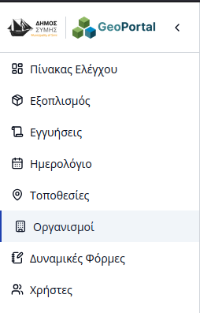
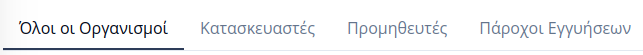
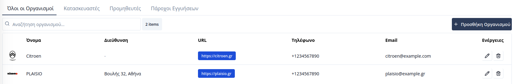
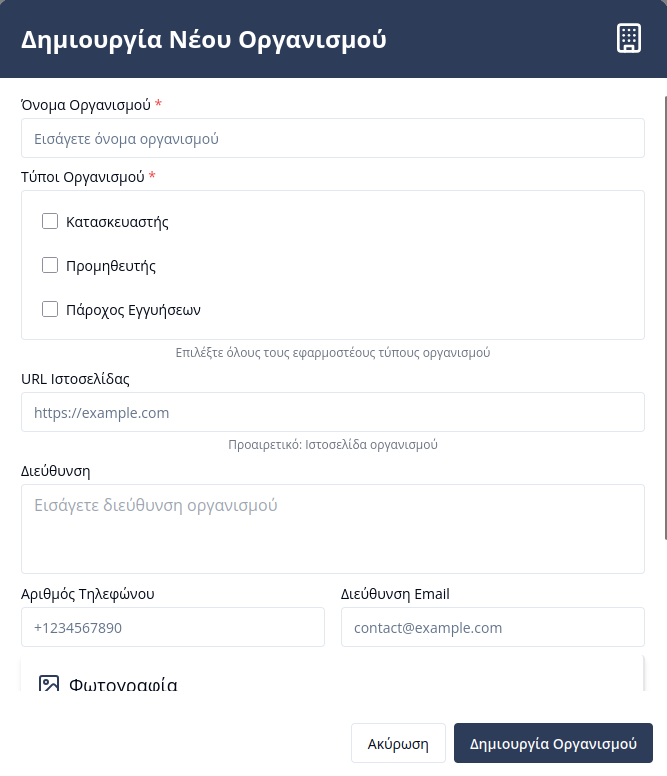

# Διαχείριση Οργανισμών

Η ενότητα **Οργανισμοί** επιτρέπει την κεντρική διαχείριση των οντοτήτων που σχετίζονται με τον εξοπλισμό του Δήμου. Μέσω αυτής της σελίδας, οι χρήστες μπορούν να καταχωρούν και να κατηγοριοποιούν εξωτερικούς συνεργάτες, προμηθευτές και κατασκευαστές, διασφαλίζοντας την ορθή ιχνηλασιμότητα των παγίων και των εγγυήσεών τους.

Για την πρόσβαση στη διαχείριση, ο χρήστης επιλέγει την καρτέλα **«Οργανισμοί»** από την πλευρική μπάρα πλοήγησης.

---

## Γενική Δομή

Η σελίδα οργανώνεται σε τέσσερις βασικές υποκαρτέλες. Κάθε υποκαρτέλα περιλαμβάνει έναν πίνακα με δυνατότητα **αναζήτησης**, ενώ το περιεχόμενο φιλτράρεται αυτόματα βάσει του ρόλου που έχει αποδοθεί στον οργανισμό:

1.  **Όλοι οι Οργανισμοί:** Πλήρης λίστα όλων των καταχωρημένων οργανισμών στο σύστημα.
2.  **Κατασκευαστές:** Οργανισμοί που ορίζονται ως κατασκευαστές εξοπλισμού.
3.  **Προμηθευτές:** Οργανισμοί που έχουν επισημανθεί ως προμηθευτές/πωλητές εξοπλισμού.
4.  **Πάροχοι Εγγύησης:** Οργανισμοί υπεύθυνοι για την τεχνική υποστήριξη και την κάλυψη εγγυήσεων.

Ο πίνακας προσφέρει επιπλέον λειτουργίες μέσω των ενεργειών σε κάθε γραμμή:
* **Επεξεργασία:** Τροποποίηση των στοιχείων του οργανισμού.
* **Διαγραφή:** Οριστική αφαίρεση της καταχώρησης από τη βάση δεδομένων.

  

---

## Δημιουργία Νέου Οργανισμού

Ο χρήστης μπορεί να προσθέσει έναν νέο οργανισμό πατώντας το κουμπί **«Προσθήκη Οργανισμού»**. Η διαδικασία πραγματοποιείται μέσω μιας αναδυόμενης φόρμας στη δεξιά πλευρά της οθόνης.

Κατά τη δημιουργία, συμπληρώνονται τα βασικά στοιχεία επικοινωνίας και ορίζεται η ιδιότητα του οργανισμού. 

> **Σημαντικό:** Ένας οργανισμός μπορεί να φέρει ταυτόχρονα πολλαπλές ιδιότητες (π.χ. να είναι ταυτόχρονα **Προμηθευτής** και **Πάροχος Εγγύησης**). Η επιλογή αυτή καθορίζει σε ποιες υποκαρτέλες θα εμφανίζεται ο οργανισμός, καθώς και σε ποια πεδία θα είναι διαθέσιμος κατά τη [Διαχείριση Εξοπλισμού](05-equipment.html).
