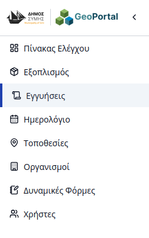
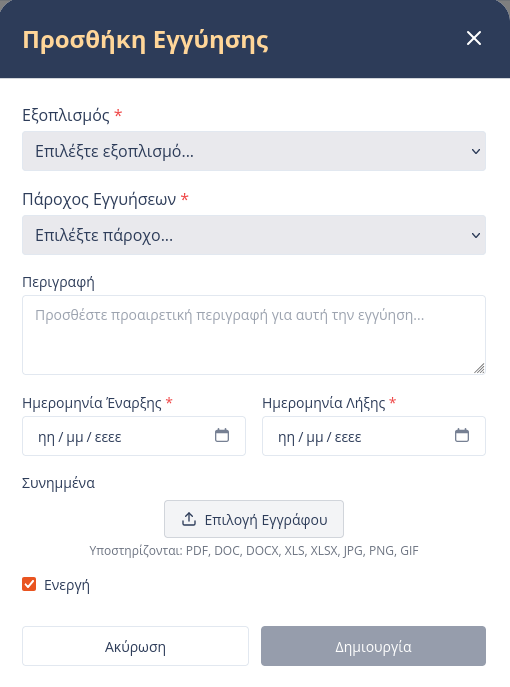
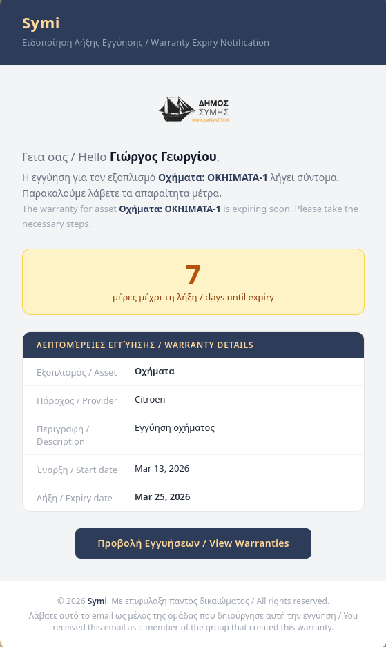

# Διαχείριση Εγγυήσεων & Αδειών

Η ενότητα **Εγγυήσεις & Άδειες** επιτρέπει την παρακολούθηση της χρονικής ισχύος και των καλύψεων που συνοδεύουν τον εξοπλισμό του Δήμου. Για την πρόσβαση στη διαχείριση, ο χρήστης επιλέγει την καρτέλα **«Εγγυήσεις»** από την πλευρική μπάρα πλοήγησης.

---

## Γενική Δομή

H σελίδα των εγγυήσεων περιλαμβάνει έναν ενιαίο συγκεντρωτικό πίνακα για όλες τις καταχωρήσεις. Ο πίνακας υποστηρίζει:

* **Αναζήτηση:** Εντοπισμός βάσει τίτλου εγγύησης ή κωδικού εξοπλισμού.
* **Φιλτράρισμα:** Δυνατότητα ταξινόμησης βάσει Παρόχου Εγγύησης ή ημερομηνίας λήξης.
* **Ενέργειες:** Κάθε γραμμή διαθέτει κουμπιά για **Επεξεργασία** (τροποποίηση στοιχείων) και **Διαγραφή** της εγγύησης.

---

## Προσθήκη Νέας Εγγύησης

Ο χρήστης μπορεί να καταχωρήσει μια νέα εγγύηση ή άδεια πατώντας το κουμπί **«Προσθήκη Εγγύησης»**. Κατά τη διαδικασία δημιουργίας, απαιτούνται τα εξής στοιχεία:

1.  **Πάροχος Εγγύησης & Οργανισμός:** Επιλογή του υπεύθυνου φορέα από τη λίστα των προκαθορισμένων [Οργανισμών](08-organizations.html).
2.  **Χρονικό Εύρος:** Ορισμός της ημερομηνίας έναρξης και λήξης της ισχύος της εγγύησης.
3.  **Μεταφόρτωση Αρχείων:** Δυνατότητα επισύναψης εγγράφων (π.χ. συμβόλαια σε μορφή PDF, πιστοποιητικά).
4.  **Σύνδεση με Εξοπλισμό:** Επιλογή των μονάδων εξοπλισμού που καλύπτονται από τη συγκεκριμένη εγγύηση.
5.  **Περιγραφή:** Λεκτική περιγραφή της εγγύησης.
6.  **Ενεργή:** Ορισμός μιας εγγύησης ενεργής ή ανενεργής.

---

## Ειδοποιήσεις Λήξης (Email)

Το σύστημα διαθέτει μηχανισμό αυτόματων ειδοποιήσεων. 

Οι διαχειριστές της πλατφόρμας λαμβάνουν αυτόματα **ενημερωτικό email** πριν από την ημερομηνία λήξης κάθε εγγύησης ή άδειας.

