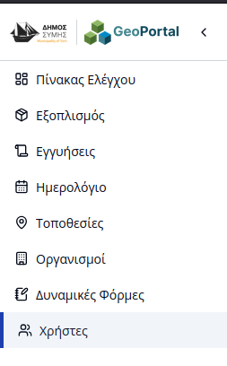
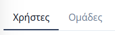
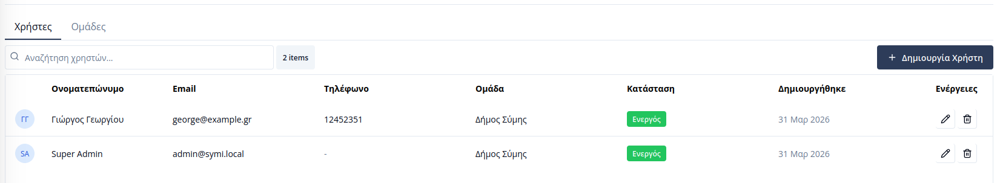
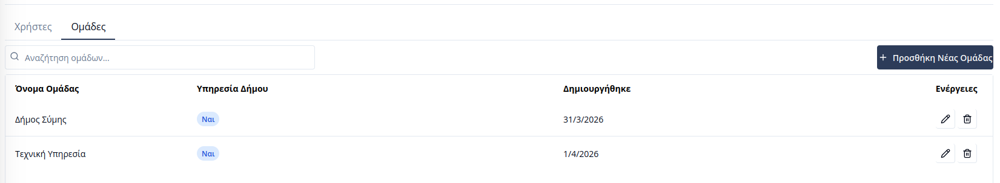
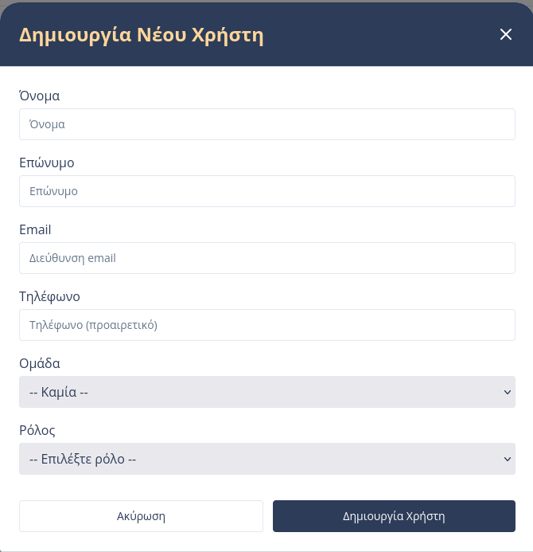
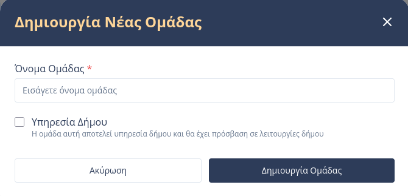

# Διαχείριση Χρηστών & Εργολάβων

Η ενότητα **Χρήστες** επιτρέπει τον έλεγχο πρόσβασης στην πλατφόρμα, τον ορισμό δικαιωμάτων και την οργάνωση των χρηστών σε ομάδες. Μέσω αυτής της σελίδας, οι διαχειριστές μπορούν να διαχωρίσουν το προσωπικό του Δήμου από τους εξωτερικούς συνεργάτες (εργολάβους).

Για την πρόσβαση στη διαχείριση, ο χρήστης επιλέγει την καρτέλα **«Χρήστες»** από την πλευρική μπάρα πλοήγησης.

---

## Γενική Δομή

Η σελίδα διαχείρισης οργανώνεται σε δύο βασικές υποκαρτέλες για τον διαχωρισμό των μεμονωμένων χρηστών από τις οργανωτικές δομές:

### 1. Υποκαρτέλα Χρήστες
Στην ενότητα αυτή προβάλλεται ένας συγκεντρωτικός πίνακας με όλους τους εγγεγραμμένους χρήστες του συστήματος. 

* **Αναζήτηση:** Δυνατότητα εύρεσης χρήστη βάσει ονόματος ή email.
* **Ενέργειες:** Κάθε γραμμή παρέχει επιλογές για **Επεξεργασία** των στοιχείων του χρήστη ή **Διαγραφή** του από το σύστημα.

### 2. Υποκαρτέλα Ομάδων
Εδώ εμφανίζονται οι δημιουργημένες ομάδες (π.χ. Τεχνική Υπηρεσία, Εξωτερικός Εργολάβος Καθαριότητας). Ο πίνακας επιτρέπει τη διαχείριση των ομαδοποιήσεων και των μελών τους.

---

## Δημιουργία Νέου Χρήστη

Ο διαχειριστής μπορεί να προσθέσει έναν νέο χρήστη πατώντας το κουμπί **«Δημιουργία Χρήστη»**. Η φόρμα δημιουργίας περιλαμβάνει τα εξής πεδία:

* **Όνομα / Επώνυμο:** Τα προσωπικά στοιχεία του χρήστη.
* **Email:** Η διεύθυνση που θα χρησιμοποιείται για τη σύνδεση και τις ειδοποιήσεις.
* **Τηλέφωνο:** Στοιχεία επικοινωνίας.
* **Ομάδα:** Επιλογή της ομάδας στην οποία ανήκει ο χρήστης.
* **Ρόλος:** Καθορισμός του επιπέδου πρόσβασης εντός της ομάδας.

---

## Ρόλοι & Δικαιώματα

Τα δικαιώματα πρόσβασης καθορίζονται συνδυαστικά από τον τύπο της **Ομάδας** (Εσωτερική Δήμου ή Εξωτερική Εργολάβου) και τον **Ρόλο** που ανατίθεται στον χρήστη.

### Α. Χρήστες Δήμου (Internal Groups)
Οι χρήστες που ανήκουν σε υπηρεσίες του Δήμου έχουν πλήρη ορατότητα στις λειτουργίες της πλατφόρμας.

| Ρόλοι | Δυναμικές Φόρμες | Εξοπλισμός | Τοποθεσίες | Αιτήματα | Ανακοινώσεις | Οργανισμοί | Εγγυήσεις & Άδειες | Χρήστες | Ομάδες |
|:---|:---:|:---:|:---:|:---:|:---:|:---:|:---:|:---|:---|
| **Υπερδιαχειριστής** | Όλα | Όλα | Όλα | Όλα | Όλα | Όλα | Όλα | Όλα | Όλα |
| **Διαχειριστής** | Όλα | Όλα | Όλα | Όλα | Όλα | Όλα | Όλα | Όλα εκτός από άλλους διαχειριστές και υπερδιαχειριστές | Όλα εκτός από επεξεργασία και διαγραφή της ομάδας του |
| **Χειριστής** | Όλα | Όλα | Όλα | Όλα | Όλα | Όλα | Όλα | Mόνο οπτικά χαρακτηριστικά του δικού του λογαριασμού | Κανένα |

### Β. Εργολάβοι (External Groups)
Οι εξωτερικοί συνεργάτες έχουν περιορισμένη πρόσβαση, εστιάζοντας αποκλειστικά στη διαχείριση των αιτημάτων που τους αφορούν.

| Ρόλοι | Δυναμικές Φόρμες | Εξοπλισμός | Τοποθεσίες | Αιτήματα | Ανακοινώσεις | Οργανισμοί | Εγγυήσεις & Άδειες | Χρήστες | Ομάδες |
|:---|:---:|:---:|:---:|:---:|:---:|:---:|:---:|:---|:---|
| **Διαχειριστής** | Κανένα | Κανένα | Κανένα | Επεξεργασία ανατεθημένου χρήστη & κατάστασης | Κανένα | Κανένα | Κανένα | Όλα για τους χρήστες της ομάδας του εκτός από άλλους διαχειριστές | Κανένα |
| **Χειριστής** | Κανένα | Κανένα | Κανένα | Επεξεργασία κατάστασης αιτήματος | Κανένα | Κανένα | Κανένα | Mόνο οπτικά χαρακτηριστικά του δικού του λογαριασμού | Κανένα |

---

## Δημιουργία Ομάδας

Πατώντας το κουμπί **«Δημιουργία Ομάδας»**, ο διαχειριστής μπορεί να ορίσει νέα σύνολα χρηστών. Κατά τη δημιουργία ορίζονται:

1.  **Όνομα Ομάδας:** Ο τίτλος της υπηρεσίας ή της εταιρείας.
2.  **Τύπος Ομάδας (Checkbox):** Καθορισμός αν η ομάδα είναι **Εσωτερική** (Υπηρεσία του Δήμου) ή **Εξωτερική** (Ιδιώτης Εργολάβος/Συνεργάτης).

> **Σημαντικό:** Η επιλογή του τύπου της ομάδας (Internal/External) είναι καθοριστική, καθώς ξεκλειδώνει διαφορετικά επίπεδα δικαιωμάτων για τους ρόλους που θα αποδοθούν στα μέλη της.