# Καρτέλα Χάρτης

## Περιγραφή
Η καρτέλα του **Χάρτη** είναι το κύριο περιβάλλον αλληλεπίδρασης της **Υποδομής Γεωχωρικών Πληροφοριών**. Περιλαμβάνει τον κύριο χάρτη, την εργαλειοθήκη και το δέντρο των θεματικών επιπέδων.

## Εργαλειοθήκη
Για το χειρισμό του χάρτη διατίθενται μια σειρά από χειριστήρια στην εργαλειοθήκη που βρίσκεται πάνω από το χάρτη.  

### Εργαλεία πλοήγησης

| Εικονίδιο                                    | Όνομα         | Περιγραφή                                                        |
|:---------------------------------------------|:--------------|:-----------------------------------------------------------------|
|       | Αριστερά      | Μετακινεί το χάρτη προς τα αριστερά                              |
|         | Πάνω          | Μετακινεί το χάρτη προς τα πάνω                                  |
|       | Κάτω          | Μετακινεί το χάρτη προς τα κάτω                                  |
|      | Δεξιά         | Μετακινεί το χάρτη προς τα δεξιά                                 |
|       | Μετακίνηση    | Ενεργοποίηση/Απενεργοποίηση της μετακίνησης του χάρτη με το ποντίκι|

### Εργαλεία εστίασης

| Εικονίδιο                                         | Όνομα                | Περιγραφή                                                                 |
|:--------------------------------------------------|:---------------------|:--------------------------------------------------------------------------|
|          | Εστίαση              | Εστίαση του χάρτη κατά μία βαθμίδα                                       |
|         | Αποεστίαση           | Αποεστίαση του χάρτη κατά μία βαθμίδα                                    |
|        | Εστίαση σε περιοχή   | Εστίαση του χάρτη στην περιοχή (ορθογώνιο) ενδιαφέροντος του χρήστη      |
|        | Πλήρης εστίαση       | Εστίαση του χάρτη στη χωρική έκταση του εκάστοτε χρησιμοποιούμενου υποβάθρου |
|        | Προηγούμενη εστίαση  | Εστίαση στην προηγούμενη εστίαση                                        |
|        | Επόμενη εστίαση      | Εστίαση στην επόμενη εστίαση                                            |

### Εργαλεία μέτρησης

| Εικονίδιο                                              | Όνομα                | Περιγραφή                                                        |
|:------------------------------------------------------|:---------------------|:-----------------------------------------------------------------|
|     | Μέτρηση Απόστασης    | Ενεργοποίηση/Απενεργοποίηση της λειτουργίας μέτρησης απόστασης   |
|         | Μέτρηση Εμβαδού      | Ενεργοποίηση/Απενεργοποίηση της λειτουργίας μέτρησης εμβαδού     |
|        | Καθαρισμός Μετρήσεων | Καθαρισμός των μετρήσεων που έχουν απεικονιστεί στο χάρτη        |

## Θεματικά Επίπεδα
Στην ενότητα «Θεματικά Επίπεδα», πραγματοποιείται η διαχείριση των χαρτογραφικών υποβάθρων (basemaps) και των θεματικών επιπέδων (layers). Τα χαρτογραφικά υπόβαθρα προέρχονται από διάφορες πηγές, όπως Google, OpenStreetMap κ.λπ. Τα θεματικά επίπεδα (layers) αντλούνται από διαδικτυακές γεωχωρικές υπηρεσίες (θέασης και τηλεφόρτωσης), οι οποίες βασίζονται σε αντίστοιχα ανοικτά πρότυπα του Open Geospatial Consortium (OGC).

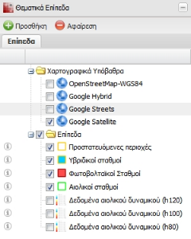

Οι διαθέσιμες λειτουργίες των θεματικών επιπέδων παρουσιάζονται συγκεντρωτικά στο σχήμα που ακολουθεί:

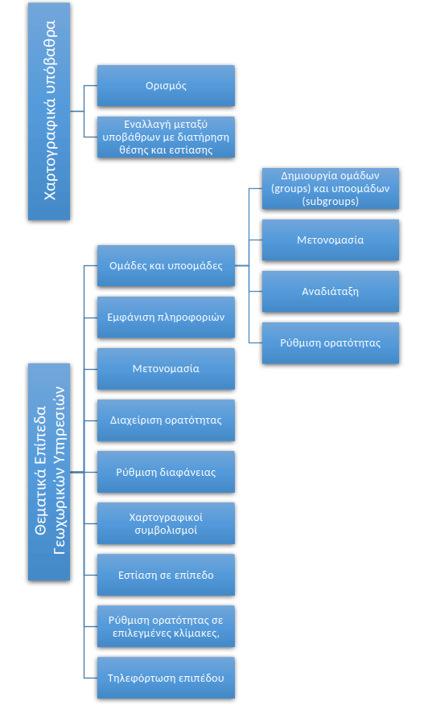

### Χαρτογραφικά υπόβαθρα
Τα χαρτογραφικά υπόβαθρα χρησιμοποιούνται προκειμένου να διευκολυνθεί ο προσανατολισμός, η απεικόνιση και η ερμηνεία των δεδομένων, καθώς παρέχουν πλούσια και λεπτομερή αναπαράσταση της φυσικής γήινης επιφάνειας και των χαρακτηριστικών. Τα υπόβαθρα είναι «στατικά» με την έννοια ότι δεν είναι δυνατή η άντληση περισσότερων πληροφοριών (π.χ. λειτουργία αναγνώρισης) από τα δεδομένα που απεικονίζονται σε αυτά, όπως με τα θεματικά επίπεδα που αντλούνται από γεωχωρικές υπηρεσίες.  

Από προεπιλογή, στην **Υποδομή Γεωχωρικών Πληροφοριών** διατίθενται τα υπόβαθρα της εταιρείας Google, του OpenStreetMap και οι Microsoft Bing Maps. Τα υπόβαθρα προσφέρονται με άδεια χρήσης που καθορίζεται από τους παρόχους τους. Ειδικότερα:
- [Άδεια χρήσης για τα ψηφιακά υπόβαθρα Google Maps](http://www.google.com/intl/en_ALL/help/terms_maps.html)
- Άδεια χρήσης για τα ψηφιακά υπόβαθρα OpenStreetMap: [Creative Commons Attribution-Share Alike 2.0 Generic License](http://creativecommons.org/licenses/by-sa/2.0/)
- [Όροι για τα ψηφιακά υπόβαθρα Microsoft Bing Maps](http://www.microsoft.com/maps/Licensing/licensing.aspx)

Η αποδοχή των όρων έγκειται στην επιλογή του χρήστη. Σε περίπτωση μη αποδοχής, τα υπόβαθρα μπορούν να αφαιρεθούν ή να προστεθούν άλλα τροποποιώντας τον πηγαίο κώδικα της εφαρμογής. 

### Θεματικά Επίπεδα Γεωχωρικών Υπηρεσιών

#### Ομάδες και υποομάδες
Η εφαρμογή παρέχει τη δυνατότητα εννοιολογικής, θεματικής κ.λπ. κατηγοριοποίησης των δεδομένων. Η κατηγοριοποίηση επιτυγχάνεται με τη δημιουργία ομάδων (και υποομάδων) με συναφή θεματικά επίπεδα. Όλες οι ομάδες τοποθετούνται ιεραρχικά κάτω από την ομάδα «Επίπεδα».

##### Δημιουργία Ομάδων (groups) και υποομάδων (subgroups)
1. Επιλέγουμε την ομάδα «Επίπεδα» και στη συνέχεια πατάμε δεξί κλικ.  
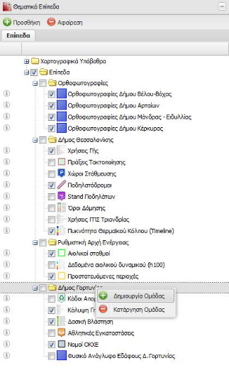
2. Επιλέγουμε «Δημιουργία Ομάδας» από το αναδυόμενο μενού.
3. Πατάμε διπλό αριστερό κλικ στον τίτλο της ομάδας που δημιουργήθηκε και έχει από προεπιλογή τον τίτλο «Νέα ομάδα» και πληκτρολογούμε το όνομα που επιθυμούμε.  
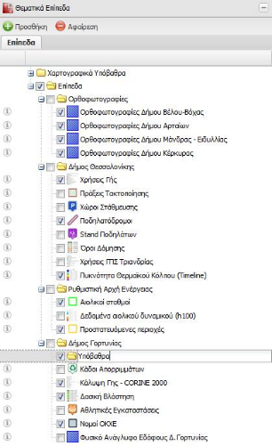

Επαναλαμβάνοντας την ίδια διαδικασία μπορούμε να δημιουργήσουμε και υποπομάδα(ες) επιλέγοντας την κατάλληλη κάθε φορά «γονική» ομάδα.  

Αξίζει να σημειωθεί ότι δεν υπάρχει περιορισμός στο πλήθος των ομάδων και υποομάδων που μπορούν να δημιουργηθούν, παρέχοντας έτσι τη δυνατότητα πλήρους κατηγοριοποίησης των θεματικών επιπέδων.  

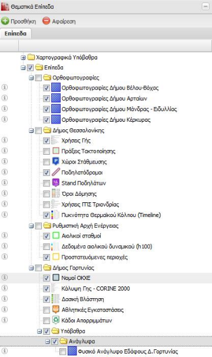

##### Μετονομασία Ομάδας
Στην περίπτωση που θέλουμε να μετονομάσουμε μία ομάδα, πατάμε διπλό αριστερό κλικ στον τίτλο της ομάδας που έχουμε επιλέξει και την μετονομάζουμε όπως επιθυμούμε.

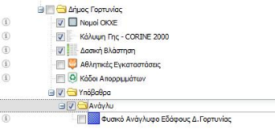

##### Αναδιάταξη
Αφού δημιουργηθεί η ομάδα, μπορούμε να επιλέξουμε το(α) θεματικό(ά) επίπεδο(α) που μας ενδιαφέρουν

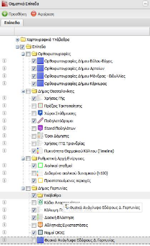

Τέλος, ταξινομούμε τα επίπεδα όπως επιθυμούμε.

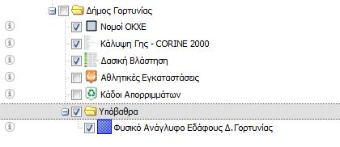

##### Ρύθμιση ορατότητας
Επιλέγοντας ή αποεπιλέγοντας το στοιχείο ελέγχου, δίπλα σε κάθε όνομα ομάδας ή υποομάδας, αυτόματα ρυθμίζεται η ορατότητα όλων των υποομάδων και επιπέδων που βρίσκονται κάτω από την επιλεγμένη ομάδα.

#### Εμφάνιση Πληροφοριών
Στην περίπτωση που κάποιο επίπεδο προέρχεται από υπηρεσίες OGS όπως WMS, WFS, WMTS, πατώντας δεξί κλικ πάνω στο επίπεδο, μπορούμε να εμφανίζουμε τις πληροφορίες επικοινωνίας σχετικά με την υπηρεσία από την οποία αντλείται το επίπεδο αυτό.

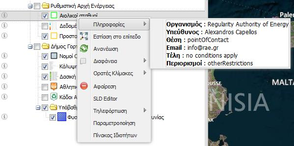

#### Μετονομασία Επιπέδου
Για την αλλαγή του τίτλου ενός θεματικού επιπέδου, επιλέγουμε το επιθυμητό επίπεδο και πατάμε διπλό κλικ πάνω στον τίτλο.

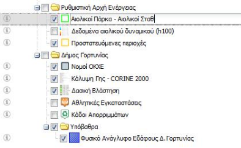

Στη συνέχεια πληκτρολογούμε το νέο τίτλο του θεματικού επιπέδου και πατάμε “Enter”.

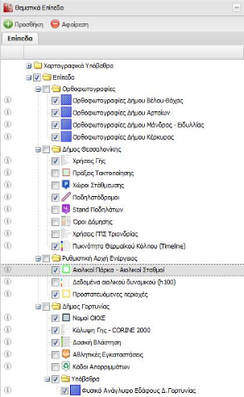

#### Διαχείριση Ορατότητας
Ενεργοποιώντας ή απενεργοποιώντας μία ομάδα μέσω του στοιχείου τσεκαρίσματος, αυτόματα καθορίζεται και η ορατότητα όλων των επιπέδων και υποομάδων που περιλαμβάνονται σε αυτή.

#### Ρύθμιση Διαφάνειας
Η επιλογή «Διαφάνεια» ορίζει το ποσοστό της διαφάνειας του θεματικού επιπέδου στο χάρτη.

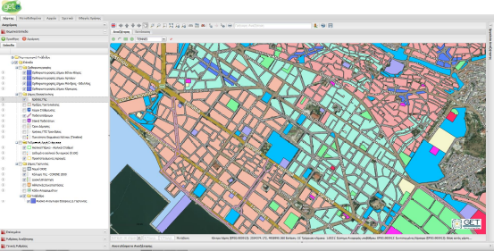

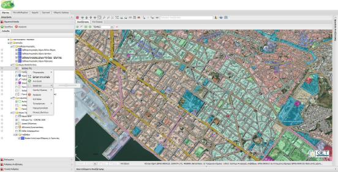

#### Ρύθμιση Διαφάνειας
Η επιλογή «SLD Editor», προσφέρει τη δυνατότητα επεξεργασίας του γραφικού του θεματικού επιπέδου, εφόσον αυτό προέρχεται από υπηρεσία WMS.

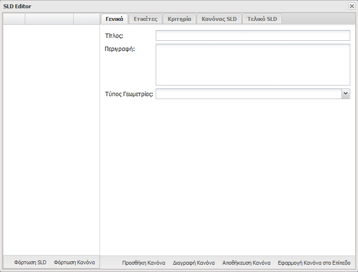

Από την καρτέλα «Γενικά», ορίζουμε τον τίτλο και τη περιγραφή του νέου γραφικού κανόνα.  

Στη συνέχεια επιλέγουμε τον τύπο της γεωμετρίας και ορίζουμε τα γραφικά (π.χ. περίγραμμα, γέμισμα), για τον κανόνα.

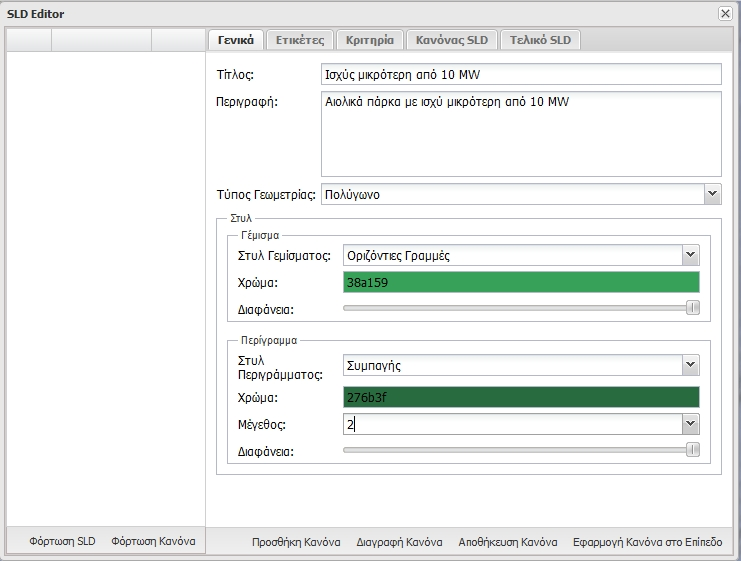

Στη συνέχεια εφόσον επιθυμούμε να προσθέσουμε ετικέτες στο νέο κανόνα, ορίζουμε από τη καρτέλα «Ετικέτες», την ιδιότητα που θέλουμε να απεικονίσουμε ως ετικέτα.

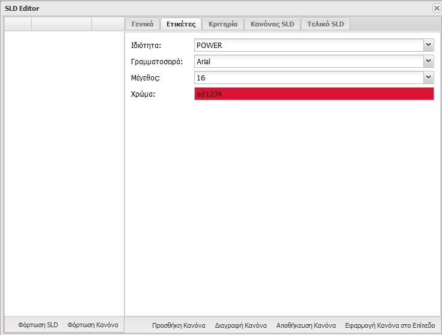

Στη συνέχεια, εφόσον επιθυμούμε, ορίζουμε τα κριτήρια στα οποία θα τεθεί σε εφαρμογή ο νέος κανόνας.

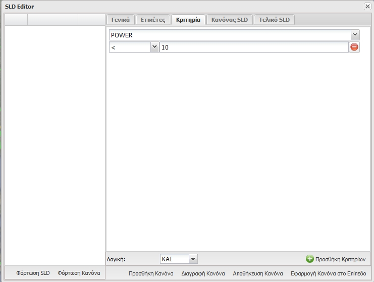

Οι καρτέλες «Κανόνας SLD» και «Τελικό SLD», εμφανίζουν σε μορφή xml τον κανόνα και συνολικά όλο το SLD που έχει δημιουργηθεί, αντίστοιχα.

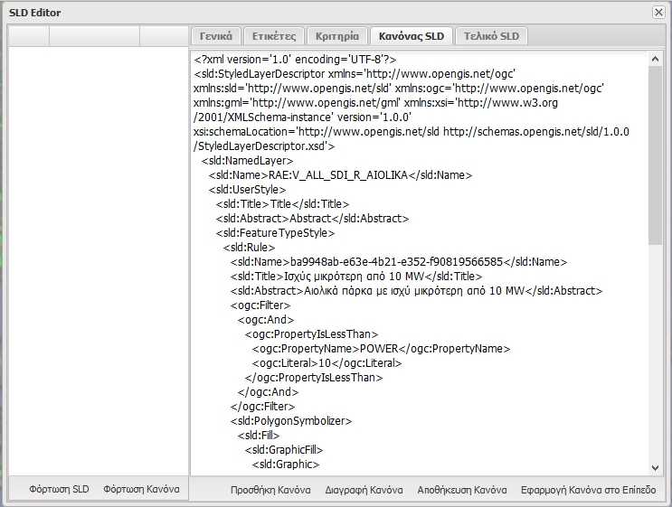

Στη συνέχεια πατάμε «Αποθήκευση Κανόνα» και επαναλαμβάνουμε τα παραπάνω βήματα για όσους κανόνες θέλουμε να δημιουργήσουμε.

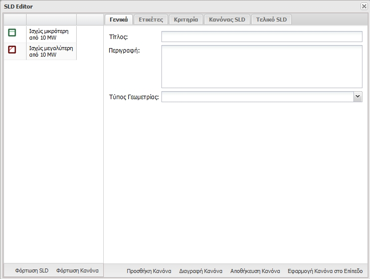

Τέλος, πατάμε «Εφαρμογή Κανόνα στο Επίπεδο», για να τεθεί το νέο γραφικό στο θεματικό επίπεδο.

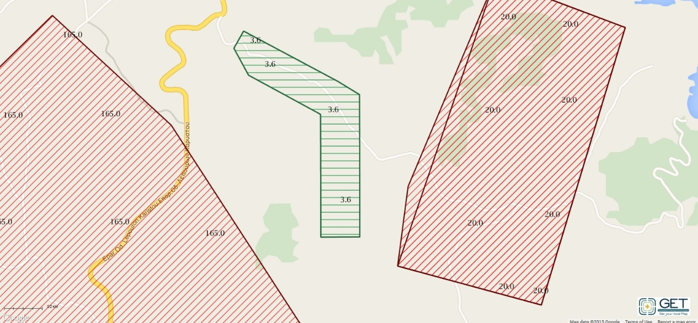

Με τον ίδιο τρόπο μπορούμε να επεξεργαστούμε ήδη δημιουργημένα γραφικά.

#### Εστίαση στο επίπεδο
Η επιλογή «Εστίαση στο επίπεδο» εστιάζει το χάρτη στην έκταση του θεματικού επιπέδου.  

_Σημείωση: Η έκταση του θεματικού επιπέδου αντλείται από την υπηρεσία OGC (WMS, WFS, WMTS) από την οποία αντλείται το θεματικό επίπεδο. Σε κάθε άλλη περίπτωση και εφόσον πρόκειται για διανυσματικά επίπεδα, η έκταση ορίζεται ως η έκταση του συνόλου των γεωχωρικών δεδομένων._  

#### Ρύθμιση Ορατότητας σε επιλεγμένες κλίμακες
Η επιλογή «Ορατές κλίμακες», καθορίζει την εμφάνιση η όχι του θεματικού επιπέδου, ανά προεπιλεγμένο εύρος κλίμακας του χάρτη.

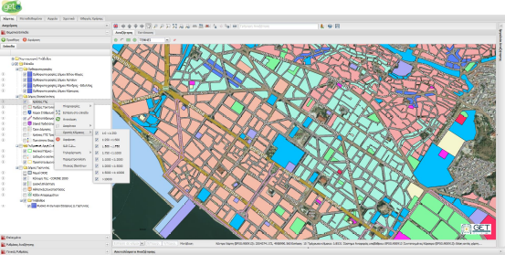

#### Ανανέωση
Η επιλογή «Ανανέωση», εκτελεί τη λειτουργία της ανανέωση του θεματικού επιπέδου.

#### Αφαίρεση
Η επιλογή «Αφαίρεση», αφαιρεί το θεματικό επίπεδο από το χάρτη.

#### Τηλεφόρτωση
Με την επιλογή «Τηλεφόρτωση», μπορούμε να κατεβάσουμε το θεματικό επίπεδο από την υπηρεσία σε μορφότυπους: CSV, KML, ShapeFile, SVG, Tiff, εφόσον αυτό υποστηρίζεται από την υπηρεσία. Η τηλεφόρτωση ενεργοποιείται μόνο για επίπεδα WMS και WFS.

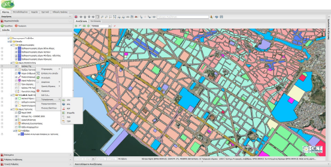

Στις επιλογές Shapefile ή CSV, δίνεται η δυνατότητα επιλογής κωδικοποίησης χαρακτήρων και συστήματος συντεταγμένων.

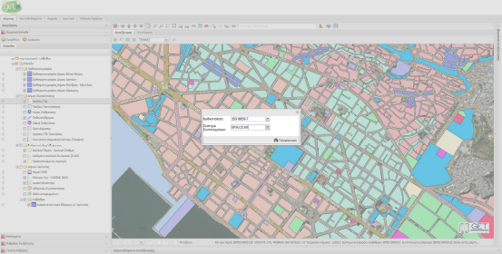

### Προσθήκη Υπηρεσιών
Η **Υποδομή Γεωχωρικών Πληροφοριών**, μέσω της καρτέλα «Διαχείριση Υπηρεσιών», μπορεί να αντλήσει θεματικά επίπεδα από διάφορες υπηρεσίες OGC και μη. Για την εμφάνιση της καρτέλας, πατάμε το κουμπί «Προσθήκη» στη καρτέλα «Θεματικά Επίπεδα».

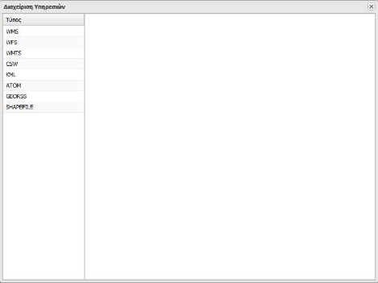

Για την προσθήκη/αφαίρεση θεματικών επιπέδων, επιλέγουμε από την αριστερή λίστα τον τύπο της υπηρεσίας που επιθυμούμε. Στη συνέχεια ανάλογα με τον τύπο της υπηρεσίας ακολουθούμε τα παρακάτω βήματα.

#### WMS
Μέσω της καρτέλας «Διαχείριση Υπηρεσιών WMS», μπορούμε να αντλήσουμε τα θεματικά επίπεδα που είναι διαθέσιμα μέσω μιας υπηρεσίας WMS και να τα απεικονίσουμε στο χάρτη.

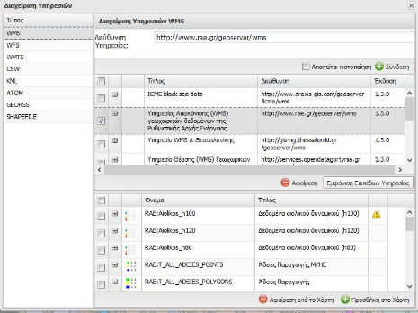

Πληκτρολογούμε στο πεδίο «Διεύθυνση Υπηρεσίας» την Διαδικτυακή διεύθυνση της υπηρεσίας από την οποία θέλουμε να αντλήσουμε δεδομένα και πατάμε το κουμπί «Σύνδεση».  

_Σημείωση: Σε περίπτωση που απαιτείται πιστοποίηση για την υπηρεσία, επιλέγουμε και την επιλογή «Απαιτείται πιστοποίηση» και ορίζουμε τα διαπιστευτήρια στα αντίστοιχα πεδία στο αναδυόμενο παράθυρο πιστοποίησης._

Στη συνέχεια, εφόσον είναι σωστή η διεύθυνση, αυτή προστίθεται στη λίστα των υπηρεσιών και εμφανίζεται η έκδοση και ο τίτλος της υπηρεσίας.

Επιλέγουμε την υπηρεσία από τη λίστα και πατάμε το κουμπί «Εμφάνιση Επιπέδων Υπηρεσίας», για να εμφανιστούν σε λίστα τα επίπεδα που περιλαμβάνει η υπηρεσία αυτή.

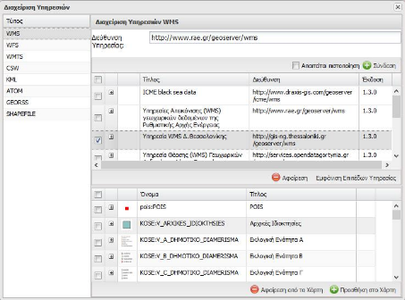

Μετακινώντας το ποντίκι πάνω στο γραφικό, αυτό εμφανίζεται μεγεθυμένο σε αναδυόμενο παράθυρο.

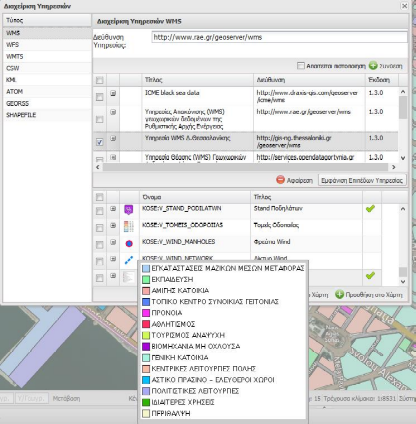

Στη συνέχεια από τη λίστα επιλέγουμε τα επίπεδα που θέλουμε και πατάμε το κουμπί «Προσθήκη στο Χάρτη» για να φορτώσουμε το επίπεδο στο χάρτη.

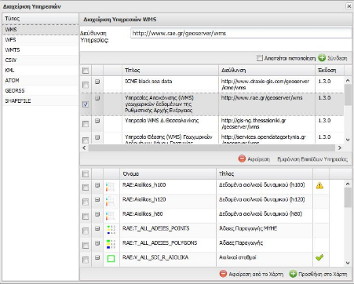

Εφόσον είναι επιτυχής η προσθήκη των επιπέδων στο χάρτη, θα εμφανιστεί μία ένδειξη δίπλα στο θεματικό επίπεδο.  

| Ένδειξη                                              | Επεξήγηση                                                                                                                        |
|:-----------------------------------------------------|:----------------------------------------------------------------------------------------------------------------------------------|
|  | Το επίπεδο φορτώθηκε επιτυχώς                                                                                                     |
|  | Το επίπεδο φορτώθηκε επιτυχώς, αλλά δεν έχουν αντληθεί οι απαραίτητες πληροφορίες (π.χ. σύστημα αναφοράς, πεδίο γεωμετρίας) και δεν θα είναι διαθέσιμες οι υπηρεσίες αναζήτησης και αναγνώρισης |

Αυτόματα τα επίπεδα εμφανίζονται στη καρτέλα «Θεματικά επίπεδα».

#### WFS / WFS-T
Μέσω της καρτέλας «Διαχείριση Υπηρεσιών WFS», μπορούμε να αντλήσουμε τα θεματικά επίπεδα που είναι διαθέσιμα μέσω μιας υπηρεσίας WFS και να τα απεικονίσουμε στο χάρτη.

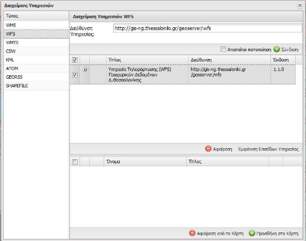

Πληκτρολογούμε στο πεδίο «Διεύθυνση Υπηρεσίας» την Διαδικτυακή διεύθυνση της υπηρεσίας από την οποία θέλουμε να αντλήσουμε δεδομένα και πατάμε το κουμπί «Σύνδεση».  

_Σημείωση: Σε περίπτωση που απαιτείται πιστοποίηση για την υπηρεσία, επιλέγουμε και την επιλογή «Απαιτείται πιστοποίηση» και ορίζουμε τα διαπιστευτήρια στα αντίστοιχα πεδία στο αναδυόμενο παράθυρο πιστοποίησης._  

Στη συνέχεια, εφόσον είναι σωστή η διεύθυνση, αυτή προστίθεται στη λίστα των υπηρεσιών και εμφανίζεται η έκδοση και ο τίτλος της υπηρεσίας.  

Επιλέγουμε την υπηρεσία από τη λίστα και πατάμε το κουμπί «Εμφάνιση Επιπέδων Υπηρεσίας», για να εμφανιστούν σε λίστα τα επίπεδα που περιλαμβάνει η υπηρεσία αυτή.

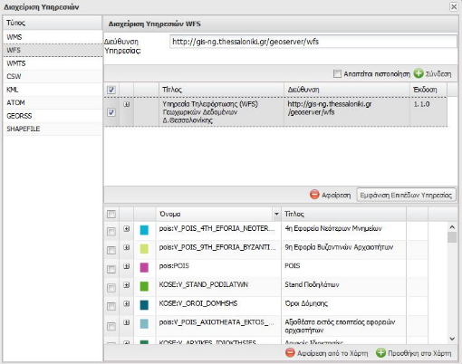

Στη συνέχεια από τη λίστα επιλέγουμε τα επίπεδα που θέλουμε και πατάμε το κουμπί «Προσθήκη στο Χάρτη» για να φορτώσουμε το επίπεδο στο χάρτη.

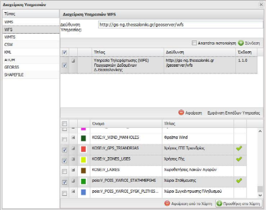

Εφόσον είναι επιτυχής η προσθήκη των επιπέδων στο χάρτη, θα εμφανιστεί μία ένδειξη δίπλα στο θεματικό επίπεδο.  

Αυτόματα τα επίπεδα εμφανίζονται στη καρτέλα «Θεματικά επίπεδα».

#### WMTS
Μέσω της καρτέλας «Διαχείριση Υπηρεσιών WMTS», μπορούμε να αντλήσουμε τα θεματικά επίπεδα που είναι διαθέσιμα μέσω μιας υπηρεσίας WMTS και να τα απεικονίσουμε στο χάρτη.

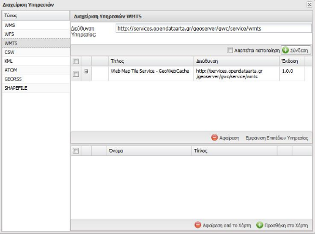

Πληκτρολογούμε στο πεδίο «Διεύθυνση Υπηρεσίας» τη Διαδικτυακή διεύθυνση της υπηρεσίας από την οποία θέλουμε να αντλήσουμε δεδομένα και πατάμε το κουμπί «Σύνδεση».  

_Σημείωση: Σε περίπτωση που απαιτείται πιστοποίηση για την υπηρεσία, επιλέγουμε και την επιλογή «Απαιτείται πιστοποίηση» και ορίζουμε τα διαπιστευτήρια στα αντίστοιχα πεδία στο αναδυόμενο παράθυρο πιστοποίησης._

Στη συνέχεια, εφόσον είναι σωστή η διεύθυνση, αυτή προστίθεται στη λίστα των υπηρεσιών και εμφανίζεται η έκδοση και ο τίτλος της υπηρεσίας.  

Επιλέγουμε την υπηρεσία από τη λίστα και πατάμε το κουμπί «Εμφάνιση Επιπέδων Υπηρεσίας», για να εμφανιστούν σε λίστα τα επίπεδα που περιλαμβάνει η υπηρεσία αυτή.  

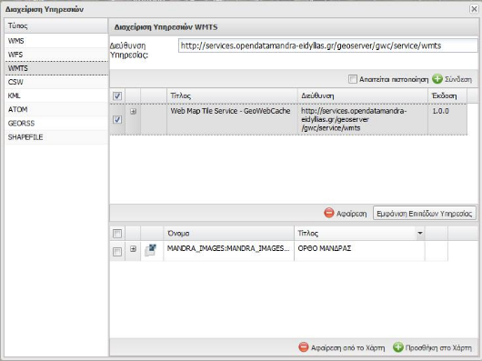

Στη συνέχεια από τη λίστα επιλέγουμε τα επίπεδα που θέλουμε και πατάμε το κουμπί «Προσθήκη στο Χάρτη» για να φορτώσουμε το επίπεδο στο χάρτη.

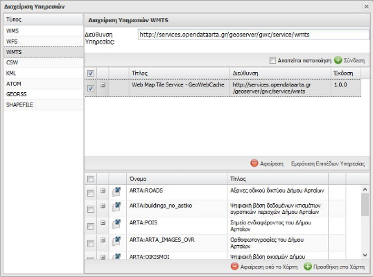

Εφόσον είναι επιτυχής η προσθήκη των επιπέδων στο χάρτη, θα εμφανιστεί μία ένδειξη δίπλα στο θεματικό επίπεδο.  

Αυτόματα τα επίπεδα εμφανίζονται στη καρτέλα «Θεματικά επίπεδα».

#### KMI

Μέσω της καρτέλας «Διαχείριση Υπηρεσιών KML», μπορούμε απεικονίσουμε τις οντότητες ενός KML αρχείου στο χάρτη.  

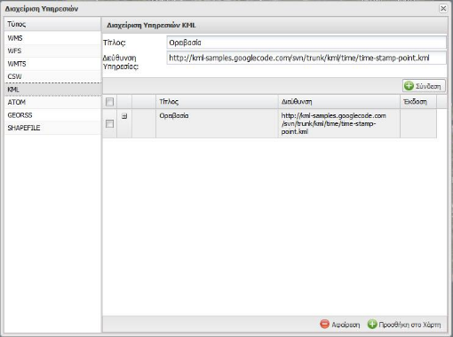

Πληκτρολογούμε στο πεδίο «Διεύθυνση Υπηρεσίας» την Διαδικτυακή διεύθυνση του KML από την οποία θέλουμε να αντλήσουμε δεδομένα και πατάμε το κουμπί «Σύνδεση».  

Στη συνέχεια, εφόσον είναι σωστή η διεύθυνση, αυτή προστίθεται στη λίστα των δεδομένων.  

Στη συνέχεια από τη λίστα επιλέγουμε τα επίπεδα που θέλουμε και πατάμε το κουμπί «Προσθήκη στο Χάρτη» για να φορτώσουμε το επίπεδο στο χάρτη.  

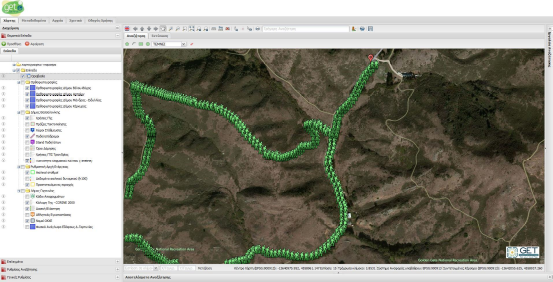

Σημειώνεται ότι οι λειτουργίες αναζήτησης δεν υποστηρίζονται στα αρχεία KML.

#### Atom
Μέσω της καρτέλας «Διαχείριση Υπηρεσιών Atom», μπορούμε απεικονίσουμε τις οντότητες ενός Atom αρχείου στο χάρτη.

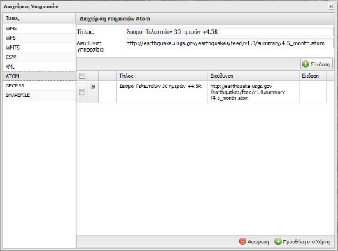

Πληκτρολογούμε στο πεδίο «Διεύθυνση Υπηρεσίας» την Διαδικτυακή διεύθυνση του Atom από την οποία θέλουμε να αντλήσουμε δεδομένα και πατάμε το κουμπί «Σύνδεση».  

Στη συνέχεια, εφόσον είναι σωστή η διεύθυνση, αυτή προστίθεται στη λίστα των δεδομένων.  

Στη συνέχεια από τη λίστα επιλέγουμε τα επίπεδα που θέλουμε και πατάμε το κουμπί «Προσθήκη στο Χάρτη» για να φορτώσουμε το επίπεδο στο χάρτη.  

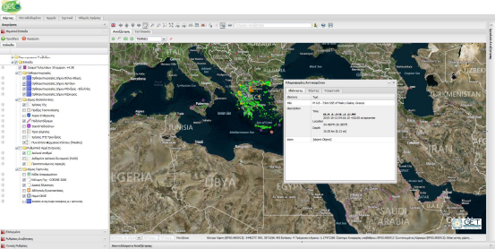

Σημειώνεται ότι οι λειτουργίες αναζήτησης δεν υποστηρίζονται στα αρχεία Atom.

#### GeoRSS
Μέσω της καρτέλας «Διαχείριση Υπηρεσιών GeoRSS», μπορούμε απεικονίσουμε τις οντότητες ενός GeoRSS αρχείου στο χάρτη.

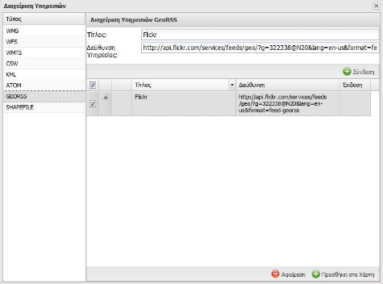

Πληκτρολογούμε στο πεδίο «Διεύθυνση Υπηρεσίας» την Διαδικτυακή διεύθυνση του Atom από την οποία θέλουμε να αντλήσουμε δεδομένα και πατάμε το κουμπί «Σύνδεση».

Στη συνέχεια, εφόσον είναι σωστή η διεύθυνση, αυτή προστίθεται στη λίστα των δεδομένων.

Στη συνέχεια από τη λίστα επιλέγουμε τα επίπεδα που θέλουμε και πατάμε το κουμπί «Προσθήκη στο Χάρτη» για να φορτώσουμε το επίπεδο στο χάρτη.

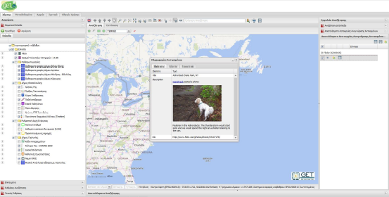

Σημειώνεται ότι οι λειτουργίες αναζήτησης δεν υποστηρίζονται στα αρχεία GeoRSS.

#### Shapefile
Μέσω της καρτέλας «Διαχείριση Υπηρεσιών Shapefile», μπορούμε απεικονίσουμε τις οντότητες ενός Shapefile αρχείου στο χάρτη.  

**Προσοχή!** Τα αρχεία shapefile δεν πρέπει να περιέχουν πολύπλοκες γεωμετρίες όπως επίσης υπάρχει και όριο στο πλήθος των οντοτήτων.

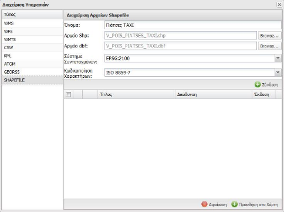

Πληκτρολογούμε στο πεδίο «Όνομα» ένα διακριτικό όνομα για το shapefile που θέλουμε να ανεβάσουμε.  

Στη συνέχεια επιλέγουμε τα shapefile και dbf αρχεία από τον υπολογιστή μας, στα πεδία «Αρχείο Shp» και «Αρχείο dbf» αντίστοιχα.  

Τέλος επιλέγουμε το σύστημα συντεταγμένων και την κωδικοποίηση των ιδιοτήτων του shapefile και πατάμε «Σύνδεση».  

Στη συνέχεια από τη λίστα επιλέγουμε το shapefile που θέλουμε και πατάμε το κουμπί «Προσθήκη στο Χάρτη» για να φορτώσουμε το επίπεδο στο χάρτη.  

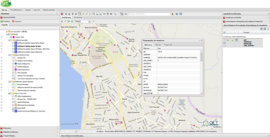

Σημειώνεται ότι οι λειτουργίες αναζήτησης δεν υποστηρίζονται στα αρχεία Shapefile.  

## Γενικές Ρυθμίσεις

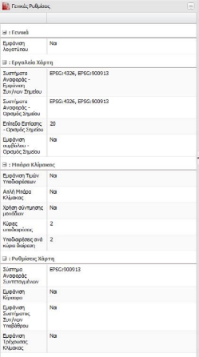

## Ρυθμίσεις Αναζήτησης
Η καρτέλα «Ρυθμίσεις Αναζήτησης», διαχειρίζεται ποια επίπεδα θ χρησιμοποιούνται κατά την εκτέλεση λειτουργιών αναζήτησης και αναγνώρισης αντικειμένων.

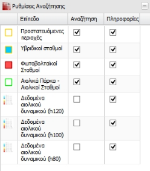

## Εργαλεία Αναζήτησης
Το GET SDI Portal παρέχει ισχυρά εργαλεία αναζήτησης γεωχωρικών δεδομένων. Η αναζήτηση μπορεί να πραγματοποιηθεί:
- βάσει χωρικών κριτηρίων, 
- βάσει περιγραφικών κριτηρίων, 
- με συνδυασμό των δύο.

### Χωρική Αναζήτηση
Για τη λειτουργία της χωρικής αναζήτησης στα ορατά επίπεδα, απαιτείται τα επίπεδα αυτά να υποστηρίζουν λειτουργίες αναζήτησης (π.χ. να έχει αναγνωριστεί κατά την προσθήκη του επιπέδου στο χάρτη, το σύστημα συντεταγμένων του επιπέδου και το πεδίο της γεωμετρίας του), καθώς επίσης και να είναι ενεργοποιημένες οι λειτουργίες αναζήτησης στην καρτέλα «Ρυθμίσεις Αναζήτησης».

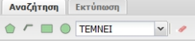

Από το μενού «Αναζήτηση», επιλέγουμε το σχήμα γραφικής αναζήτησης επιλέγοντας το κατάλληλο κουμπί όπως παρακάτω καθώς επίσης και τον χωρικό τελεστή που θα χρησιμοποιηθεί, ανάλογα με τη περίπτωση.

| Σύμβολο                                         | Επεξήγηση                        | Διαθέσιμοι Τελεστές                      |
|:------------------------------------------------|:----------------------------------|:-----------------------------------------|
|   | Αναζήτηση με χρήση πολυγώνου      | Τέμνει (Intersects), Εντός (Within)      |
|      | Αναζήτηση με χρήση γραμμής        | Τέμνει (Intersects), Διατρέχει (Crosses) |
| | Αναζήτηση με χρήση παραλληλογράμμου| Τέμνει (Intersects), Εντός (Within)      |
|    | Αναζήτηση με χρήση κύκλου         | Τέμνει (Intersects), Εντός (Within)      |

Στη συνέχεια σχεδιάζουμε στο χάρτη την επιθυμητή περιοχή ενδιαφέροντος.

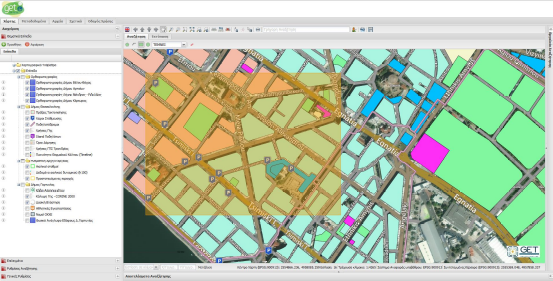

Για όσα επίπεδα λαμβάνουν μέρος στη λειτουργία αναζήτησης και βρεθούν αποτελέσματα, θα εμφανιστούν αντίστοιχες καρτέλες αποτελεσμάτων ανά επίπεδο στο κάτω μέρος του χάρτη.

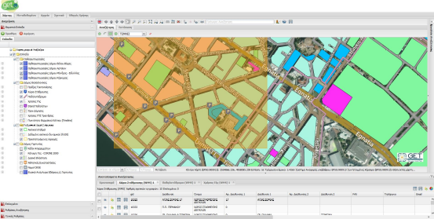

Σε περίπτωση που επιθυμούμε να εμφανίσουμε μόνο μία καρτέλα ή να κλείσουμε όλες τις υπόλοιπες, με δεξί κλικ πάνω στη σε μία καρτέλα αποτελεσμάτων, θα εμφανιστεί αναδυόμενο μενού στο οποίο ο χρήστης μπορεί να επιλέξει ανάμεσα σε:
- Κλείσιμο όλων των καρτελών
- Κλείσιμο καρτέλας
- Κλείσιμο όλων των άλλων καρτελών

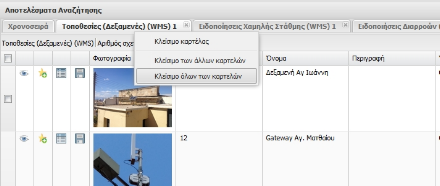

Στο πάνω μέρος των αποτελεσμάτων εμφανίζεται πληροφορίες σχετικά με το θεματικό επίπεδο και το πλήθος των εγγραφών που βρέθηκαν καθώς επίσης και πόσες από αυτές είναι επιλεγμένες.

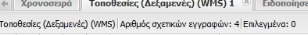

Δίπλα σε κάθε εγγραφή υπάρχουν στοιχεία ελέγχου που προσφέρουν επιπλέον λειτουργίες:

| Σύμβολο                                         | Επεξήγηση                        |
|:------------------------------------------------|:----------------------------------|
|   | Εμφάνιση της οντότητα στο χάρτη. Ο χάρτης εστιάζει στην οντότητα |
|      | Προσθήκη της οντότητας στα επιλεγμένα.        |
| | Εμφάνιση της καρτέλα «Πληροφορίες Αντικειμένου» βλ. «Πληροφορίες Αντικειμένου» |
|    | Αποθήκευση της οντότητας ως αρχείο βλ. «Αποθήκευση»         |

### Περιγραφική Αναζήτηση σε Επίπεδα

Επιπλέον της χωρικής αναζήτησης, υπάρχει η δυνατότητα και αναζήτησης βάσει περιγραφικών κριτηρίων ανά επίπεδο.

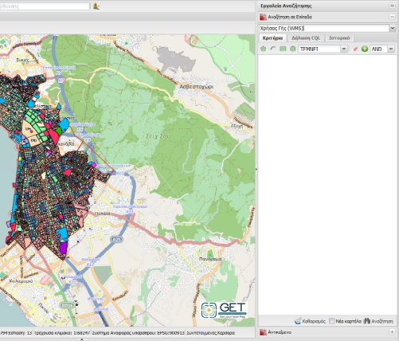

Επιλέγουμε από τη λίστα «Επιλογή επιπέδου», το επίπεδο στο οποίο θέλουμε να εκτελέσουμε την αναζήτηση. Το επίπεδο πρέπει να υποστηρίζει λειτουργίες αναζήτησης και να είναι ορατό στο χάρτη.  

Στη συνέχεια πατάμε το κουμπί «Προσθήκη Περιγραφικών Κριτηρίων» και επιλέγουμε από τη λίστα την ιδιότητα, τον τελεστή και τη τιμή που θέλουμε να αναζητήσουμε.  

Μεταξύ των κριτηρίων μπορούμε να επιλέξουμε τελεστή «ΚΑΙ» ή «Ή» μέσω της λίστας επιλογής που βρίσκεται δίπλα από το κουμπί «Προσθήκη Περιγραφικών Κριτηρίων».  

Για την ολοκλήρωση της αναζήτησης, πατάμε το κουμπί «Αναζήτηση» στο κάτω δεξί μέρος της καρτέλας. Τα αποτελέσματα της αναζήτησης εμφανίζονται στο κάτω μέρος της οθόνης.  

Εάν επιθυμούμε να εκτελέσουμε μία αναζήτηση με συνδυασμό χωρικών και περιγραφικών κριτηρίων, χρησιμοποιούμε τα στοιχεία γραφικής αναζήτησης επιλέγοντας το κατάλληλο κουμπί όπως παρακάτω, καθώς επίσης και τον τελεστή ανάλογα με τη περίπτωση.

| Σύμβολο                                         | Επεξήγηση                        | Διαθέσιμοι Τελεστές                      |
|:------------------------------------------------|:----------------------------------|:-----------------------------------------|
|   | Αναζήτηση με χρήση πολυγώνου      | Τέμνει (Intersects), Εντός (Within)      |
|      | Αναζήτηση με χρήση γραμμής        | Τέμνει (Intersects), Διατρέχει (Crosses) |
| | Αναζήτηση με χρήση παραλληλογράμμου| Τέμνει (Intersects), Εντός (Within)      |
|    | Αναζήτηση με χρήση κύκλου         | Τέμνει (Intersects), Εντός (Within)      |

Στη συνέχεια σχεδιάζουμε στο χάρτη την επιθυμητή περιοχή ενδιαφέροντος και συμπληρώνουμε και τα περιγραφικά κριτήρια. Τέλος πατάμε το κουμπί «Αναζήτηση»  

Η καρτέλα «Δήλωση CQL», εμφανίζει σε μορφή CQL το ερώτημα της τρέχουσας αναζήτησης. Η δήλωση CQL δεν είναι επεξεργάσιμη και παρέχεται για εποπτικούς μόνο λόγους.  

Στην περίπτωση που θέλουμε να εμφανίσουμε τα αποτελέσματα σε νέα καρτέλα ενεργοποιούμε την επιλογή «Νέα Καρτέλα» στο κάτω μέρος της καρτέλας αναζήτησης.  

Η κάθε νέα αναζήτηση κρατείται ως ιστορικό της καρτέλας «Ιστορικό», από την οποία μπορούμε να επιλέξουμε και να επαναφέρουμε για περαιτέρω αναζήτηση, χρησιμοποιώντας το κουμπί «Επαναφορά».  

### Λειτουργία Αναγνώρισης Αντικειμένων
Η λειτουργία αναγνώρισης αντικειμένων, αναζητεί όλες τις οντότητες σε όλα τα επίπεδα που υποστηρίζουν την λειτουργία σε ένα επιλεγμένο σημείο του χάρτη.  

Για την ενεργοποίηση της λειτουργίας αναγνώρισης αντικειμένων, χρησιμοποιούμε το κουμπί «Αναγνώριση αντικειμένων» , από την εργαλειοθήκη. 

Αυτόματα θα ανοίξει η καρτέλα αποτελεσμάτων στη δεξιά στήλη.  

Στη συνέχεια πατάμε πάνω σε ένα σημείο στο χάρτη και περιμένουμε έως ότου επιστρέψουν αποτελέσματα.  

## Στοιχεία Ελέγχου
Δίπλα σε κάθε μία εγγραφή που εμφανίζεται στα αποτελέσματα αναζήτησης και αναγνώρισης αντικειμένων, υπάρχουν λειτουργικές επιλογές που αφορούν την εγγραφή και περιγράφονται παρακάτω.  

### Προσθήκη στα Επιλεγμένα  
Από τις λίστες αποτελεσμάτων αναζήτησης και αναγνώρισης αντικειμένων, πατώντας πάνω στο κουμπί «Προσθήκη στα Επιλεγμένα» , το αντικείμενο αποθηκεύεται προσωρινά στη λίστα «Επιλεγμένα» για μελλοντική αναφορά σε αυτά.  

### Πληροφορίες Αντικειμένου
Από τις λίστες αποτελεσμάτων αναζήτησης και αναγνώρισης αντικειμένων, πατώντας πάνω στο κουμπί «Πληροφορίες Αντικειμένου» , μπορούμε να εμφανίσουμε την καρτέλα πληροφοριών της συγκεκριμένης οντότητας. Μέσω της καρτέλας αυτής, μπορούμε να πληροφορηθούμε για τα περιγραφικά χαρακτηριστικά της, την θέση της σε μικρότερο χάρτη καθώς και τη γεωμετρία της.  

### Μεταφόρτωση (Download)
Από τις λίστες αποτελεσμάτων αναζήτησης και αναγνώρισης αντικειμένων, πατώντας πάνω στο κουμπί «Μεταφόρτωση» , μπορούμε να αποθηκεύσουμε τοπικά την οντότητα σε μορφότυπο GML, Shapefile, CSV, JSON, εφόσον η οντότητα προέρχεται από υπηρεσίες που υποστηρίζουν τη δυνατότητα μεταφόρτωσης.

Από τη καρτέλα μεταφόρτωσης, μπορούμε να επιλέξουμε το μορφότυπο αποθήκευσης, την κωδικοποίηση των περιγραφικών τιμών όπως επίσης και το επιθυμητό σύστημα συντεταγμένων.  

Στη συνέχεια πατάμε το κουμπί μεταφόρτωση, για να αποθηκεύσουμε την οντότητα τοπικά.