# Αρθρώματα (Modules) 

Η αρχιτεκτονική του της **Υποδομής Γεωχωρικών Πληροφοριών**, είναι δομημένη έτσι ώστε να υποστηρίζει την επεκτασιμότητα των λειτουργιών μέσω της δημιουργίας αρθρωμάτων (modules).  

Τα αρθρώματα που διατίθενται στην τρέχουσα έκδοση περιγράφονται στη συνέχεια.  

## Γρήγορη Αναζήτηση
Μέσω του αρθρώματος της γρήγορης αναζήτησης, μπορούμε να αναζητήσουμε οντότητες από προκαθορισμένες υπηρεσίες και επίπεδα, μέσω του πεδίου γρήγορης αναζήτησης που βρίσκεται στην εργαλειοθήκη της εφαρμογής.

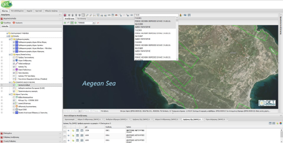  

Η λειτουργία αυτή υποστηρίζει την αυτόματη συμπλήρωση των αποτελεσμάτων βάση της περιγραφικής ιδιότητας στην οποία γίνεται η αναζήτηση.  

Επιλέγοντας πάνω σε μία από τις ευρεθείσες εγγραφές, ο χάρτης μετακινείται αυτόματα στο σημείο της οντότητας όπως επίσης και ανοίγει αυτόματα η καρτέλα πληροφοριών του επιλεγμένου αντικειμένου.  

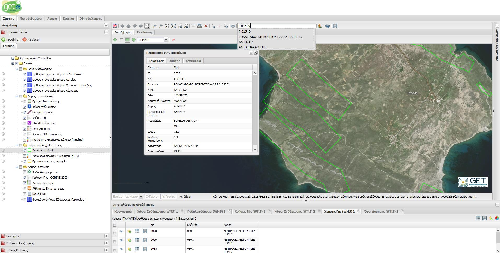  

## Google Street View
Το άρθρωμα «Google Street View» προσφέρει τη δυνατότητα της θέασης σε ένα σημείο του χάρτη, μέσω του Google Street View.  

Για την ενεργοποίηση της λειτουργίας, επιλέγουμε από την εργαλειοθήκη το κουμπί «Google Street View» . Αυτόματα θα ανοίξει η καρτέλα του «Google Street View», εμφανίζοντας στο κέντρο του χάρτη ένα βελάκι θέσης.  

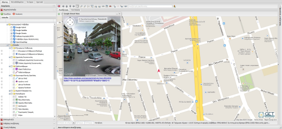  

Για την εμφάνιση του Google Street View σε κάποια άλλη θέση του χάρτη, πατάμε δεξί κλίκ πάνω στο χάρτη και από το αναδυόμενο μενού, πατάμε Google Street View όταν αυτό είναι ενεργό.  

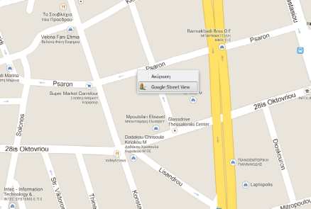  

Σημειώνεται ότι το βελάκι θέσης του Google Street View, είναι συγχρονισμένο με το παράθυρο του Google Street View και επισημαίνει τη φορά της κίνησης, προσφέροντας με αυτόν τον τρόπο πλήρη εποπτεία και πληροφορία θέσης.  

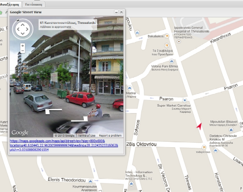  

## Google Earth
Το άρθρωμα «Google Earth» προσφέρει τη δυνατότητα των επιπέδων που υποστηρίζουν τη εξαγωγή τους σε KML, να εμφανίζονται στο περιβάλλον του «Google Earth».  

Για την ενεργοποίηση της λειτουργίας, επιλέγουμε από την εργαλειοθήκη το κουμπί «Google Earth» . Αυτόματα θα ανοίξει η καρτέλα του «Google Earth».  

Τα επίπεδα που υποστηρίζουν την εξαγωγή τους ως KML, θα αρχίσουν να φορτώνονται αυτόματα στο περιβάλλον του Google Earth.  

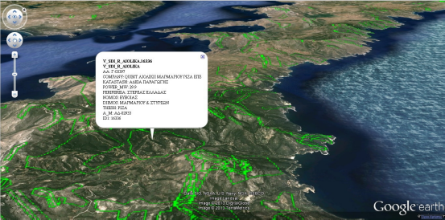  

_Σημείωση: Για την λειτουργία Google Earth, απαιτείται η εγκατάσταση του Google Earth Plugin στο πλοηγό ιστοσελίδων σας._  

## Χρονοσειρά
Η καρτέλα χρονοσειρά ενεργοποιείται σε όλα τα επίπεδα που προέρχονται από υπηρεσίες θέασης με ενεργοποιημένη τη χρονική διάσταση WMS-T (WMS TIME) και που είναι φορτωμένα στο χάρτη.  

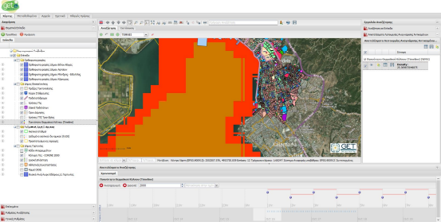  

Η **Υποδομή Γεωχωρικών Πληροφοριών**, εμφανίζει σε δυναμική χρονοσειρά, όλες τις στιγμές του χρόνου που αντλούνται από επίπεδα WMS-T σε ένα εύχρηστο στοιχείο ελέγχου.  

Για την αναπαραγωγή των δεδομένων στις διαθέσιμες χρονικές στιγμές, επιλέξτε το κουμπί «Αναπαραγωγή», που υπάρχει στη μπάρα ελέγχου της χρονοσειράς και ορίστε την τιμή της ανανέωσης του επιπέδου σε milliseconds (προκαθορισμένο 1500ms).  

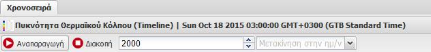  

Καθώς θα μετακινείται η χρονοσειρά σε κάθε διακριτή χρονική στιγμή, το WMS-T επίπεδο, ανανεώνεται αυτόματα, ανανεώνοντας τη γραφική του απεικόνιση με δεδομένα την τρέχουσα χρονική στιγμή.  

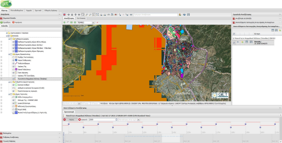  

Ο χρήστης μπορεί να μετατεθεί σε οποιαδήποτε χρονική στιγμή επιθυμεί, μέσω του διαδραστικού γραφήματος, πατώντας πάνω στα σημεία των χρονικών στιγμών ή/και μέσω της επιλογή «Μετακίνηση στη ημερομηνία» επιλέγοντας την επιθυμητή ημερομηνία.

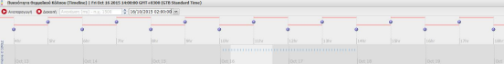  

Χρησιμοποιώντας το στοιχείο ελέγχου «Αναγνώριση Αντικειμένου», πάνω σε ένα WMS-T επίπεδο, τα δεδομένα που αντλούνται αντιστοιχούν στην τρέχουσα χρονική στιγμή.  

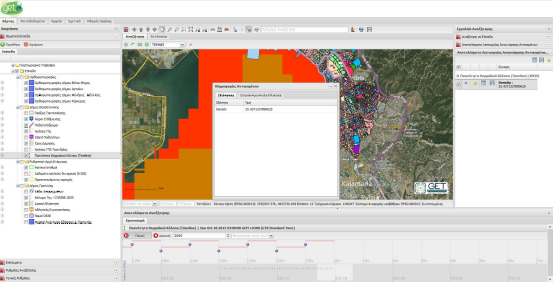  

Επιπλέον στη καρτέλα «Πληροφορίες Αντικειμένου», για WMS-T επίπεδα, εμφανίζεται μία νέα καρτέλα «Συγκεντρωτικός Πίνακας», απ’ όπου ο χρήστης μπορεί να αντλήσει τις τιμές των ιδιοτήτων ανά εύρος ημερομηνιών.  

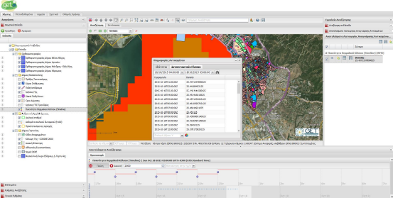  

Τέλος, ο χρήστης μπορεί να απεικονίσει τις τιμές αυτές σε χρονικό διάγραμμα, επιλέγοντας την ιδιότητα του άξονα Y του διαγράμματος από τις ιδιότητες του επιπέδου.  

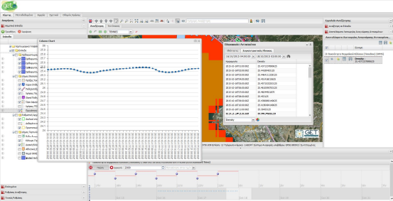

## Διαγράμματα  
Μέσω του αρθρώματος των διαγραμμάτων, μπορούμε να εμφανίσουμε σε γραφικές αναπαραστάσεις τα αποτελέσματα των αναζητήσεων.  

Για να εκτελέσουμε τη λειτουργία δημιουργίας διαγραμμάτων, από τη λίστα αποτελεσμάτων, πατάμε το κουμπί «Διαγράμματα» , που βρίσκεται στο δεξί πάνω μέρος της λίστα αποτελεσμάτων.  

Στη συνέχεια επιλέγουμε τα πεδία που θα ορίζουν τους άξονες Χ και Y των διαγραμμάτων όπως επίσης και το επιθυμητό τύπο διαγράμματος.  

Στην περίπτωση που επιλέξουμε την ίδια ιδιότητα και για άξονα Χ και για άξονα Υ, τότε εμφανίζεται το διάγραμμα με τον άξονα Υ να εμφανίζει το πλήθος της ομαδοποίησης.  

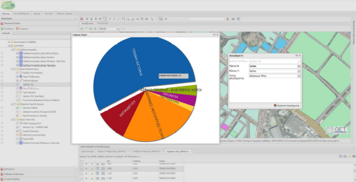  

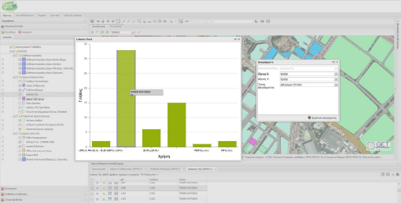  

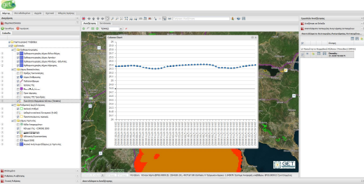  

## Πίνακας Ιδιοτήτων (Attribute Table)
Σε επίπεδα WMS και WFS που υποστηρίζεται από την υπηρεσία τους το αίτημα «GETFEATURE» καθώς επίσης και τα ορίσματα «MAXFEATURES» και «STARTINDEX», δύναται να απεικονιστούν όλες οι ιδιότητες του επιπέδου σε μορφή πίνακα (attribute table).  

Η εμφάνιση των ιδιοτήτων σε πίνακα γίνεται με την επιλογή «Πίνακας Ιδιοτήτων» από το αναδυόμενο μενού του επιθυμητού επιπέδου.  

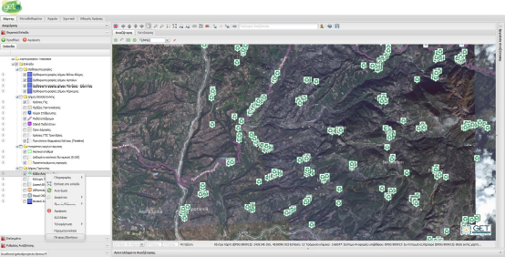  

Αυτόματα θα εμφανιστεί αναδυόμενο παράθυρο με τις ιδιότητες του επιπέδου, σελιδοποιημένες ανά 100 εγγραφές.  

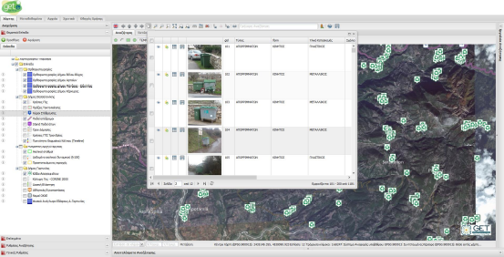

