# Καρτέλα μεταδεδομένα
Η καρτέλα ‘Μεταδεδομένα’ αποτελεί τη διεπαφή μέσω της οποίας καθίσταται εφικτή η πραγματοποίηση αναζητήσεων σε καταλόγους μεταδεδομένων. Πρακτικά, ο χρήστης εισάγει τα κριτήρια αναζήτησης που επιθυμεί στα αντίστοιχα πεδία και λαμβάνει ως αποτέλεσμα αρχεία μεταδεδομένων τα οποία περιγράφουν τα δεδομένα. Επίσης, η αναζήτηση μπορεί να αφορά και σε Υπηρεσίες Γεωχωρικών Δεδομένων, δηλαδή ο χρήστης να αναζητήσει διαδικτυακές υπηρεσίες με χρήση των οποίων θα μπορεί να έχει θέαση, να μεταφορτώσει, να αναζητήσει ή να επεξεργαστεί γεωχωρικά δεδομένα. Στη συνέχεια μπορεί να εμφανίσει στο χάρτη τα όρια της περιοχής που καλύπτουν τα δεδομένα και να εξετάσει αναλυτικά τις πληροφορίες που περιέχουν. Η αναζήτηση πραγματοποιείται σε καταλόγους (αποθετήρια) μεταδεδομένων τους οποίους επιλέγει ο χρήστης.  

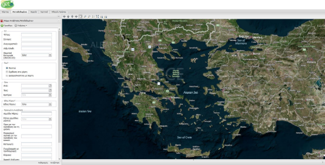  

## Γενικά
Τα μεταδεδομένα αποτελούν δεδομένα για τα δεδομένα, τα οποία βοηθούν στην κατανόηση των δεδομένων. Πρακτικά, τα μεταδεδομένα είναι αρχεία σε μορφή εγγράφων XML που περιγράφουν, χαρακτηρίζουν και τεκμηριώνουν τα γεωχωρικά δεδομένα. Η ίδια ακριβώς λογική τηρείται και για τα μεταδεδομένα υπηρεσιών γεωχωρικών δεδομένων.  

Ο κύριος στόχος που εξυπηρετείται ύπαρξης μεταδεδομένων είναι η εξεύρεση (discovery), δηλαδή η αναζήτηση δεδομένων και υπηρεσιών που πληρούν τα κριτήρια του εκάστοτε χρήστη. Δεύτερος και εξίσου σημαντικός σκοπός που εξυπηρετούν τα μεταδεδομένα είναι η τεκμηρίωση της καταλληλότητας προς χρήση των δεδομένων, δηλαδή αν τα δεδομένα καλύπτουν τις προδιαγραφές που επιθυμεί ο χρήστης (ως προς το χρόνο, την ακρίβεια κ.λπ.)  

Τα στοιχεία μεταδεδομένων που προτείνονται στην Οδηγία INSPIRE και τα οποία αποτελούν την ελάχιστη πληροφορία μεταδεδομένων που οφείλουν να τηρούν τα κράτη μέλη της ΕΕ για τα γεωχωρικά τους δεδομένα, εντάσσονται σε κατηγορίες ως προς το (εννοιολογικό) περιεχόμενο. Οι κατηγορίες αυτές είναι:
- Ταυτοποίηση
- Κατηγοριοποίηση χωρικών δεδομένων και υπηρεσιών
- Λέξη κλειδί
- Γεωγραφική Θέση
- Χρονική αναφορά
- Ποιότητα και εγκυρότητα
- Συμμόρφωση
- Περιορισμοί σχετικά με την πρόσβαση και χρήση
- Οργανισμοί που είναι αρμόδιοι για τη δημιουργία, τη διαχείριση, τη συντήρηση και τη διανομή των συνόλων και υπηρεσιών χωρικών δεδομένωn
- Μεταδεδομένα σχετικά με μεταδεδομένα

Κάθε κατηγορία περιλαμβάνει τουλάχιστον ένα στοιχείο μεταδεδομένων. Στον Πίνακα που ακολουθεί, παρουσιάζεται συγκεντρωτικά το σύνολο των στοιχείων μεταδεδομένων, η πολλαπλότητά τους και η πληροφορία που μπορεί να καταχωριστεί για το καθένα, ομαδοποιημένα ανά θεματική ενότητα.

| Θεματική ενότητα μεταδεδομένων | α/α | Στοιχείο μεταδεδομένων | Πολλαπλότητα | Πληροφορία που πρέπει να καταχωριστεί για κάθε στοιχείο μεταδεδομένων | Πολλαπλότητα εντός του στοιχείου |
|:-------------------------------|:----|:-----------------------|:-------------|:----------------------------------------------------------------------|:----------------------------------|
| **Ταυτοποίηση** | 1 | Τίτλος πόρου | 1 | Τίτλος πόρου | 1 |
| | 2 | Σύνοψη πόρου | 1 | Σύνοψη πόρου | 1 |
| | 3 | Τύπος πόρου | 1 | Τύπος πόρου | 1 |
| | 4 | Εντοπιστής πόρου | 0..* | Εντοπιστής πόρου | 0..* |
| | 5 | Μοναδικό αναγνωριστικό πόρου | 1..* | Μοναδικό αναγνωριστικό πόρου | 1..* |
| | 6 | Γλώσσα πόρου | 0..* | Γλώσσα πόρου | 0..* |
| **Κατηγοριοποίηση χωρικών δεδομένων και υπηρεσιών** | 7 | Θεματική κατηγορία | 1..* | Θεματική κατηγορία | 1..* |
| **Λέξη κλειδί** | 8 | Λέξη κλειδί | 1..* | Τιμή της λέξης κλειδί | 1 |
| | | | | Τίτλος | 1 |
| | | | | Τύπος Ημερομηνίας | 1 |
| | | | | Ημερομηνία | 1 |
| **Γεωγραφική θέση** | 9 | Περίγραμμα γεωγραφικών συντεταγμένων | 1..* | Δυτικό γεωγραφικό μήκος | 1 |
| | | | | Ανατολικό γεωγραφικό μήκος | 1 |
| | | | | Νότιο γεωγραφικό πλάτος | 1 |
| | | | | Βόρειο γεωγραφικό πλάτος | 1 |
| **Χρονική αναφορά** | 10 | Χρονική αναφορά | 1..* | Χρονική έκταση | 1..* |
| | | | | Ημερομηνία δημοσίευσης | 1..* |
| | | | | Ημερομηνία τελευταίας αναθεώρησης | 1 |
| | | | | Ημερομηνία δημιουργίας | 1 |
| **Ποιότητα και εγκυρότητα** | 11 | Καταγωγή | 1 | Καταγωγή | 1 |
| | 12 | Χωρική ανάλυση | 0..* | Ισοδύναμη κλίμακα | 1..* |
| | | | | Απόσταση χωρικής ανάλυσης - Τιμή | 1..* |
| | | | | Απόσταση χωρικής ανάλυσης - Μονάδα μήκους | 1..* |
| **Συμμόρφωση** | 13 | Συμμόρφωση | 1..* | Προδιαγραφή - Τίτλος | 1..* |
| | | | | Προδιαγραφή - Τύπος Ημερομηνίας | 1..* |
| | | | | Προδιαγραφή - Ημερομηνία | 1..* |
| | | | | Βαθμός συμμόρφωσης | 1 |
| **Περιορισμοί σχετικά με την πρόσβαση και τη χρήση** | 14 | Όροι για την πρόσβαση και τη χρήση | 1..* | Όροι για την πρόσβαση και τη χρήση | 1..* |
| | 15 | Περιορισμοί σχετικά με την πρόσβαση του κοινού | 1..* | Περιορισμοί σχετικά με την πρόσβαση του κοινού | 1..* |
| **Οργανισμοί που είναι αρμόδιοι για τη δημιουργία, τη διαχείριση, τη συντήρηση και τη διανομή των συνόλων και υπηρεσιών χωρικών δεδομένων** | 16 | Αρμόδιο μέρος | 1..* | Ονομασία φορέα | 1 |
| | | | | Διεύθυνση ηλεκτρονικού ταχυδρομείου | 1..* |
| | | | | Ρόλος αρμόδιου μέρους | 1 |
| **Μεταδεδομένα για τα μεταδεδομένα** | 17 | Αρμόδιος για επικοινωνία σχετικά με τα μεταδεδομένα | 1..* | Ονομασία φορέα | 1 |
| | | | | Διεύθυνση ηλεκτρονικού ταχυδρομείου | 1..* |
| | 18 | Ημερομηνία μεταδεδομένων | 1 | Ημερομηνία μεταδεδομένων | 1 |
| | 19 | Γλώσσα μεταδεδομένων | 1 | Γλώσσα μεταδεδομένων | 1 |

## Επιλογές
### Επιλογή Καταλόγου
Ο χρήστης μέσω αυτής της επιλογής έχει τη δυνατότητα να επιλέξει από ένα σύνολο προκαθορισμένων καταλόγων μεταδεδομένων (CSW), εκείνους τους καταλόγους στους οποίους θα αναζητήσει δεδομένα ή υπηρεσίες αξιοποιώντας τα κριτήρια αναζήτησης.  

Ο χρήστης για να επιλέξει τον κατάλογο που τον ενδιαφέρει επιλέγει από το μενού ‘Ρυθμίσεις’ και στην συνέχεια από το υπό-μενού ‘Υπηρεσίες CSW’ τους καταλόγους που επιθυμεί.  

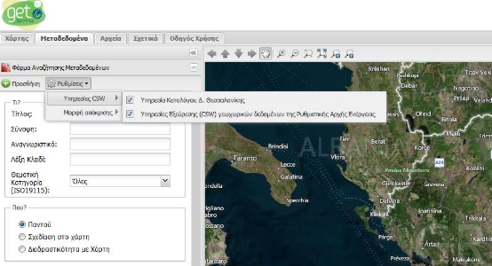  

### Επιλογή Προτύπου
Ο χρήστης μέσω αυτής της επιλογής έχει τη δυνατότητα να επιλέξει από ένα σύνολο προτύπων μεταδεδομένων, το πρότυπο το οποίο θα χρησιμοποιηθεί για την αναζήτηση των μεταδεδομένων στον κατάλογο ή στους καταλόγους που έχει επιλέξει. Η δυνατότητα αυτή παρέχεται στο χρήστη διότι διαφορετικοί κατάλογοι υποστηρίζουν διαφορετικά πρότυπα μεταδεδομένων.  

Για την επιλογή του προτύπου ο χρήστης από το μενού ‘Ρυθμίσεις’ επιλέγει το υπό-μενού ‘Μορφή Απόκρισης’ και στην συνέχεια το πρότυπο που επιθυμεί να χρησιμοποιήσει στην αναζήτησή του.  

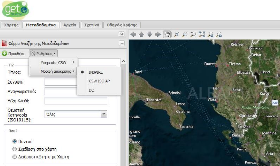

#### INSPIRE
Η επιλογή αυτή αναφέρεται στο πρότυπο μεταδεδομένων που προδιαγράφει η Οδηγία INSPIRE.  

#### CSW/ISO-AP
Η επιλογή αυτή αναφέρεται στο πρότυπο ISO AP.

#### DC
Η επιλογή αυτή αναφέρεται στο πρότυπο Dublin Core.

## Κριτήρια Αναζήτησης Μεταδεδομένων
Ο χρήστης προκειμένου να προχωρήσει στην εισαγωγή των κριτηρίων αναζήτησης θα πρέπει αρχικά να έχει επιλέξει κατάλογο και πρότυπο όπως περιγράφεται παραπάνω.  

Ο χρήστης μπορεί να αναζητήσει βάσει περιγραφικών κριτηρίων από την ομάδα ‘Τι?’, χωρικών κριτηρίων από την ομάδα ‘Που?’, χρονολογικών κριτηρίων από την ομάδα ‘Πότε?’, τύπου πόρου από την ομάδα ‘Τύπος Πόρου’, καθώς επίσης και βάσει κάποιων επιπλέον κριτηρίων που βρίσκονται στην ομάδα ‘Προηγμένη Αναζήτηση’.  

Παρακάτω ακολουθεί αναλυτική περιγραφή των κριτηρίων αναζήτησης, σε τι αναφέρονται και πώς χρησιμοποιούνται.  

### Τίτλος
Το πεδίο ‘Τίτλος’ στη φόρμα κριτηρίων αναζήτησης αναφέρεται στο κείμενο που θα χρησιμοποιηθεί κατά την αναζήτηση (στον επιλεγμένο κατάλογο μεταδεδομένων), των οποίων ο τίτλος τους (Resource Title) περιέχει ακριβώς ή τμήμα του κείμενου που εισάγει ο χρήστης στο πεδίο.  

Στην παρακάτω εικόνα φαίνεται ένα παράδειγμα αναζήτησης χρησιμοποιώντας το πεδίο ‘Τίτλος’. Ο χρήστης εισάγει τη λέξη ‘σταθμοί’ και η εφαρμογή εμφανίζει στα αποτελέσματα τα μεταδεδομένα στα οποία στον τίτλο τους περιέχουν τη λέξη σταθμοί.  

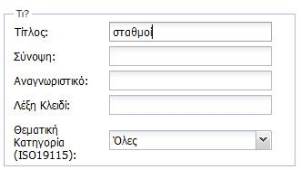  

### Σύνοψη
Το πεδίο ‘Σύνοψη’ στη φόρμα κριτηρίων αναζήτησης αναφέρεται στο κείμενο που θα χρησιμοποιηθεί κατά την αναζήτηση (στον επιλεγμένο κατάλογο μεταδεδομένων), των οποίων η σύνοψη (Resource Abstract) τους περιέχει ακριβώς ή τμήμα του κείμενου που εισάγει ο χρήστης στο πεδίο.  

Στην παρακάτω εικόνα φαίνεται ένα παράδειγμα αναζήτησης χρησιμοποιώντας το πεδίο ‘Σύνοψη’. Ο χρήστης εισάγει τη λέξη ‘αιολικών σταθμών’ και η εφαρμογή εμφανίζει στα αποτελέσματα τα μεταδεδομένα στα οποία στην σύνοψη τους περιέχουν το λεκτικό ’αιολικών σταθμών’.  

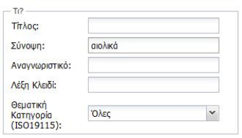  

### Αναγνωριστικό
Το πεδίο ‘Αναγνωριστικό’ στη φόρμα κριτηρίων αναζήτησης αναφέρεται στο μοναδικό αναγνωριστικό κωδικό που θα χρησιμοποιηθεί κατά την αναζήτηση (στον επιλεγμένο κατάλογο μεταδεδομένων), των οποίων ο μοναδικός αναγνωριστικός κωδικός(Unique Resource Identifier) ταυτίζεται με το κωδικό που εισάγει ο χρήστης στο πεδίο. Όσον αφορά στην αναζήτηση βάσει μοναδικού αναγνωριστικού κωδικού ο χρήστης πρέπει να γνωρίζει ακριβώς τον κωδικό για να επιστραφούν αποτελέσματα κατά την αναζήτηση.  

Στην παρακάτω εικόνα φαίνεται ένα παράδειγμα αναζήτησης χρησιμοποιώντας το πεδίο ‘Αναγνωριστικό’. Ο χρήστης εισάγει το κωδικό 86df8b7b-7abd-49d5-b7ba-afc189f0fa12 και η εφαρμογή εμφανίζει στα αποτελέσματα τα μεταδεδομένα στα οποία ο μοναδικός αναγνωριστικός κωδικός είναι ίδιος με το κωδικό που εισήγαγε ο χρήστης.  

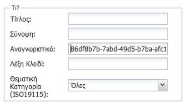  

### Λέξη-κλειδί
Το πεδίο ‘Λέξη Κλειδί’ στη φόρμα κριτηρίων αναζήτησης αναφέρεται στο λεκτικό που θα χρησιμοποιηθεί για την αναζήτηση μεταδεδομένων, στον επιλεγμένο κατάλογο, στα οποία το λεκτικό που εισάγει ο χρήστης περιέχεται στις λέξεις κλειδιά που έχουν καταχωριστεί στα μεταδεδομένα.  

Στην παρακάτω εικόνα φαίνεται ένα παράδειγμα αναζήτησης χρησιμοποιώντας το πεδίο ‘Λέξη Κλειδί’. Ο χρήστης εισάγει τη λέξη ‘Energy’ και η εφαρμογή εμφανίζει στα αποτελέσματα τα μεταδεδομένα τα οποία περιέχουν στις λέξεις κλειδιά τη λέξη ‘Energy’.  

Οι λέξεις κλειδιά που κατ’ ελάχιστον καταχωρούνται στα μεταδεδομένα και με τις οποίες μπορεί να πραγματοποιηθεί αναζήτηση, αφορούν στην κατηγοριοποίηση των γεωχωρικών δεδομένων, όπως αυτή εμφανίζεται στα Παραρτήματα της Οδηγίας INSPIRE. Οι λέξεις κλειδιά για γεωχωρικά δεδομένα είναι:  

| α/α | Θεματική Κατηγορία - Λέξη κλειδί (ελληνική) | Θεματική Κατηγορία - Λέξη κλειδί (αγγλική) | Περιγραφή |
|:----|:-------------------------------------------|:-------------------------------------------|:----------|
| 1 | Ανθρώπινη υγεία και ασφάλεια | Human health and safety | Γεωγραφική κατανομή της κυριαρχίας παθολογιών (αλλεργίες, καρκίνοι, αναπνευστικές ασθένειες, κ.λπ.), πληροφορίες που καταδεικνύουν τις επιπτώσεις στην υγεία (βιοδείκτες, πτώση της γονιμότητας, επιδημίες) ή την ευεξία των ανθρώπων (κούραση, υπερένταση, κ.λπ.) που συνδέονται άμεσα (ατμοσφαιρική ρύπανση, χημικές ουσίες, καταστροφή της στιβάδας του όζοντος, θόρυβος, κ.λπ.) ή έμμεσα (τρόφιμα, γενετικώς τροποποιημένοι οργανισμοί, κ.λπ.) με την ποιότητα του περιβάλλοντος. |
| 2 | Ατμοσφαιρικές συνθήκες | Atmospheric conditions | Φυσικές ιδιότητες της ατμόσφαιρας. Περιλαμβάνονται χωρικά δεδομένα βασιζόμενα σε μετρήσεις, σε μοντέλα ή σε συνδυασμό τους, καθώς και οι τοποθεσίες μετρήσεων |
| 3 | Βιογεωγραφικές περιοχές | Bio-geographical regions | Περιοχές σχετικώς ομοιογενών οικολογικών συνθηκών με κοινά χαρακτηριστικά |
| 4 | Γεωλογία | Geology | Γεωλογικός χαρακτηρισμός με βάση τη σύσταση και τη δομή. Περιλαμβάνονται το μητρικό πέτρωμα, οι υδροφόροι ορίζοντες και η γεωμορφολογία |
| 5 | Γεωργικές εγκαταστάσεις και εγκαταστάσεις υδατοκαλλιέργειας | Agricultural and aquaculture facilities | Γεωργικός εξοπλισμός και εγκαταστάσεις παραγωγής (συμπεριλαμβανομένων των συστημάτων άρδευσης, των θερμοκηπίων και των στάβλων) |
| 6 | Γεωτεμάχια κτηματολογίου | Cadastral parcels | Εκτάσεις που ορίζονται από κτηματολογικά μητρώα ή αντίστοιχες |
| 7 | Διευθύνσεις | Addresses | Θέση ακινήτων με βάση τη διεύθυνση, συνήθως με όνομα οδού, αριθμό οικίας και ταχυδρομικό κώδικα |
| 8 | Δίκτυα μεταφορών | Transport networks | Δίκτυα οδικών, σιδηροδρομικών, αεροπορικών και υδάτινων μεταφορών και οι αντίστοιχες υποδομές. Περιλαμβάνονται οι συνδέσεις μεταξύ των διαφόρων δικτύων. Περιλαμβάνεται επίσης το διευρωπαϊκό δίκτυο μεταφορών, όπως ορίζεται στην απόφαση αριθ. 1692/96/EΚ του Ευρωπαϊκού Κοινοβουλίου και του Συμβουλίου, της 23ης Ιουλίου 1996, περί των κοινοτικών προσανατολισμών για την ανάπτυξη του διευρωπαϊκού δικτύου μεταφορών (1) και στις μελλοντικές αναθεωρήσεις της εν λόγω απόφασης |
| 9 | Διοικητικές ενότητες | Administrative units | Διοικητικές ενότητες που χωρίζουν περιοχές επί των οποίων κράτη μέλη έχουν ή/και ασκούν δικαιοδοτικά δικαιώματα σε τοπικό, περιφερειακό και εθνικό επίπεδο, χωρίζονται από διοικητικά όρια |
| 10 | Εγκαταστάσεις παραγωγής και βιομηχανικές εγκαταστάσεις | Production and industrial facilities | Τοποθεσίες βιομηχανικής παραγωγής, συμπεριλαμβανομένων των εγκαταστάσεων που καλύπτονται από την οδηγία 96/61/ΕΚ του Συμβουλίου, της 24ης Σεπτεμβρίου 1996, σχετικά με την ολοκληρωμένη πρόληψη και έλεγχο της ρύπανσης (1), και εγκαταστάσεις υδροληψίας, εξόρυξης, χώροι αποθήκευσης |
| 11 | Εγκαταστάσεις παρακολούθησης του περιβάλλοντος | Environmental monitoring facilities | Η τοποθεσία και η λειτουργία των εγκαταστάσεων παρακολούθησης του περιβάλλοντος περιλαμβάνει την παρατήρηση και τη μέτρηση των εκπομπών, της κατάστασης των στοιχείων του περιβάλλοντος και άλλων παραμέτρων του οικοσυστήματος (βιοποικιλότητα, οικολογική κατάσταση της βλάστησης, κ.λπ.) από τις δημόσιες αρχές ή για λογαριασμό τους |
| 12 | Έδαφος | Soil | Χαρακτηρισμός εδάφους και υπεδάφους ανάλογα με το βάθος, την υφή, τη δομή και την περιεκτικότητα σε σωματίδια και οργανικά υλικά, το πετρώδες, τη διάβρωση και, κατά περίπτωση, τη μέση κλίση και την προβλεπόμενη χωρητικότητα αποθήκευσης νερού |
| 13 | Ενδιαιτήματα και βιότοποι | Habitats and biotopes | Γεωγραφικές περιοχές που χαρακτηρίζονται από ειδικές οικολογικές συνθήκες, διαδικασίες, δομή και λειτουργίες (υποστήριξης της ζωής) οι οποίες στηρίζουν φυσικά τους οργανισμούς που ενδιαιτούν. Περιλαμβάνονται χερσαίες και υδάτινες εκτάσεις, διακρινόμενες ανάλογα με τα γεωγραφικά, αβιοτικά και βιοτικά χαρακτηριστικά τους, ανεξαρτήτως εάν είναι πλήρως φυσικές ή ημιφυσικές |
| 14 | Ενεργειακοί πόροι | Energy resources | Ενεργειακοί πόροι, μεταξύ άλλων υδρογονάνθρακες, υδροηλεκτρική ενέργεια, βιοενέργεια, ηλιακή ενέργεια, αιολική ενέργεια, κ.λπ., συμπεριλαμβανομένων, κατά περίπτωση, πληροφοριών περί του βάθους και του ύψους όσον αφορά την έκταση του εκάστοτε πόρου |
| 15 | Επιχειρήσεις κοινής ωφελείας και κρατικές υπηρεσίες | Utility and governmental services | Περιλαμβάνονται εγκαταστάσεις υπηρεσιών κοινής ωφελείας, όπως η αποχέτευση, η διαχείριση αποβλήτων, ο ενεργειακός εφοδιασμός και η υδροδότηση, οι διοικητικές και κοινωνικές κρατικές υπηρεσίες, όπως οι δημόσιες διοικήσεις, οι χώροι πολιτικής προστασίας, τα σχολεία και τα νοσοκομεία |
| 16 | Ζώνες διαχείρισης/περιορισμού/ρύθμισης εκτάσεων και μονάδες αναφοράς | Area management/restriction/regulation zones and reporting units | Εκτάσεις υπό διαχείριση, υπό ρύθμιση ή χρησιμοποιούμενες για αναφορά σε διεθνές, ευρωπαϊκό, εθνικό, περιφερειακό και τοπικό επίπεδο. Περιλαμβάνονται χώροι απόρριψης, προστατευόμενες περιοχές γύρω από πηγές πόσιμου νερού, ζώνες ευάλωτες στη νιτρορρύπανση, κανονιστικά ρυθμιζόμενοι δίαυλοι θαλάσσιας ή εσωτερικής ναυσιπλοΐας, περιοχές για τη βύθιση αποβλήτων, ζώνες προστασίας από τον θόρυβο, περιοχές όπου επιτρέπεται η μεταλλευτική έρευνα και εξόρυξη, διοικητικές περιοχές ποτάμιων λεκανών, σχετικές μονάδες αναφοράς και περιοχές διαχείρισης παράκτιας ζώνης |
| 17 | Ζώνες φυσικών κινδύνων | Natural risk zones | Χαρακτηρισμός ευάλωτων περιοχών ανάλογα με τους φυσικούς κινδύνους (όλα τα ατμοσφαιρικά, υδρολογικά, σεισμικά, ηφαιστειακά φαινόμενα και τα φαινόμενα καταστροφικών πυρκαγιών που, λόγω της θέσης, της σφοδρότητας και της συχνότητάς τους, είναι δυνατό να έχουν σοβαρές επιπτώσεις στην κοινωνία), π.χ. πλημμύρες, κατολισθήσεις και καθιζήσεις, χιονοστιβάδες, δασικές πυρκαγιές, σεισμοί, εκρήξεις ηφαιστείων |
| 18 | Θαλάσσιες περιοχές | Sea regions | Φυσικές ιδιότητες των θαλασσών και των αλατούχων υδατικών συστημάτων, με υποδιαίρεση ανά περιοχές και υποπεριοχές με κοινά χαρακτηριστικά |
| 19 | Κάλυψη γης | Land cover | Φυσική και βιολογική κάλυψη της γήινης επιφάνειας, όπου συμπεριλαμβάνονται τεχνητές εκτάσεις, γεωργικές εκτάσεις, δάση, (ημι-)φυσικές εκτάσεις, υγρότοποι, υδατικά συστήματα |
| 20 | Κατανομή ειδών | Species distribution | Γεωγραφική κατανομή ειδών πανίδας και χλωρίδας, ανά κάνναβο, περιοχή, διοικητική ενότητα ή άλλη ενότητα ανάλυσης |
| 21 | Κατανομή πληθυσμού — δημογραφία | Population distribution — demography | Γεωγραφική κατανομή του πληθυσμού, συμπεριλαμβανομένων των χαρακτηριστικών του πληθυσμού και των επιπέδων δραστηριοτήτων, ανά κάνναβο, περιοχή, διοικητική ενότητα ή άλλη ενότητα ανάλυσης |
| 22 | Κτίρια | Buildings | Γεωγραφική θέση κτιρίων |
| 23 | Μετεωρολογικά γεωγραφικά χαρακτηριστικά | Meteorological geographical features | Καιρικές συνθήκες και οι μετρήσεις τους· ατμοσφαιρικές κατακρημνίσεις, θερμοκρασία, εξατμισοδιαπνοή, ταχύτητα και διεύθυνση ανέμου |
| 24 | Ορθοφωτογραφία | Orthoimagery | Γεωαναφερόμενα δεδομένα από εικόνες της επιφάνειας της γης, από δορυφόρους ή αερομεταφερόμενους αισθητήρες |
| 25 | Ορυκτοί πόροι | Mineral resources | Ορυκτοί πόροι, μεταξύ άλλων και μεταλλεύματα, βιομηχανικά μεταλλεύματα, κ.λπ., συμπεριλαμβανομένων, κατά περίπτωση, πληροφοριών περί του βάθους και του ύψους όσον αφορά την έκταση του εκάστοτε πόρου |
| 26 | Προστατευόμενες τοποθεσίες | Protected sites | Εκτάσεις χαρακτηρισμένες ή υποκείμενες σε διαχείριση σε ένα πλαίσιο διεθνούς, κοινοτικού και εθνικού δικαίου για την επίτευξη συγκεκριμένων στόχων διατήρησης |
| 27 | Στατιστικές μονάδες | Statistical units | Μονάδες διάδοσης ή χρήσης στατιστικών πληροφοριών |
| 28 | Συστήματα γεωγραφικού καννάβου | Geographical grid systems | Εναρμονισμένος κάνναβος πολλαπλής ανάλυσης με ενιαίο σημείο αφετηρίας και τυποποιημένη θέση και μέγεθος των φατνίων του καννάβου |
| 29 | Συστήματα συντεταγμένων | Coordinate reference systems | Συστήματα για μονοσήμαντη αναφορά χωρικών πληροφοριών στον χώρο, ως σύνολο συντεταγμένων (x,y,z) ή/και γεωγραφικό πλάτος και μήκος και ύψος, με βάση γεωδαιτικό οριζόντιο και κατακόρυφο σύστημα αναφοράς (datum) |
| 30 | Τοπωνύμια | Geographical names | Τοπωνύμια εκτάσεων, περιοχών, τοποθεσιών, πόλεων, προαστίων, κωμοπόλεων ή οικισμών, ή οποιοδήποτε γεωγραφικό ή τοπογραφικό χαρακτηριστικό δημόσιου ή ιστορικού ενδιαφέροντος |
| 31 | Υδρογραφία | Hydrography | Υδρογραφικά στοιχεία, όπου περιλαμβάνονται οι θαλάσσιες περιοχές και όλα τα άλλα υδατικά συστήματα και σχετιζόμενα στοιχεία, μεταξύ των οποίων και οι λεκάνες και υπολεκάνες απορροής ποταμών. Κατά περίπτωση, σύμφωνα με τους ορισμούς της οδηγίας 2000/60/ΕΚ του Ευρωπαϊκού Κοινοβουλίου και του Συμβουλίου, της 23ης Οκτωβρίου 2000, για τη θέσπιση πλαισίου κοινοτικής δράσης στον τομέα της πολιτικής των υδάτων (2) και υπό μορφή δικτύων |
| 32 | Υψομετρία | Elevation | Ψηφιακά υψομετρικά μοντέλα για χερσαίες εκτάσεις, εκτάσεις καλυπτόμενες από πάγους και ωκεανούς. Περιλαμβάνονται, εν προκειμένω, η χερσαία υψομετρία, η βαθυμετρία και οι ακτογραμμές |
| 33 | Χρήσεις γης | Land use | Χαρακτηρισμός περιοχών ανάλογα με τη σημερινή και τη μελλοντική σχεδιαζόμενη λειτουργία τους ή τον κοινωνικοοικονομικό σκοπό τους (π.χ. αμιγώς οικιστική, βιομηχανική, εμπορική, γεωργική, δασική, αναψυχής) |
| 34 | Ωκεανογραφικά γεωγραφικά χαρακτηριστικά | Oceanographic geographical features | Φυσικές ιδιότητες των ωκεανών (ρεύματα, αλατότητα, ύψος κυμάτων, κ.λπ.) |

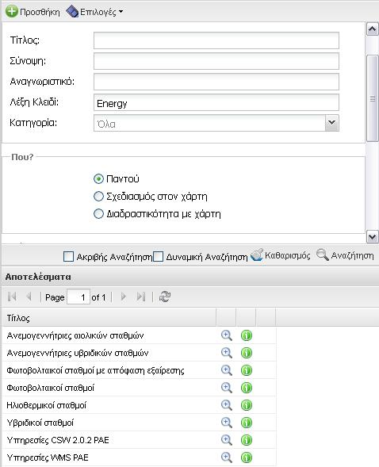  

### Κατηγορία
Το πεδίο ‘Κατηγορία’ στη φόρμα κριτηρίων αναζήτησης αναφέρεται στην κατηγορία που εντάσσονται τα γεωχωρικά δεδομένα σύμφωνα με την κατηγοριοποίηση (Classification) που προβλέπεται στο Πρότυπο EN ISO 19115:2003.  

| α/α | Κατηγορία | Περιγραφή |
|:----|:----------|:----------|
| 1 | Γεωργία (farming) | Εκτροφή ζώων ή/και καλλιέργεια φυτών |
| 2 | Βιόκοσμος (biota) | Χλωρίδα ή/και πανίδα σε φυσικό περιβάλλον |
| 3 | Όρια (boundaries) | Νομικώς κατοχυρωμένα γεωγραφικά όρια |
| 4 | Κλιματολογία/Μετεωρολογία/Ατμόσφαιρα (climatologyMeteorologyAtmosphere) | Ατμοσφαιρικές διεργασίες και φαινόμενα |
| 5 | Οικονομία (economy) | Οικονομικές δραστηριότητες, συνθήκες και απασχόληση |
| 6 | Υψομετρία (elevation) | Ύψος πάνω ή βάθος κάτω από τη στάθμη της θάλασσας |
| 7 | Περιβάλλον (environment) | Περιβαλλοντικοί πόροι , προστασία και διατήρηση του περιβάλλοντος |
| 8 | Γεωεπιστημονικές πληροφορίες (geoscientificInformation) | Πληροφορίες που αφορούν τις γεωεπιστήμες |
| 9 | Υγεία (health) | Υγεία, υγειονομικές υπηρεσίες, ανθρωποοικολογία και ανθρώπινη ασφάλεια |
| 10 | Ορθοεικόνες/Βασικοίχάρτες /Κάλυψη γης (imageryBaseMapsEarthCover) | Βασικοί χάρτες |
| 11 | Στρατιωτικές πληροφορίες (intelligenceMilitary) | Στρατιωτικές βάσεις, δομές, δραστηριότητες |
| 12 | Εσωτερικά ύδατα (inlandWaters) | Χαρακτηριστικά εσωτερικών υδάτων, συστήματα απορροής και ιδιότητές τους |
| 13 | Γεωγραφική θέση (location) | Πληροφορίες και υπηρεσίες που αφορούν εντοπισμό γεωγραφικής θέσης |
| 14 | Θάλασσες (oceans) | Χαρακτηριστικά και ιδιότητες θαλάσσιων υδάτων (πλην των εσωτερικών υδάτων) |
| 15 | Χωροταξία/κτηματολόγιο (planningCadastre) | Πληροφορίες που χρησιμοποιούνται για κατάλληλα μέτρα σχετικά με μελλοντικές χρήσεις γης |
| 16 | Κοινωνία (society) | Κοινωνικά και πολιτισμικά χαρακτηριστικά |
| 17 | Κατασκευές (structure) | Ανθρωπογενείς κατασκευές |
| 18 | Μεταφορές (transportation) | Μέσα και τρόποι μεταφοράς προσώπων ή/και αγαθών |
| 19 | Επιχειρήσεις κοινής ωφελείας/Επικοινωνία (utilitiesCommunication) | Συστήματα ενέργειας, υδάτων και αποβλήτων, υποδομές και υπηρεσίες επικοινωνιών |  

Στην παρακάτω εικόνα φαίνεται ένα παράδειγμα αναζήτησης χρησιμοποιώντας το πεδίο ‘Κατηγορία’. Ο χρήστης επιλέγει την κατηγορία ‘Κλιματολογία/Μετεωρολογία/Ατμόσφαιρα’ και η εφαρμογή εμφανίζει στα αποτελέσματα τα μεταδεδομένα τα οποία ανήκουν σε αυτή τη κατηγορία.  

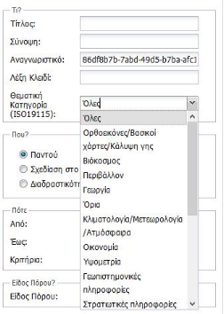  

### Χωρικά Κριτήρια
Η εφαρμογή, εκτός από τη δυνατότητα αναζήτησης με περιγραφικά κριτήρια, παρέχει και τη δυνατότητα αναζήτησης με χρήση γεωγραφικών κριτηρίων, μέσω των οποίων προσδιορίζεται η περιοχή ενδιαφέροντος του χρήστη. Τα κριτήρια αυτά είναι:  
1. Σε οποιοδήποτε σημείο (Παντού)
2. Με σχεδίαση ενός ορθογωνίου παραλληλογράμμου στο χάρτη
3. Με χρήση του απεικονιζόμενου εύρους του χάρτη.

#### Παντού
Αν ο χρήστης χρησιμοποιήσει την επιλογή ‘Παντού’, η αναζήτηση δεν περιλαμβάνει πεπερασμένα χωρικά όρια.  

#### Σχεδίαση στον χάρτη
Ο χρήστης επιλέγοντας ‘Σχεδίαση στο χάρτη’ περιορίζει την αναζήτηση μεταδεδομένων στα όρια του ορθογωνίου παραλληλογράμμου που θα σχεδιάσει στο χάρτη.

Για να εκτελεστεί αυτή η λειτουργία ο χρήστης αρχικά επιλέγει ‘Σχεδίαση στο χάρτη’. Στην συνέχεια μετακινεί τον κέρσορα του ποντικιού στο χάρτη , πατάει το αριστερό πλήκτρο του ποντικιού σε κάποιο σημείο του χάρτη και στη συνέχεια διατηρώντας πατημένο το αριστερό πλήκτρο μετακινεί το κέρσορα προς οποιαδήποτε κατεύθυνση τον ενδιαφέρει. Μόλις σχεδιαστεί το σχήμα προκείμενου να κλείσει το σχήμα αφήνει ελεύθερο το αριστερό πλήκτρο του ποντικιού.Στις παρακάτω εικόνες περιγράφεται ο τρόπος λειτουργίας αυτής της επιλογής.  

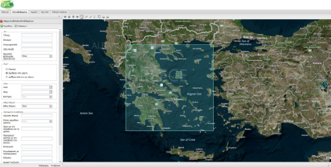

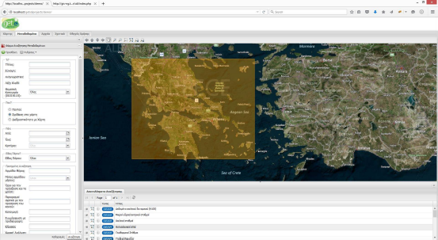

#### Διαδραστικότητα με χάρτη
Ο χρήστης επιλέγοντας την επιλογή ‘Διαδραστικότητα με χάρτη’ η αναζήτηση εκτελείται βάσει της τρέχουσας γεωγραφικής περιοχής που απεικονίζεται στο παράθυρο του χάρτη. Συνεπώς, καθώς ο χρήστης πλοηγείται στο χάρτη, μπορεί να αναζητήσει μεταδεδομένα για την περιοχή που απεικονίζεται εκείνη τη στιγμή στο χάρτη.  

Στις παρακάτω εικόνες περιγράφεται ο τρόπος λειτουργίας αυτής της επιλογής.  

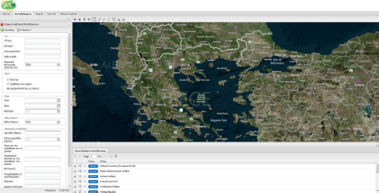  

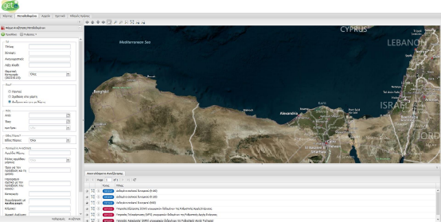  

#### Χρονικά Κριτήρια
Ο χρήστης έχει τη δυνατότητα να περιορίσει την αναζήτησή του ορίζοντας εύρος για την χρονική έκταση των δεδομένων, την ημερομηνία δημιουργίας, την ημερομηνία τελευταίας αναθεώρησης και τέλος για την ημερομηνία δημοσίευσης των δεδομένων ή των υπηρεσιών.  

Ο ορισμός του χρονικού εύρους στο οποίο θα πραγματοποιηθεί η αναζήτηση γίνεται βάσει δύο πεδίων με την ονομασία ‘Από’ και ‘Έως’.  

Ο χρήστης για να επιλέξει τις ημερομηνίες που τον ενδιαφέρουν πατάει στο δεξί άκρο του πεδίου την μικρογραφία ημερολογίου (Από, Έως ) και αυτομάτως ανοίγει ένα ημερολόγιο που του επιτρέπει να επιλέξει τις ημερομηνίες που τον ενδιαφέρουν.  

Παρακάτω φαίνεται ο τρόπος επιλογής ημερομηνίας  

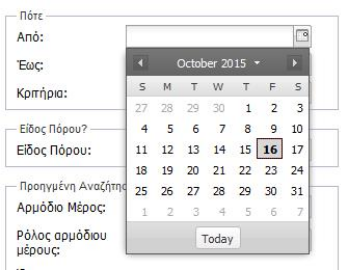  

Στη συνέχεια αφού έχουν επιλεχθεί οι ημερομηνίες για τα πεδία ‘Από’ – Έως’ ο χρήστης επιλέγει το κριτήριο επιλογής προκειμένου ορίσει στην αναζήτηση του το χρονολογικό εύρος που όρισε αν θα εφαρμοσθεί είτε για την χρονική έκταση των δεδομένων, είτε για την ημερομηνία δημιουργίας μεταδεδομένων, είτε για την ημερομηνία τελευταίας αναθεώρησης των μεταδεδομένων, είτε για την ημερομηνία δημοσίευσης μεταδεδομένων.  

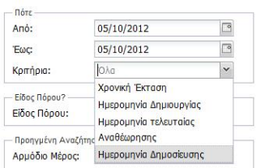  

#### Τύπος Πόρου
Το πεδίο ‘Τύπος Πόρου’ στη φόρμα κριτηρίων αναζήτησης αφορά στο είδος πόρου που επιθυμεί να αναζητήσει ο χρήστης. Οι δυνατότητες που παρέχονται από την εφαρμογή είναι οι εξής:
- Σύνολο χωρικών δεδομένων
- Σειρά συνόλων χωρικών δεδομένων
- Υπηρεσίες χωρικών δεδομένων

Όταν ο χρήστης επιθυμεί να αναζητήσει γεωχρικά δεδομένα, πρέπει να επιλέξει είτε Σύνολο χωρικών δεδομένων, είτε Σειρά συνόλων χωρικών δεδομένων.  

Όταν ο χρήστης επιθυμεί να αναζητήσει Υπηρεσίες γεωχωρικών δεδομένων τότε πρέπει να επιλέξει Υπηρεσίες Χωρικών δεδομένων.  

Ο χρήστης επιλέγει από μια λίστα μία από τις παραπάνω τιμές, ή οποιοδήποτε τύπο πόρου επιλέγοντας ‘Όλα’ όπως φαίνεται στην παρακάτω εικόνα.  

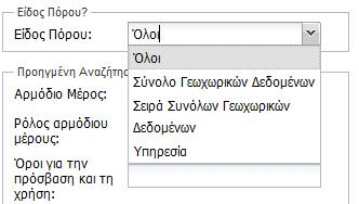  

### Προηγμένη Αναζήτηση
Στην προηγμένη αναζήτηση η εφαρμογή παρέχει τη δυνατότητα στο χρήστη να χρησιμοποιήσει επιπλέον κριτήρια αναζήτησης τα οποία είναι συμβατά και προαπαιτούμενα από την Οδηγία INSPIRE.  

#### Υπεύθυνος
Το πεδίο ‘Υπεύθυνος’ στη φόρμα κριτηρίων αναζήτησης αναφέρεται στον υπεύθυνο οργανισμό που είναι αρμόδιος για τη δημιουργία, διαχείριση, τήρηση και διάθεση των δεδομένων του επιλεγμένου καταλόγου. Συνεπώς, ο χρήστης μπορεί να εισάγει το όνομα του φορέα που τον ενδιαφέρει και να διαπιστώσει για ποια μεταδεδομένα είναι υπεύθυνος.  

#### Ρόλος Υπευθύνου
Το πεδίο ‘Ρόλος Υπευθύνου’ στη φόρμα κριτηρίων αναζήτησης αναφέρεται στον ρόλο του υπεύθυνου οργανισμού που εισήγαγε ο χρήστης στο πεδίο ‘Υπεύθυνος’.  

Ο χρήστης μπορεί να επιλέξει από μία λίστα τους διαθέσιμους ρόλους και στην συνέχεια να αναζητήσει μεταδεδομένα για τα οποία ο Υπεύθυνος Οργανισμός συμμετέχει με τον επιλεγμένο ρόλο που όρισε ο χρήστης.  

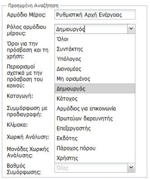  

#### Πρόσβαση και Χρήση
Το πεδίο ‘Πρόσβαση και Χρήση’ στη φόρμα κριτηρίων αναζήτησης αναφέρεται στις προϋποθέσεις που ισχύουν για την πρόσβαση και χρήση των δεδομένων και υπηρεσιών χωρικών δεδομένων που παρέχονται από τον επιλεγμένο κατάλογο. Ο χρήστης εισάγοντας κάποιο λεκτικό που αφορά τους όρους πρόσβασης και χρήσης μπορεί να αναζητήσει δεδομένα/υπηρεσίες για τα οποία ισχύουν οι συγκεκριμένοι όροι.  

#### Περιορισμοί σε Δημόσια Πρόσβαση
Το πεδίο ‘Περιορισμοί σε Δημόσια Πρόσβαση’ στη φόρμα κριτηρίων αναζήτησης αναφέρεται στις προϋποθέσεις που ισχύουν για την πρόσβαση στα δεδομένα και τις υπηρεσίες χωρικών δεδομένων που παρέχονται από τον επιλεγμένο κατάλογο από το κοινό. Ο χρήστης εισάγοντας κάποιο λεκτικό που αφορά στους όρους πρόσβασης και χρήσης των μεταδεδομένων από το κοινό μπορεί να αναζητήσει μεταδεδομένα για τα οποία ισχύουν οι συγκεκριμένοι όροι.  

#### Καταγωγή  
Το πεδίο ‘Καταγωγή’ στη φόρμα κριτηρίων αναζήτησης αναφέρεται στο λεκτικό που θα χρησιμοποιηθεί κατά την αναζήτηση (στον επιλεγμένο κατάλογο), στα οποία το λεκτικό που εισάγει ο χρήστης περιέχεται στο πεδίο καταγωγή (Lineage) των μεταδεδομένων.  

Σο πεδίο αυτό είναι καταγεγραμμένη η γνώση του δημιουργού σχετικά με τη διαδικασία και το ιστορικό παραγωγής/επεξεργασίας των δεδομένων ή/και της συνολικής ποιότητας. Κατά περίπτωση, είναι δυνατόν να περιλαμβάνεται δήλωση του κατά πόσον τα δεδομένα έχουν  επικυρωθεί ή είναι διασφαλισμένη η ποιότητά τους, κατά πόσον πρόκειται για επίσημη έκδοση  και κατά πόσον είναι νομικά έγκυρα.   

#### Πρότυπο
Το πεδίο ‘Πρότυπο’ στη φόρμα κριτηρίων αναζήτησης αναφέρεται στην προδιαγραφή της Οδηγίας INSPIRE με την οποία είναι σύμμορφος ο πόρος (δεδομένα ή υπηρεσίες) ή τα μεταδεδομένα του. Στο στοιχείο αυτό αναφέρεται ο τίτλος της προδιαγραφής (λ.χ. Regulation No 1205/2008 implementing Directive 2007/2/EC as regards metadata). Ο επιθυμητός βαθμός συμμόρφωσης με την προδιαγραφή επιλέγεται στο πεδίο ‘Βαθμός Συμμόρφωσης’.  

#### Κλίμακα
Το πεδίο ‘Κλίμακα’ στη φόρμα κριτηρίων αναζήτησης αναφέρεται στη κλίμακα των δεδομένων. Ο χρήστης λοιπόν μπορεί να αναζητήσει δεδομένα συγκεκριμένης κλίμακας απλά εισάγοντας τον παρονομαστή της κλίμακας.  

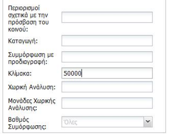  

#### Απόσταση
Το πεδίο ‘Απόσταση’ στη φόρμα κριτηρίων αναζήτησης αναφέρεται στη χωρική ανάλυση των δεδομένων και αναφέρεται κυρίως σε εικονιστικού τύπου δεδομένα όπως ορθοφωτοχάρτες, ψηφιακό μοντέλο εδάφους κ.λπ. Ο χρήστης λοιπόν μπορεί να αναζητήσει δεδομένα χωρικής ανάλυσης ενδιαφέροντος του απλά εισάγοντας τη χωρική ανάλυση που τον ενδιαφέρει. Στο πεδίο αυτό αναγράφεται μόνο η τιμή.  

#### Μονάδα
Το πεδίο ‘Μονάδα’ στη φόρμα κριτηρίων αναζήτησης αναφέρεται στη μονάδα μέτρησης για την τιμή που έχει εισάγει ο χρήστης στο πεδίο ‘Απόσταση’. Για παράδειγμα, εάν ο χρήστης επιθυμεί να αναζητήσει ορθοφωτοχάρτες χωρικής ανάλυσης 1 μέτρου θα εισάγει στο πεδίο ‘Απόσταση’ την τιμή 1 και στο πεδίο ‘Μονάδα’ θα εισάγει Meter.  

#### Βαθμός Συμμόρφωσης
Το πεδίο ‘Βαθμός Συμμόρφωσης’ στη φόρμα κριτηρίων αναζήτησης αναφέρεται στο βαθμό που τα δεδομένα, οι υπηρεσίες ή τα μεταδεδομένα είναι συμμορφωμένα με τις αντίστοιχες προδιαγραφές της Οδηγίας INSPIRE. O χρήστης έχει τη δυνατότητα να επιλέξει από λίστα τις δυνατές τιμές που αφορούν στο βαθμό συμμόρφωσης.  

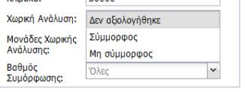  

### Αποτελέσματα Αναζήτησης
Τα αποτελέσματα της αναζήτησης που εκτελεί ο χρήστης παρουσιάζονται σε μορφή πίνακα κάτω από την φόρμα κριτηρίων αναζήτησης, όπως φαίνεται στην παρακάτω εικόνα.  

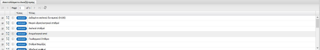  

Τα αποτελέσματα της αναζήτησης διαφοροποιούνται σε δύο κατηγορίες:
1. Αποτελέσματα Μεταδεδομένων για Γεωχωρικά Δεδομένα
2. Αποτελέσματα Μεταδεδομένων για Υπηρεσίες Γεωχωρικών Δεδομένων

#### Αποτελέσματα Αναζήτησης Μεταδεδομένων για Γεωχωρικά Δεδομένα
Η ενότητα αυτή περιγράφει τη δομή των αποτελεσμάτων αναζήτησης μεταδεδομένων για δεδομένα.  

##### Τίτλος
Η πρώτη στήλη των αποτελεσμάτων περιέχει τον τίτλο, όπως αυτός έχει καταχωριστεί στο αντίστοιχο πεδίο των μεταδεδομένων. 

##### Εμφάνιση στο χάρτη
Η δεύτερη στήλη του χάρτη περιέχει το κουμπί εμφάνισης των χωρικών ορίων των δεδομένων στα οποία αφορούν τα μεταδεδομένα που βρέθηκαν.

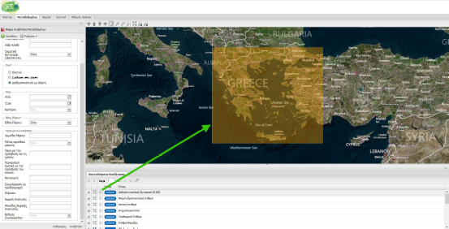  

##### Εμφάνιση Στοιχείων
Η τρίτη στήλη του πίνακα περιέχει το κουμπί εμφάνισης  των μεταδεδομένων σε ένα αναδυόμενο παράθυρο.  

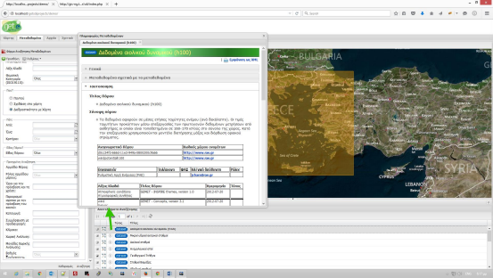  

