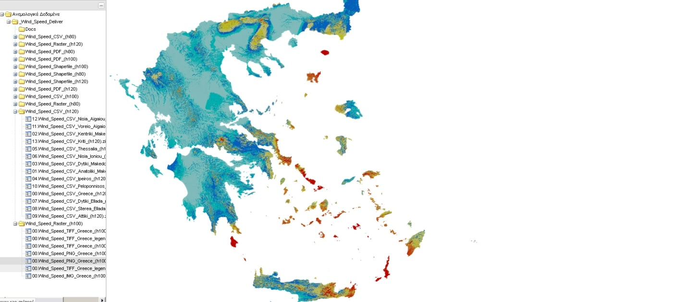

# Καρτέλα «Αρχεία»
Στην καρτέλα ‘Αρχεία’, ο χρήστης μπορεί να έχει πρόσβαση σε αρχεία που έχουν εγκατασταθεί κατά την παραμετροποίηση της **Υποδομής Γεωχωρικών Πληροφοριών** στον εξυπηρετητή. Τα αρχεία εμφανίζονται ταξινομημένα σε δενδροειδή μορφή και μπορούν να προσπελαστούν εύκολα από τους χρήστες.

